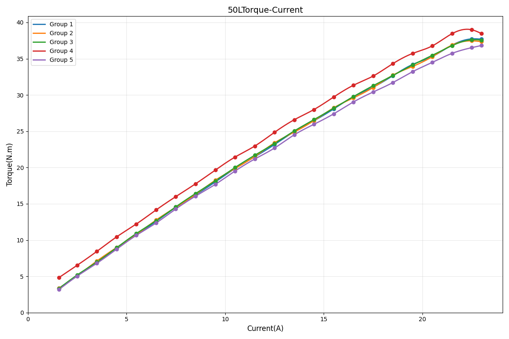

# BXI5018-19 Joint Motor

**BXI Hollow Planetary Series — Motor Specifications (BXI50 Long Version)**

---

## Engineering Drawing

- **Mounting OD**: 64.00 mm
- **Height**: 70.50 mm
- **Hollow Bore**: 6 mm

---

## Specifications

| Parameter | Value | Unit |
| :--- | :--- | :--- |
| **Rated Voltage** | 24–58 | V |
| **No-load Speed** | 200 | RPM |
| **Rated Output Speed** | 100 | RPM |
| **Rated Torque** | 11 | Nm |
| **Peak Torque** | 35 | Nm |
| **Peak Phase Current** | 22 | A(rms) |
| **Gear Ratio** | 19.5 | — |
| **Weight** | 0.55 | kg |

> **Note**: All parameters above are theoretical values and may vary under actual operating conditions.

---

## Interface & Sensor Definitions

| Item | Specification |
| :--- | :--- |
| **Communication** | CAN / CANFD |
| **Protocol** | MIT Protocol Compatible |
| **Control Mode** | Mixed Torque / Velocity / Position |
| **Bearing Type** | Cross Roller Bearing |
| **Dual Absolute Encoder** | Supported |
| **Input Encoder** | Magnetic Encoder (16-bit) |
| **Output Encoder** | Inductive Encoder |

---

## Performance Curves

**Torque–Current Curve**

> Test conditions: Voltage 57 V; Speed 50 RPM

**Torque–Speed Curve**

> Test conditions: Voltage 57 V

---

> Specifications may be updated or revised. For more information, visit [www.bxirobotics.cn](https://www.bxirobotics.cn) or contact contact@bxirobotics.com.
