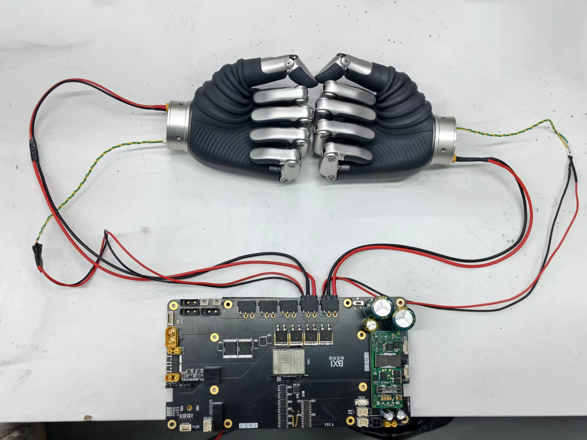

# External Dexterous Hand Quick Deployment

This page is intended for customer-side deployment of the Revo2 dexterous hand on ELF3. It focuses on wiring, dependency installation, build, run, and acceptance checks. For SDK APIs and custom development, refer to the example repository:

- BXI Revo2 example: [bxi_revo2_example](https://github.com/konodoki/bxi_revo2_example)
- Official hand SDK: [brainco-hand-sdk](https://github.com/BrainCoTech/brainco-hand-sdk.git)

!!! warning "Safety"
    The demo moves the fingers through open, fist, pinch, single-finger motion, speed/current/PWM control, and other gestures. Make sure no body parts, cables, or fragile objects are inside the hand motion range. Do not run the full demo while the hand is holding an object.

## Environment

| Item | Requirement |
|---|---|
| Robot | ELF3 with the robot hardware node running |
| Dexterous hand | Revo2 Basic |
| Communication | BXI controller CANFD |
| ROS version | ROS 2 Humble |
| Example package | `bxi_revo2_example` |
| Python SDK | `bc-stark-sdk==1.5.1` |

The example package communicates with the BXI CANFD hardware node through `communication/msg/CANFDPacket`, so the `bxi_ros2_pkg` environment must be sourced first.

## Wiring

With the default wiring, no source-code changes are required:

| Hand | BXI controller port | Default ID | Protocol | `master_id` |
|---|---:|---:|---|---:|
| Left hand | CAN5 | 126 / `0x7E` | CANFD | 1 |
| Right hand | CAN6 | 127 / `0x7F` | CANFD | 1 |



After wiring, start the robot normally. When the hardware node starts successfully, the Revo2 hand usually opens automatically. Use this as the first hardware-link check.

## Quick Deployment

### 1. Get The Example Package

Run the following on the robot controller or a ROS 2 host:

```bash
cd ~/bxi_ws
mkdir -p src
cd src
git clone https://github.com/konodoki/bxi_revo2_example.git
```

If GitHub is unavailable on site, download the repository in advance and copy it to `~/bxi_ws/bxi_revo2_example`.

### 2. Download The C++ SDK Files

The C++ demo requires the official SDK shared library and headers before build.

```bash
cd ~/bxi_ws/bxi_revo2_example
./download-lib.sh
```

The script creates:

- `dist/include/`
- `dist/shared/linux/libbc_stark_sdk.so`
- `VERSION`

### 3. Install The Python SDK

Install the pinned SDK version before running the Python demo:

```bash
pip install bc-stark-sdk==1.5.1 --index-url https://pypi.org/simple/
```

### 4. Build The Package

```bash
cd ~/bxi_ws
source /opt/ros/humble/setup.bash
source /opt/bxi/bxi_ros2_pkg/setup.bash
colcon build --packages-select bxi_revo2_example
source install/setup.bash
```

!!! tip
    If the `communication` package is built in another workspace, source that workspace before running `colcon build`.

## Run And Validate

### 1. Start The Robot Hardware Node

Start ELF3 using the normal robot startup flow. See [Motion Control Development Guide](motioncontrol.md#launching-the-robot-program) if needed.

Check that the CANFD topics exist:

```bash
source /opt/ros/humble/setup.bash
source /opt/bxi/bxi_ros2_pkg/setup.bash
ros2 topic list | grep canfd_packet
```

Expected topics:

```text
/canfd_packet/rx
/canfd_packet/tx
```

### 2. Run The Demo

Run the C++ demo:

```bash
cd ~/bxi_ws
source /opt/ros/humble/setup.bash
source /opt/bxi/bxi_ros2_pkg/setup.bash
source install/setup.bash
ros2 run bxi_revo2_example bxi_revo2_example
```

Or run the Python demo:

```bash
cd ~/bxi_ws
source /opt/ros/humble/setup.bash
source /opt/bxi/bxi_ros2_pkg/setup.bash
source install/setup.bash
ros2 run bxi_revo2_example bxi_revo2_example.py
```

### 3. Acceptance Check

The terminal should print device information, finger positions, speeds, currents, and configuration values. The hand will run:

1. Basic position control: fist, open hand, single-finger motion;
2. Speed, current, and PWM control;
3. Revo2 advanced control: unit mode, position with time, position with speed, multi-finger motion;
4. Built-in gestures: Open, Fist, Pinch, Point, and others;
5. Device information and parameter queries.

The default demo runs the left hand first, then the right hand. If both hands complete these actions without continuous errors, the basic deployment is complete.

## Change The Default Bus Or ID

If the site wiring or hand ID differs from the default configuration, update the bus and ID in the example source.

Python example:

```text
~/bxi_ws/bxi_revo2_example/src/bxi_revo2_example.py
```

Default configuration:

```python
left_ctx = await init_bxipci_device(5, 126, master_id=1, is_canfd=True, ...)
right_ctx = await init_bxipci_device(6, 127, master_id=1, is_canfd=True, ...)
```

C++ example:

```text
~/bxi_ws/bxi_revo2_example/src/bxi_revo2_example.cpp
```

Default configuration:

```cpp
init_bxipci_device(&left_ctx_, 5, 126, true);
init_bxipci_device(&right_ctx_, 6, 127, true);
```

Rebuild after changing the source:

```bash
cd ~/bxi_ws
colcon build --packages-select bxi_revo2_example
source install/setup.bash
```

## Troubleshooting

### Missing `stark-sdk.h` Or `libbc_stark_sdk.so`

The C++ SDK files have not been downloaded. Run:

```bash
cd ~/bxi_ws/bxi_revo2_example
./download-lib.sh
```

Then rebuild the package.

### `No module named bc_stark_sdk`

The Python SDK is missing or installed into the wrong Python environment. Run:

```bash
pip install bc-stark-sdk==1.5.1 --index-url https://pypi.org/simple/
```

### `communication.msg.CANFDPacket not found`

The BXI ROS 2 message package environment has not been sourced:

```bash
source /opt/bxi/bxi_ros2_pkg/setup.bash
source ~/bxi_ws/install/setup.bash
```

### No Response Or Read Timeout

Check the following:

1. Left hand is connected to CAN5 and uses ID 126;
2. Right hand is connected to CAN6 and uses ID 127;
3. The robot hardware node is running and `/canfd_packet/rx` plus `/canfd_packet/tx` exist;
4. Cabling and power are normal;
5. No other process is controlling the same hand at the same time.
6. If it is a factory-installed hardware node, please check if ROS_DOMAIN_ID is consistent.

## Development Entry

Customer deployment usually does not require changes to the low-level CAN bridge. To control the hand from a custom ROS 2 node, see “Use In Your Own ROS 2 Node class” in the example repository README:

[https://github.com/konodoki/bxi_revo2_example](https://github.com/konodoki/bxi_revo2_example)
