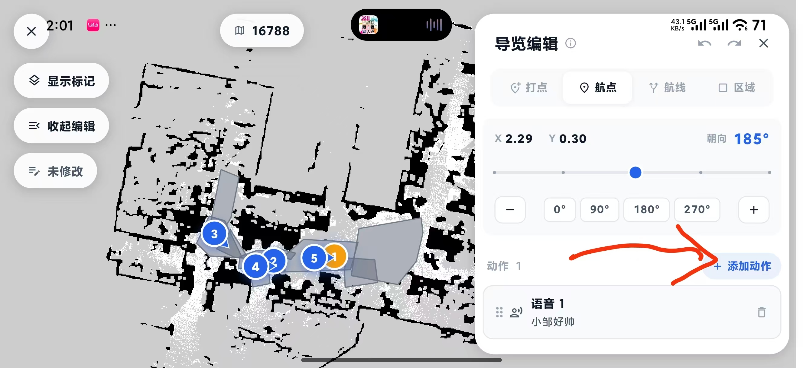
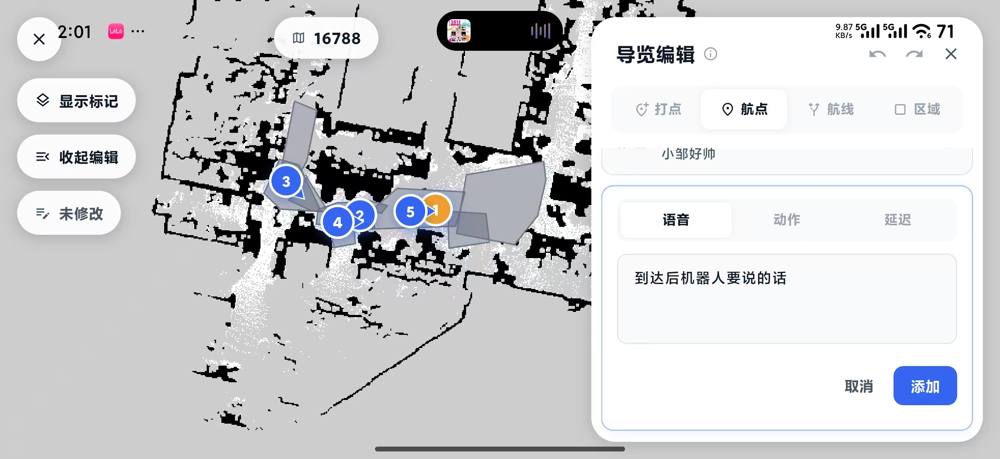
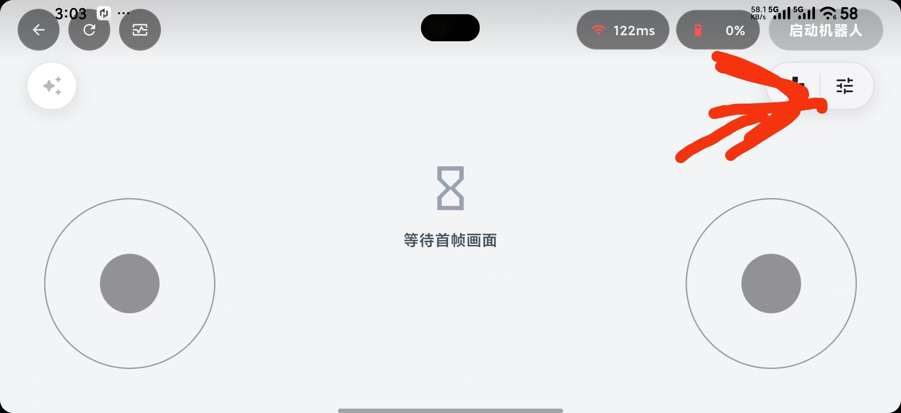
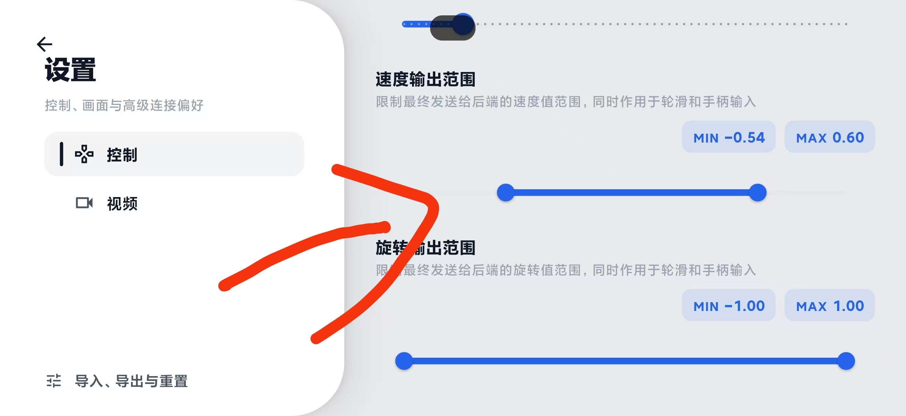

# ELF3 Navigation App User Guide

This guide explains how to configure a Livox MID-360s LiDAR for ELF3 and use `bxi_rc_app` to create maps, edit navigation data, and run guided tours.

Reference project: [bxi_nav](https://github.com/Luckyt1/bxi_nav)

## Prerequisites

- Install the latest version of `bxi_rc_app`.
- Prepare an ELF3 robot equipped with a Livox MID-360s LiDAR.
- Make sure the `bxi_rc_slam` package is up to date.
- Connect the computer directly to the LiDAR with an Ethernet cable.
- Keep the operating area safe and the paths clear, with as little pedestrian traffic as possible.

## Environment Setup

This guide assumes Ubuntu 22.04 and ROS 2 Humble. Before continuing, source a ROS 2 environment with Navigation2 installed, then install the point-cloud-to-laser-scan tool:

```bash
source /opt/ros/humble/setup.bash
sudo apt update
sudo apt install -y ros-humble-pointcloud-to-laserscan
```

After installation, verify that the required packages are available:

```bash
ros2 pkg prefix nav2_bringup
ros2 pkg prefix pointcloud_to_laserscan
```

If both commands print their package installation paths, the environment is ready.

## 1. Configure the Livox MID-360s LiDAR

If the LiDAR does not start, the network or device configuration is usually incorrect. First confirm that the computer and LiDAR are on the same subnet, then check the configuration file.

### 1.1 Configure a Static IP Address

Set the computer's Ethernet interface to a static IP address, such as `192.168.1.51`. A direct Ethernet connection is recommended. Changing network settings through a remote desktop session may cause permission issues.


### 1.2 Update the LiDAR Configuration File

Configuration file path:

```text
bxi_rc_slam/src/livox_ros_driver2/config/MID360s_config.json
```

Check the following fields:

- `host_ip`: the static IP address of the computer's Ethernet interface, such as `192.168.1.51`.
- `ip`: the LiDAR IP address. A MID-360s address is typically in the `192.168.1.1xx` range. The final two digits may be printed below the QR code on the LiDAR housing.

If the label is difficult to read, place the computer and LiDAR on the same subnet and run:

```bash
ros2 launch livox_ros_driver2 msg_MID360s_launch.py
```

Identify the LiDAR IP address in the program output, then enter it in the configuration file.

Example configuration:

```json
{
  "lidar_summary_info": {
    "lidar_type": 8
  },
  "Mid360s": {
    "lidar_net_info": {
      "cmd_data_port": 56100,
      "push_msg_port": 56200,
      "point_data_port": 56300,
      "imu_data_port": 56400,
      "log_data_port": 56500
    },
    "host_net_info": [
      {
        "host_ip": "192.168.1.51",
        "cmd_data_port": 56101,
        "push_msg_port": 56201,
        "point_data_port": 56301,
        "imu_data_port": 56401,
        "log_data_port": 56501
      }
    ]
  },
  "lidar_configs": [
    {
      "ip": "192.168.1.128",
      "pcl_data_type": 1,
      "pattern_mode": 0,
      "extrinsic_parameter": {
        "roll": 0.0,
        "pitch": 0.0,
        "yaw": 0.0,
        "x": 0,
        "y": 0,
        "z": 0
      }
    }
  ]
}
```

!!! warning "Rebuild after changing the configuration"

    After saving the configuration, enter the project directory containing `install.sh` and rebuild the installation with root privileges:

    ```bash
    sudo ./install.sh
    ```

## 2. Use the Navigation App

1. Open `bxi_rc_app` and select **My Devices (我的设备)**.

   

2. Select the robot you want to navigate from the device list to open its details page.

   

3. Open **Map Management (地图管理)** from the robot details page.

   

### 2.1 Create a Map

1. Open **Map Management (地图管理)** and select **New Map (新建地图)**.

   

2. Start the robot and keep it in walking mode. After confirming that the point cloud is displayed correctly, select **Start Mapping (开始建图)**.

   

3. Stand behind the robot and remotely drive it through the target area. Staying behind the robot prevents the operator from being captured in the map. Minimize pedestrian movement while mapping.

4. After the map covers the target area, select **Save (保存)**. Wait for confirmation that the map has been saved before leaving the mapping page.

   

### 2.2 Edit the Map

1. In **Map Management (地图管理)**, select the map you just saved.

   

2. Open the guided-tour editor, switch to **Waypoint (航点)**, and mark each destination on the map.

   

3. Set the robot's arrival heading for each waypoint. Add a waypoint name if needed.

   

4. Optional: To make the robot perform a specific behavior after reaching the waypoint, select **Add Action (添加动作)**, choose **Voice (语音)**, **Action (动作)**, or **Delay (延迟)**, configure it, and then select **Add (添加)**. You can add multiple behaviors to the same waypoint if needed.

   

   

5. Switch to **Area (区域)** and select **Add Clearing Zone (添加清除区)**. Draw clearing zones over the robot's travel paths to remove obstacles that no longer exist in the physical environment.

   

6. Verify the waypoints, headings, arrival behaviors, and clearing zones, then wait for the map to be saved successfully.

### 2.3 Start a Guided Tour

1. Return to the robot details page, open **Operating Mode (运行模式)**, and select guided-tour mode.

   

2. Select the required map, then select **Start (开始)** on its card.

   

3. Select **Relocalize (重定位)**. Tap the robot's approximate position on the map, then drag the pose marker in the direction the robot is facing.

   

4. Check whether the red point cloud around the robot aligns with the walls on the map. If they align, select **Confirm (确认)**. If the offset is significant, adjust the position and heading again.

   

5. Select **Navigate (导航)** to start the guided-tour task.

   

6. If a problem occurs during the tour, immediately select **Pause (暂停)** or **Stop (终止)**. You can also use the on-screen joystick to take manual control and prevent the robot from continuing off course.

   

7. When the tour is complete, stop navigation before leaving the page.

## Troubleshooting

### How to Adjust the Remote-Control Speed

1. Open the robot remote-control page and select the **Settings** icon in the upper-right corner.

   

2. Select **Control (控制)** on the Settings page, then adjust the following parameters as needed:

   - **Speed Output Range (速度输出范围)**: limits the forward and reverse linear speed for both the on-screen virtual joystick and an external gamepad.
   - **Rotation Output Range (旋转输出范围)**: limits the left and right turning speed for both the on-screen virtual joystick and an external gamepad.

   

After changing the ranges, test the robot at low speed in a clear, safe area. Increase the limits gradually only after confirming that the robot moves as expected.

### The LiDAR Does Not Start

- Confirm that the computer and LiDAR are connected by Ethernet and are on the same subnet.
- Confirm that `host_ip` matches the static IP address of the computer's Ethernet interface.
- Confirm that `ip` matches the actual LiDAR IP address.

### People or Dynamic Obstacles Appear on the Map

- Keep the mapping operator behind the robot.
- Minimize pedestrian movement during mapping.
- Add clearing zones in the map editor for obstacles that no longer exist.

### The Point Cloud Does Not Align with the Walls After Relocalization

- Select the robot's position on the map again.
- Adjust the pose marker to match the robot's actual heading.
- Start navigation only after the red point-cloud returns are reasonably aligned with the walls.
