# ELF3 导航 App 使用教程

本文介绍如何为 ELF3 配置 Livox MID-360s 激光雷达，并通过 `bxi_rc_app` 完成建图、地图编辑和导览。

项目参考：[bxi_nav](https://github.com/Luckyt1/bxi_nav)

## 准备工作

- 安装最新版 `bxi_rc_app`。
- 准备一台已安装 Livox MID-360s 激光雷达的 ELF3 机器人。
- 确保 `bxi_rc_slam` 包已更新至最新版本。
- 使用网线连接电脑与雷达。
- 确保作业区域安全、通道畅通，并尽量减少人员走动。

## 1. 配置 Livox MID-360s 雷达

雷达无法启动时，通常是网络或雷达配置不正确。请先确认电脑与雷达处于同一网段，再检查配置文件。

### 1.1 配置静态 IP

将电脑网口设置为静态 IP，例如 `192.168.1.51`。建议使用网线直连雷达进行配置；在远程桌面环境中修改网络设置时，可能会遇到权限问题。


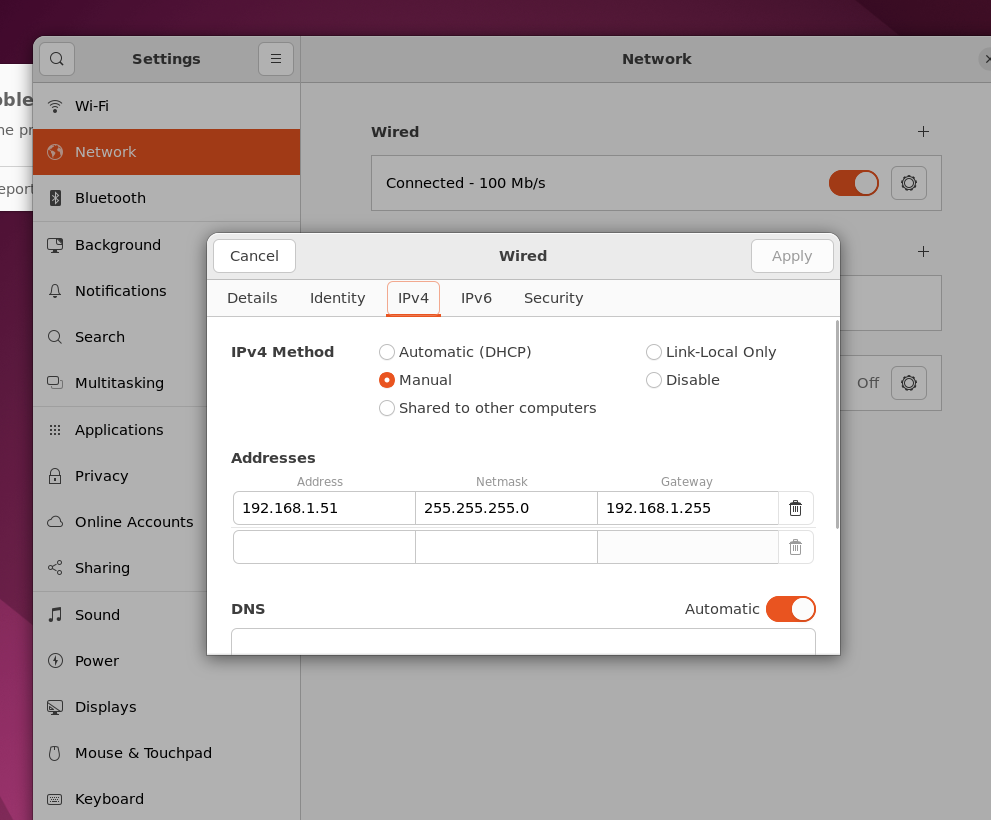

### 1.2 修改雷达配置文件

配置文件路径：

```text
bxi_rc_slam/src/livox_ros_driver2/config/MID360s_config.json
```

重点检查以下字段：

- `host_ip`：电脑网口的静态 IP，例如 `192.168.1.51`。
- `ip`：雷达 IP。MID-360s 的地址通常为 `192.168.1.1xx`，末尾两位可参考雷达机身二维码下方的数字。

如果无法查看机身信息，可在电脑与雷达处于同一网段后运行：

```bash
ros2 launch livox_ros_driver2 msg_MID360s_launch.py
```

从程序输出中确认雷达 IP，再填写到配置文件中。

配置示例：

```json
{
  "lidar_summary_info": {
    "lidar_type": 8
  },
  "Mid360s": {
    "lidar_net_info": {
      "cmd_data_port": 56100,
      "push_msg_port": 56200,
      "point_data_port": 56300,
      "imu_data_port": 56400,
      "log_data_port": 56500
    },
    "host_net_info": [
      {
        "host_ip": "192.168.1.51",
        "cmd_data_port": 56101,
        "push_msg_port": 56201,
        "point_data_port": 56301,
        "imu_data_port": 56401,
        "log_data_port": 56501
      }
    ]
  },
  "lidar_configs": [
    {
      "ip": "192.168.1.128",
      "pcl_data_type": 1,
      "pattern_mode": 0,
      "extrinsic_parameter": {
        "roll": 0.0,
        "pitch": 0.0,
        "yaw": 0.0,
        "x": 0,
        "y": 0,
        "z": 0
      }
    }
  ]
}
```

## 2. 使用导航 App

1. 打开 `bxi_rc_app`，点击 **我的设备**。

   

2. 在设备列表中选择需要导航的机器人，进入机器人详情页。

   

3. 在机器人详情页中进入 **地图管理**。

   

### 2.1 建图

1. 进入 **地图管理**，点击 **新建地图**。

   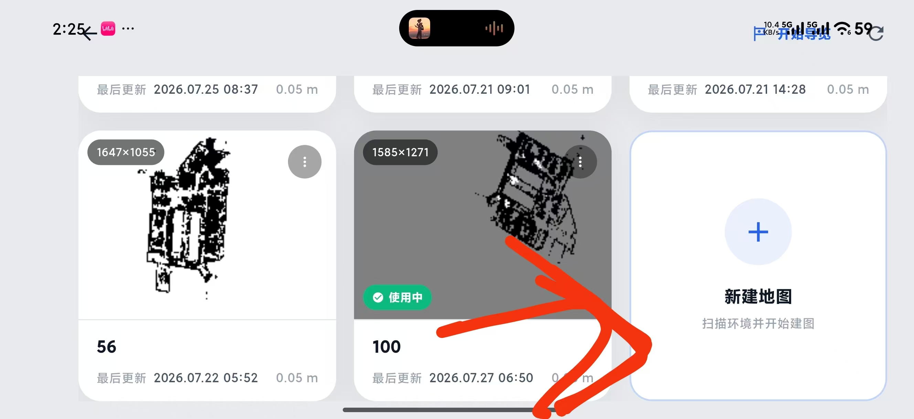

2. 启动机器人并保持走路模式。确认界面中能正常显示点云后，点击 **开始建图**。

   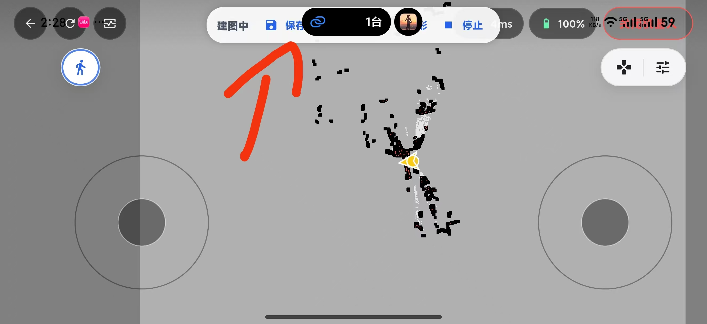

3. 站在机器人后方遥控机器人遍历目标区域，避免建图人员被扫描进地图。建图期间尽量减少现场人员走动。

4. 地图覆盖目标区域后，点击 **保存**。等待界面确认地图保存成功，再退出建图页面。

   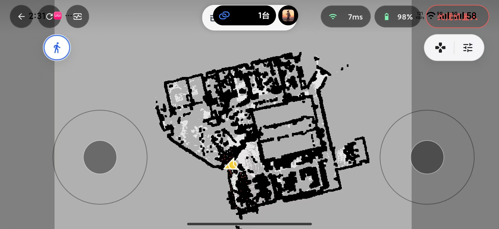

### 2.2 编辑地图

1. 在 **地图管理** 中选择刚刚保存的地图。

   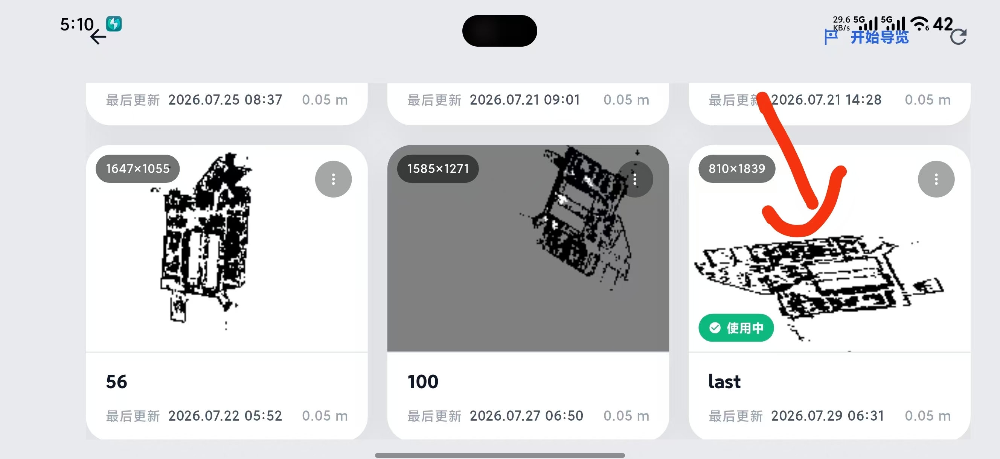

2. 进入导览编辑，切换到 **航点**，然后在地图上标记需要到达的位置。

   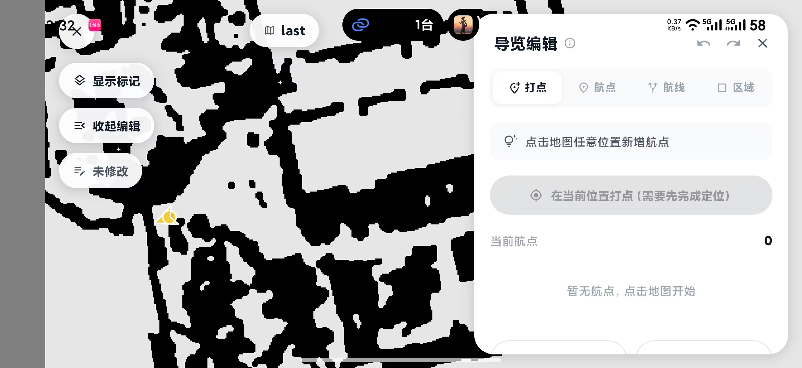

3. 为每个航点设置机器人到达后的朝向，并根据需要填写航点名称。

   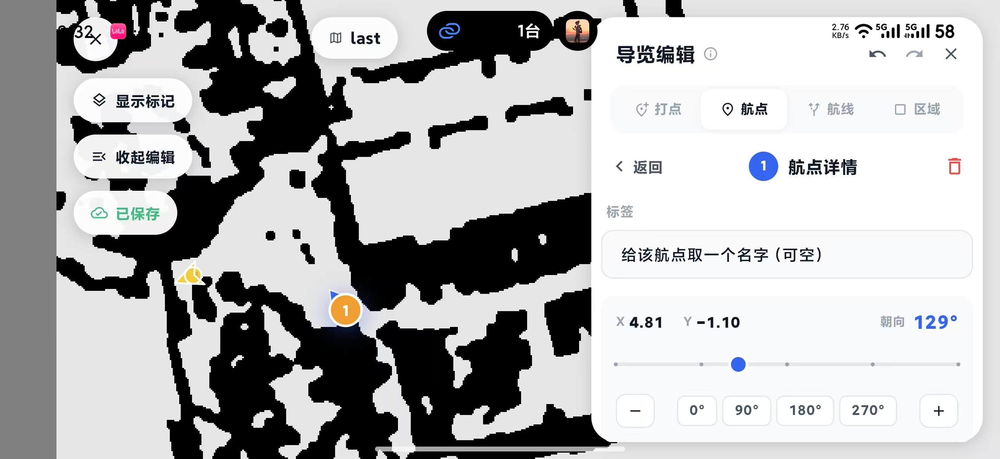

4. 切换到 **区域**，点击 **添加清除区**。让清除区覆盖机器人的行走通道，用于清除地图中实际已不存在的障碍物。

   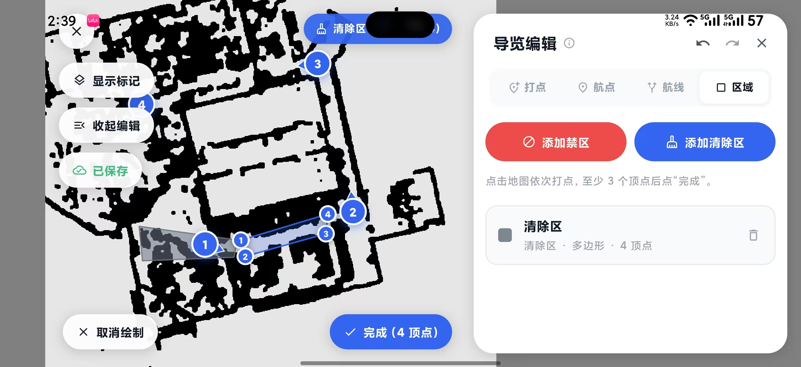

5. 确认航点、方向和清除区设置无误，并等待地图保存成功。

### 2.3 开始导览

1. 返回机器人详情页，进入 **运行模式**，选择导览模式。

   

2. 选择需要使用的地图，并点击该地图的 **开始**。

   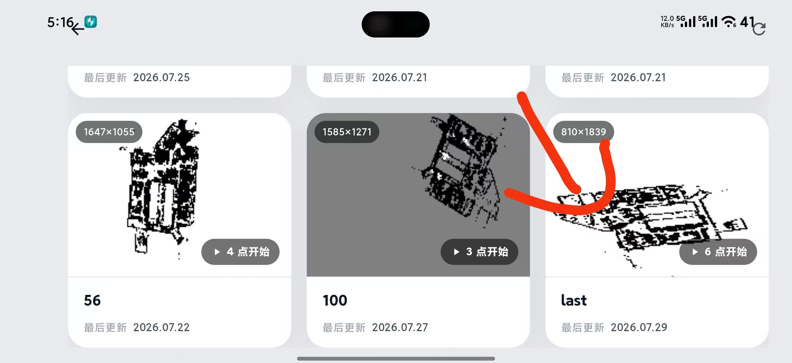

3. 点击 **重定位**。在地图上点击机器人的大致位置，并沿机器人当前朝向拖动定位标记。

4. 检查机器人周围的红色点云是否与地图墙壁重合。重合后点击 **确认**；如果偏差明显，请重新调整位置和方向。

   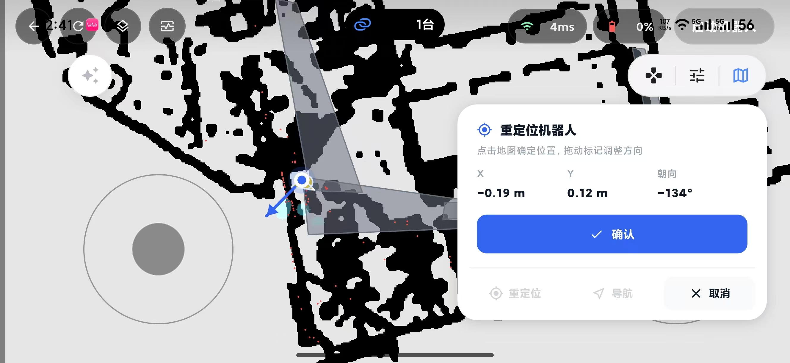

5. 点击 **导航** 开始执行导览任务。

   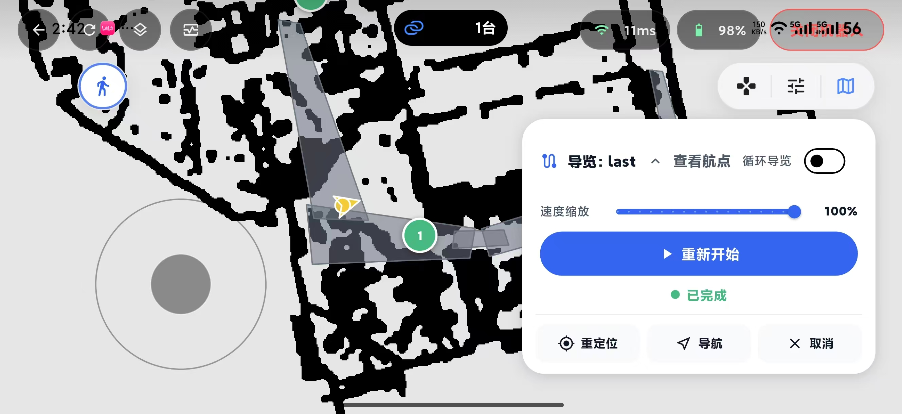

6. 导览过程中如出现异常，立即点击 **暂停** 或 **终止**。也可以使用界面中的遥杆临时接管机器人，避免机器人继续偏离路线。

   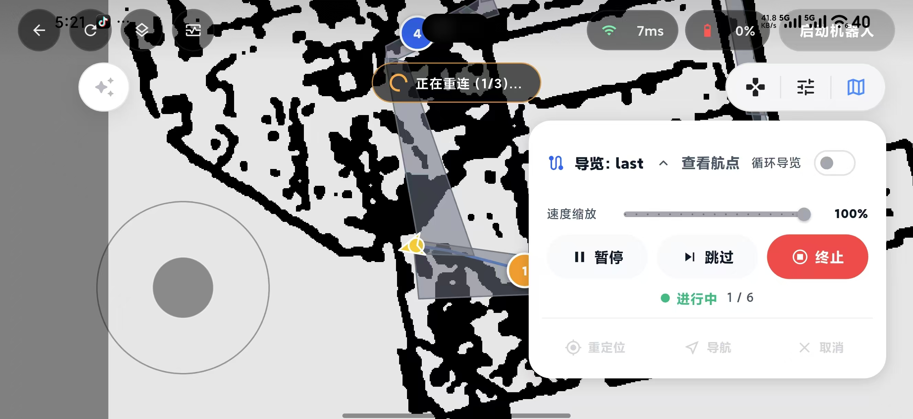

7. 导览完成后，先停止导航，再退出当前页面。

## 常见问题

### 雷达无法启动

- 确认电脑与雷达使用网线连接，并处于同一网段。
- 确认 `host_ip` 与电脑网口的静态 IP 一致。
- 确认 `ip` 与雷达实际 IP 一致。

### 地图中出现人员或动态障碍物

- 建图人员应始终站在机器人后方。
- 建图期间减少现场人员走动。
- 对实际已不存在的障碍物，可在地图编辑中添加清除区。

### 重定位后点云与墙壁不重合

- 重新选择机器人在地图中的位置。
- 调整定位标记，使其方向与机器人实际朝向一致。
- 确认红色点云与墙壁基本重合后，再开始导航。
