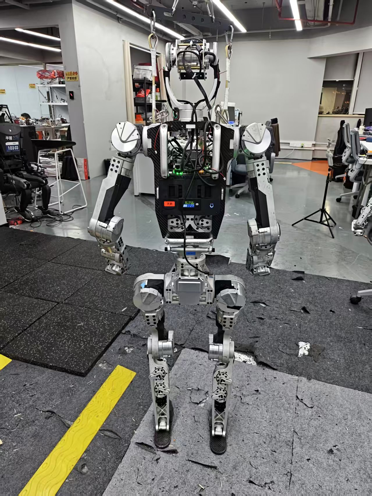
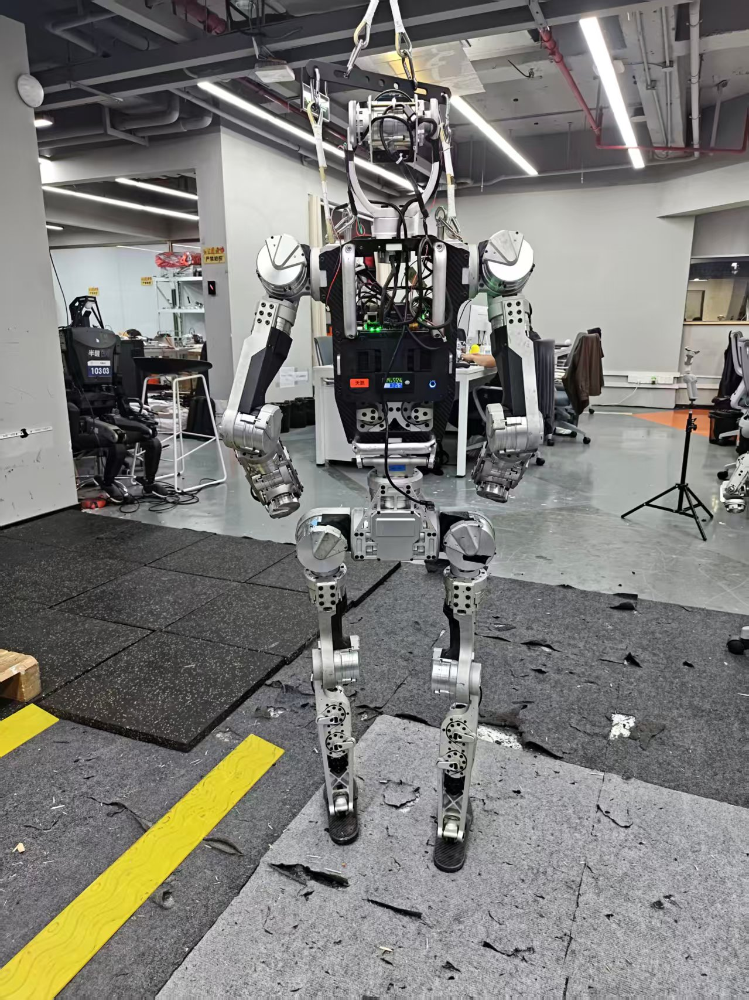
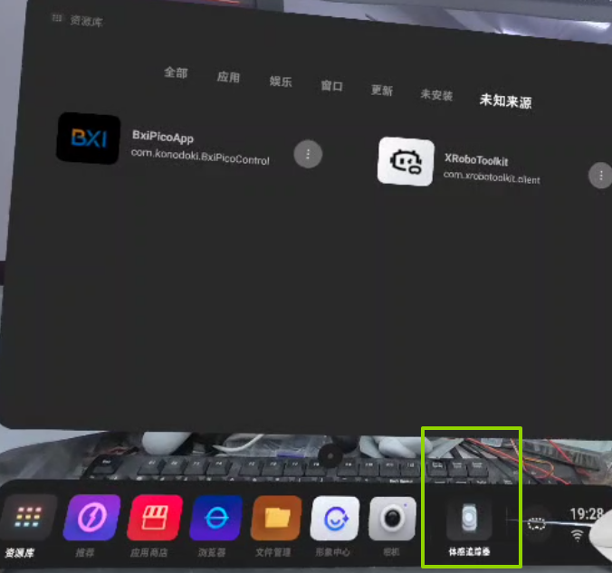
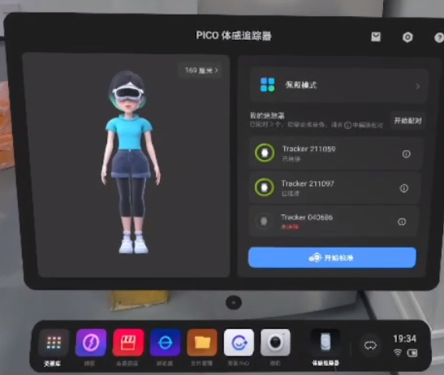
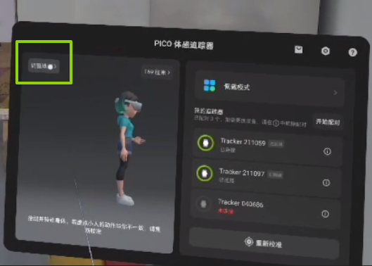
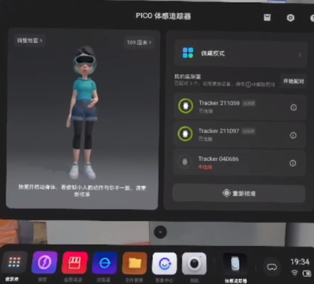
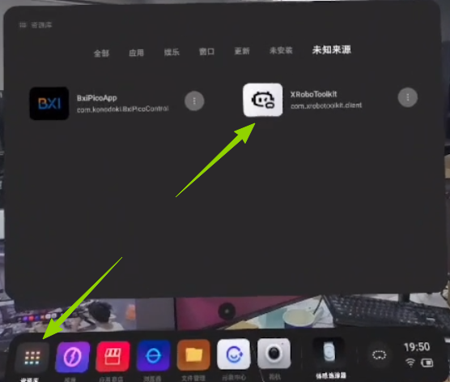
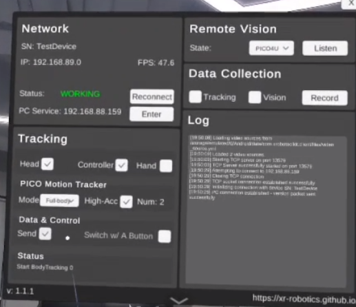
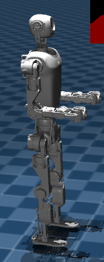

# Sonic Full-Body Teleoperation

This guide explains how to deploy and use Sonic full-body teleoperation on ELF3, including robot-side dependency installation, PICO Motion Tracker calibration, XRoboToolkit network configuration, full-body motion following, and the exit procedure.

- Motion-control repository: [bxi_rl_controller_ros2_example](https://github.com/bxirobotics/bxi_rl_controller_ros2_example)
- PICO client: [XRoboToolkit-PICO-1.1.1.apk](https://github.com/XR-Robotics/XRoboToolkit-Unity-Client/releases/download/v1.1.1/XRoboToolkit-PICO-1.1.1.apk)

!!! warning "Safety"
    Full-body teleoperation drives the robot's legs, torso, and both arms at the same time. Incorrect operation may destabilize the robot or cause a collision with nearby people or objects. Before first use, clear the operating areas around both the robot and operator, make sure the emergency stop is available, and have a safety operator stand by the robot.

    Begin with slow, small movements. Do not jump, turn quickly, stand on one leg, or move beyond the robot's joint range. Stop motion following immediately if the robot shakes, assumes an abnormal posture, or starts to lose balance. Press the emergency stop if necessary.

## Environment

| Item | Requirement |
|---|---|
| Robot | ELF3 with the motion-control program running normally |
| Robot-side project | `/home/bxi/bxi_ws/bxi_rl_controller_ros2_example` |
| Input devices | Robot remote controller, PICO headset, and left and right PICO controllers |
| Motion tracking | 2 leg-mounted PICO Motion Trackers |
| PICO application | XRoboToolkit-PICO 1.1.1 |
| Network | PICO and the robot are on the same LAN and can communicate with each other |

## Prepare the Robot

### 1. Update the Motion-Control Project

Update `bxi_rl_controller_ros2_example` on the robot to the latest version:

```bash
cd /home/bxi/bxi_ws/bxi_rl_controller_ros2_example
git pull --ff-only
```

After updating the source, rebuild the project as described in the repository README and source the environment:

```bash
source /opt/ros/humble/setup.bash
source /opt/bxi/bxi_ros2_pkg/setup.bash
cd /home/bxi/bxi_ws/bxi_rl_controller_ros2_example
bash build.sh
source install/setup.bash
```

!!! tip "Note"
    If your site uses another managed deployment process, follow its update and build procedure instead. Do not update the working tree directly when it contains uncommitted site-specific changes.

### 2. Install Sonic Dependencies

Before using Sonic for the first time, switch to the root user on the robot and install the Python dependencies required for PICO connectivity:

```bash
sudo su
python3 -m pip install -r /home/bxi/bxi_ws/bxi_rl_controller_ros2_example/src/bxi_example_py_elf3/mods/com.bxi.sonic/requirements-pico.txt
```

The dependencies normally need to be installed only once. Run the command again after an update if `requirements-pico.txt` has changed.

### 3. Install the PICO Application

Download [XRoboToolkit-PICO-1.1.1.apk](https://github.com/XR-Robotics/XRoboToolkit-Unity-Client/releases/download/v1.1.1/XRoboToolkit-PICO-1.1.1.apk) and install the APK on the PICO headset. After installation, `XRoboToolkit` is available under **Unknown Sources** in the PICO Library.

## Enter the Sonic Ready State

1. Start ELF3 normally, confirm that the robot has completed its self-check, and use the remote controller to put the robot into walking mode. The robot should hold its normal standing posture.

   

2. Press `LB + RB + X` simultaneously on the robot remote controller to request Sonic full-body teleoperation.

3. Wait for the state transition to finish. The robot assumes the ready posture shown below. Continue with PICO calibration and motion following only after the posture is stable.

   

!!! note "Sonic Does Not Start"
    Confirm that the robot is already in normal walking mode, then press `LB + RB + X` simultaneously. If the robot still does not respond, check that the motion-control project has been updated, rebuilt, and sourced correctly.

## Calibrate the PICO Motion Trackers

Recalibrate the Motion Trackers before each full-body teleoperation session to reduce body-pose and floor-height errors.

1. Secure one Motion Tracker to each leg. The side with the button and indicator light must face upward along the body. Press the button to turn on each tracker.

2. Put on the PICO headset and pick up both controllers. Select **Motion Tracker** in the lower-right corner of the PICO home screen.

   

3. Confirm that both leg trackers are connected. Select **Start Calibration** and follow the instructions in the headset.

   

4. After calibration, select **Adjust Floor** and follow the instructions to align the virtual floor with the physical floor.

   

5. Observe the avatar on the screen. When the operator moves their head, hands, and legs, the avatar should follow those movements and its feet should remain close to the floor.

   

## Connect XRoboToolkit

1. Return to the PICO Library and open `XRoboToolkit` under **Unknown Sources**.

   

2. Confirm that PICO and the robot are connected to the same LAN, then obtain the robot's LAN IP address.

3. In the **Network** section of XRoboToolkit, select **Enter** next to `PC Service`, enter the robot's IP address, and connect.

4. Check the tracking and transmission options against the table below:

   | Section | Option | Setting |
   |---|---|---|
   | Tracking | `Head` | Selected |
   | Tracking | `Controller` | Selected |
   | PICO Motion Tracker | `Mode` | `Full-body` |
   | PICO Motion Tracker | `High-Acc` | Selected |
   | PICO Motion Tracker | `Num` | `2` |
   | Data & Control | `Send` | Selected |

5. Confirm that `Status` in the **Network** section shows `WORKING` and that the log does not contain continuous errors.

   

## Calibrate the Reference Posture and Start Following

1. Face the same direction as the robot and stand upright. Let the upper arms hang naturally, bend the elbows approximately 90 degrees, and hold the forearms horizontally in front of the body as shown below.

   

2. Hold the posture steady and press `A + B + X + Y` across the two PICO controllers at the same time. This aligns PICO three-point tracking with the robot's reference posture.

3. After calibration, continue matching the robot's posture and heading. Confirm that body tracking in the headset does not show significant drift.

4. Press `A + X` simultaneously on the PICO controllers. The robot begins following the operator's full-body motion. Move the arms slowly first, then make small torso and leg movements to verify that all motion directions are correct.

5. To pause following and return the robot to its default posture, press `A + X` simultaneously again.

6. After confirming that real-time following has stopped, press `RB + X` simultaneously on the robot remote controller to return the robot to normal walking mode.

Common controls:

| Device | Buttons | Function |
|---|---|---|
| Robot remote controller | `LB + RB + X` | Enter the Sonic ready state from walking mode |
| PICO controllers | `A + B + X + Y` | Align body tracking with the robot's reference posture |
| PICO controllers | `A + X` | Start following; press again to return to the default posture |
| Robot remote controller | `X` | Reset heading alignment when no shoulder or trigger button is held |
| Robot remote controller | `RB + X` | Exit Sonic and return to normal walking mode |

## Acceptance Check

After deployment, verify all of the following:

1. Both leg trackers show as connected in the PICO Motion Tracker screen;
2. The avatar's head, hands, and legs follow the operator's movements;
3. XRoboToolkit shows `WORKING`, `Mode` is set to `Full-body`, and `Send` is selected;
4. The robot enters and stably holds the Sonic ready posture after `LB + RB + X` is pressed;
5. After calibration with `A + B + X + Y`, pressing `A + X` makes the robot follow small movements with low latency;
6. Pressing `A + X` again returns the robot to its default posture, and pressing `RB + X` returns it to normal walking mode.

## Troubleshooting

### XRoboToolkit Cannot Connect to the Robot

- Confirm that PICO and the robot are on the same LAN;
- Confirm that `PC Service` contains the robot's IP address, not the PICO IP address;
- Check whether the IP address changed after switching networks;
- Confirm that XRoboToolkit shows `WORKING`, and review its log for connection errors.

### The Avatar's Legs Do Not Follow or Its Feet Float

- Confirm that both leg trackers are connected and sufficiently charged;
- Make sure the button and indicator side of each tracker faces upward along the body;
- Run **Start Calibration** and **Adjust Floor** again;
- Confirm that XRoboToolkit uses `Full-body` mode with `Num` set to `2`.

### The Robot Cannot Enter the Sonic Ready State

- Confirm that the robot has completed its self-check and is in normal walking mode;
- Confirm that `LB + RB + X` is pressed as a three-button combination;
- Confirm that the project has been updated to the latest version and rebuilt;
- On first use, confirm that the packages in `requirements-pico.txt` were installed into the Python environment used by the robot process.

### The Robot Does Not Follow After Calibration

- Confirm that `Send` is selected in XRoboToolkit and its status is `WORKING`;
- Confirm that the avatar in PICO Motion Tracker follows the operator correctly;
- Return to the initial posture and press `A + B + X + Y` again;
- Wait for calibration to finish, then press `A + X` to start real-time following.

### The Robot Moves in a Different Direction From the Operator

Stop real-time following, face the same direction as the robot, and recalibrate. If only the heading is offset, press `X` alone on the robot remote controller while no shoulder or trigger button is held to reset heading alignment.

### Motion Stutters or the Posture Jumps

Stop large movements and check the wireless network quality between PICO and the robot, the tracker connections, and the XRoboToolkit log. Before resuming, verify the initial posture and surrounding safety again. If the issue continues, exit Sonic, then recalibrate and reconnect.

## References

- [bxi_rl_controller_ros2_example](https://github.com/bxirobotics/bxi_rl_controller_ros2_example)
- [Sonic ELF3 Deployment and Acceptance Guide](https://github.com/bxirobotics/bxi_rl_controller_ros2_example/blob/main/src/bxi_example_py_elf3/mods/com.bxi.sonic/SONIC_ELF3.md)
- [XRoboToolkit Unity Client](https://github.com/XR-Robotics/XRoboToolkit-Unity-Client)
