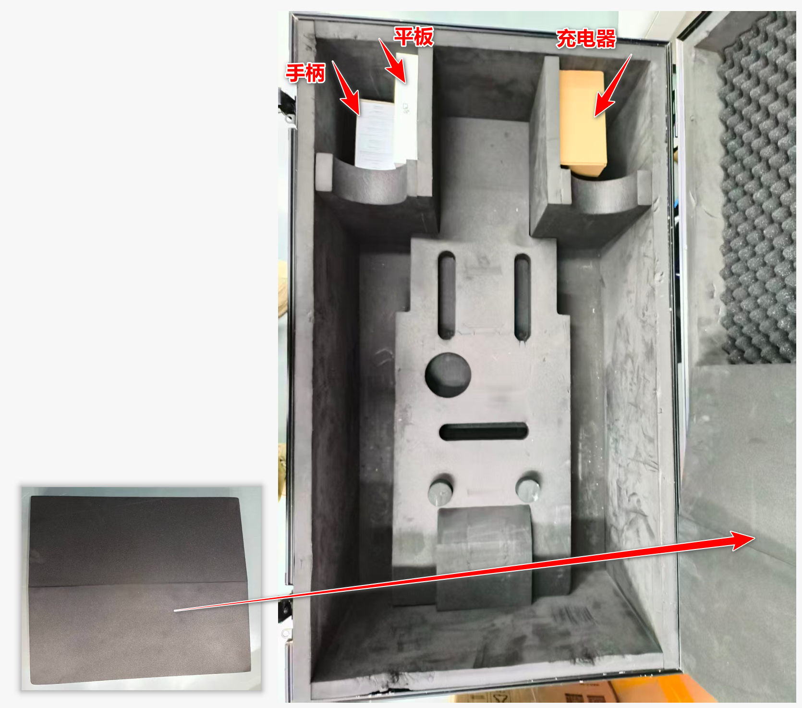
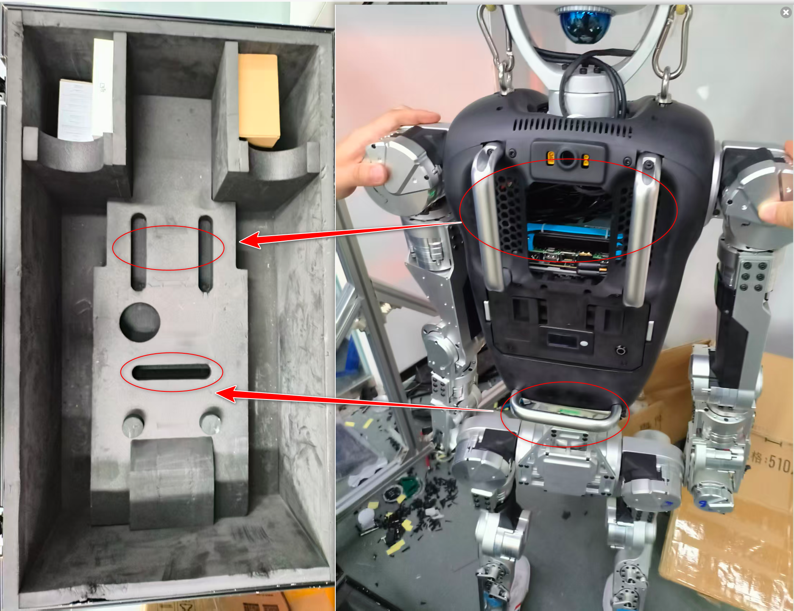
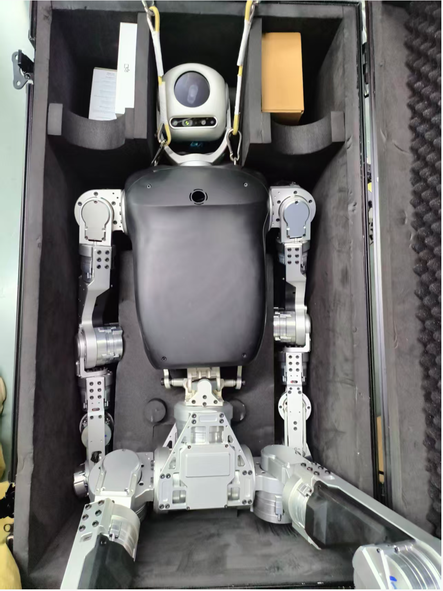
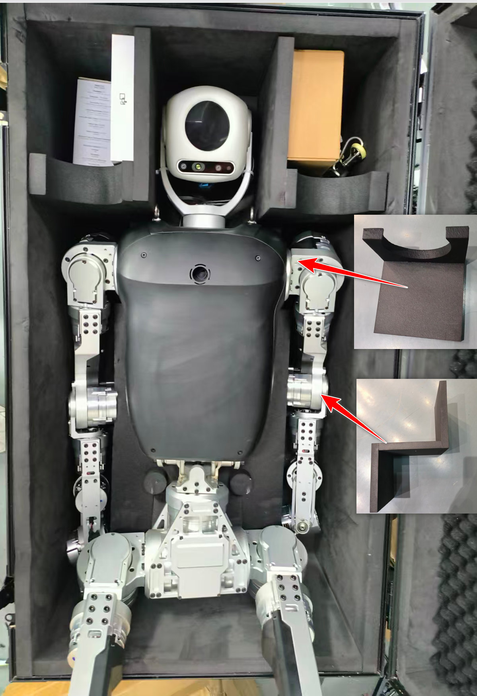
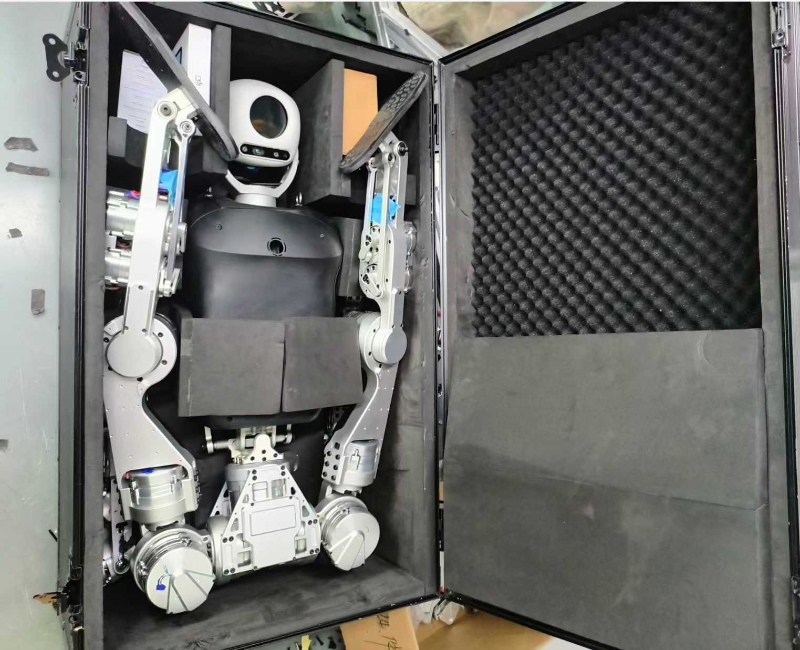

# Packaging Instructions

This page explains how to pack the ELF 3 robot back into its shipping case. Before starting, make sure the case, foam inserts, hoist, and lifting strap are in good condition, and reserve enough space for the operation.

!!! warning "Operation Safety"
    - At least 2 people are recommended for the whole process. Keep the robot stable during lifting and lowering.
    - Lower the robot slowly into the case to avoid hitting the case or compressing the foam inserts incorrectly.
    - Before closing the case, confirm that the lid can close naturally. Do not force the lid closed.

## Preparation

| Item | Requirement |
| :--- | :--- |
| Personnel | At least 2 people are recommended |
| Lifting | Prepare the hoist and robot lifting strap |
| Packing parts | Confirm that the case and all foam inserts are complete and identifiable |
| Accessories | Prepare the tablet, controller, charger, and leg foam inserts |

## Process Overview

| Step | Goal | Key Check |
| :--- | :--- | :--- |
| 1 | Place the accessories and leg foam inserts | All accessories are in their corresponding slots |
| 2 | Lift the robot and lower it into the case | The rear handle aligns with the foam recess |
| 3 | Place the arm and elbow foam inserts | The arms are seated in the lower foam slots |
| 4 | Position the legs and finish packing | The toes face the slot edge, and the lid can close naturally |

## Detailed Steps

### 1. Place Accessories and Leg Foam Inserts

**Operation**

- Place the tablet, controller, and charger into the corresponding slots in the case.
- Place the leg foam inserts into the case slots as shown.

**Check**

- Accessories should not sit higher than the surrounding foam surface.
- The leg foam inserts should match the orientation shown in the figure.

{ width="600" }

Figure 1

### 2. Lift the Robot and Lower It Into the Case

**Operation**

- After the accessories are placed, lift the robot with the hoist.
- Move the case under the robot, then lower the robot slowly.
- After the robot's hips contact the bottom foam insert, remove the upper hook from the hoist.

**Two-Person Coordination**

- One person lifts the robot's rear lifting strap.
- One person supports the robot's legs.
- Lower the robot while aligning the rear handle with the foam recess.
- After the robot is seated, remove the lifting strap from the robot and place it in the designated slot.

**Check**

- The robot's hips should rest on the bottom foam insert.
- The rear handle should align with the foam recess.
- The lifting strap should be removed and placed in its designated slot.

{ width="560" }

Figure 2-1

{ width="520" }

Figure 2-2

### 3. Place the Arm and Elbow Foam Inserts

**Operation**

- Pull the robot's left and right legs and slowly rotate the waist.
- Place the robot arms into the lower foam slots and seat them securely.
- Place the foam inserts around the arms and elbows.

**Check**

- The arms should be fully seated in the foam slots.
- The elbow foam inserts should not be loose or shifted.
- Avoid moving any joint into an extreme limit position during adjustment.

{ width="480" }

Figure 3

### 4. Position the Legs and Finish Packing

**Operation**

- Rotate the robot's legs.
- Slowly place the left and right legs into the positions shown.
- Keep the toes facing the edge of the slot.

**Check**

- The left and right legs should match the positions shown.
- The toes should face the edge of the slot.
- Foam inserts should not be squeezed out or visibly deformed.

{ width="620" }

Figure 4

## Final Check

!!! warning "Before Locking the Case"
    - Check whether the robot is still powered on before locking the case.
    - After closing the lid, check whether the lid is lifted or misaligned. If anything is abnormal, adjust it immediately.
    - Do not force the case closed. When the robot is placed correctly, the upper lid will not lift.
    - If the lid lifts, check whether the upper foam insert and foot positions are correct.
