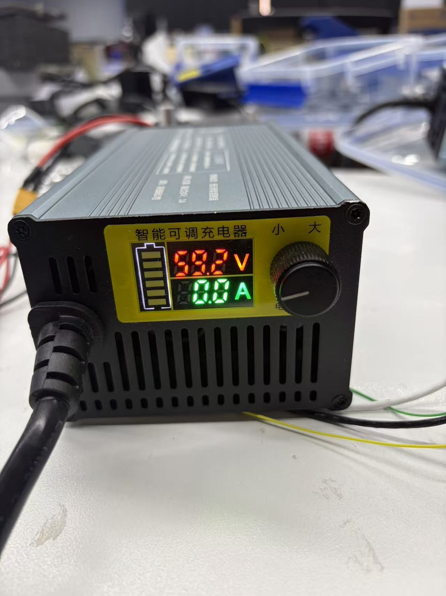

# Operation Guide

This document contains instructions for unboxing, basic operations, safety precautions, and secondary development for the Genie 3 ELF3 robot.

---

## Unboxing Instructions

1. **Placement and Unboxing**: Open the box face up, remove the surrounding foam, and lift the robot out with **at least two people**.
    - **Pay strict attention to the cable positions during extraction** to avoid crushing or tearing.
    - After taking it out, it is recommended to **suspend the robot using a hanger** or lay it flat on the ground.

2. **Backplate Structure Introduction**:
    - The following figure shows the backplate structure of the robot (*(Physical image pending)*).
    - **Upper Display Screen**: Shows voltage, battery level, and temperature. Press the button on the right side of the screen to wake it up and display the battery level; it will automatically turn off after 10 seconds.
    - **Lower Right**: The power switch button for the main battery.
    - **Upper Body**: Charging port.

3. **Host System Information**:
    - The host operating system of the robot is **Ubuntu 22**.
    - **Username**: `bxi`
    - **Password**: `12345`

---

## Power-on and Operation Steps

### 1. Turn on Battery Power & Host Power
- At this stage, the robot should be suspended on the hanger, with both feet touching the ground.
- Press the battery power button. The battery will supply power normally, and the voltage should display **above 45V**; the host will also power on simultaneously. **If the voltage is insufficient, it is recommended to charge it to above 47V before operating.**
- After the robot PC powers on, the Linux system starts running, **but the control program is not yet running**. At this time, the robot joint torque is 0, and it is in a **relaxed state**. It is recommended to hang the robot on a hanger at this point.

!!! tip "Charging Notes"
    The charger supports a charging voltage range of **42V–88V**. To adjust the charging voltage, **long-press the knob for 20 seconds** to enter adjustment mode.

    **Verify charger output voltage**: Connect the charger directly to a power source (without connecting to the robot) and check that the charger displays a voltage between **58V–60V**. If the voltage is outside this range, adjust it before connecting the robot.

    { width="300" }

### 2. Connect Remote Controller
Connect the remote controller to the robot PC via Bluetooth. The controller is pre-paired at the factory.
- **Long press the Xbox button** directly.
- Wait for the indicator light below the button to stay **solid**, which means the controller has successfully connected to the robot PC.

### 3. Run the Control Program
Watch the operation instruction video carefully.
The built-in control program of the robot has multiple modes: Zero Torque, PD Homing, Walk/Run, Dance, etc., and will be continuously updated.

!!! warning "Important: Pre-Movement Preparation"
    - To prevent accidental falls, ensure the robot is hung on a gantry crane using a lanyard, sitting on a chair, or sitting upright on the ground. **It is highly recommended to use a hanger and suspend the robot at an appropriate height.**
    - **Remove all cables from the body** (such as charging cables) to prevent tangling during movement.
    - **Make sure the battery has enough charge** (above 45V) so the robot does not fall because it cannot complete certain motions due to insufficient power.
    - **Always prioritize safety** during operation. **No one should enter the robot's motion range**, and avoid getting hit by the swinging joints of the robot.

#### 3.1 Start the Program    
!!! warning "Important: Pre-Zero-Position Check"    
    - Ensure the robot’s limbs are not in a posture that may cause motor stalling during the zero-position movement.    
*(It is recommended to remain suspended)*: After the robot powers on, **press the Right Stick (RS/R3)**. Observe the chest light of the robot; if it lights up, the control program has started running. It enters **Zero Torque mode** by default. After starting the program, the robot won't react until another button is pressed.

#### 3.2 Initial Position (Zeroing) Initialization
*(It is recommended to remain suspended)*:
- **Press `RB` + `B` simultaneously** to make the robot enter the initial position.
- **Check if the robot is normal**: Briefly observe if the motors have any anomalies (such as no response or abnormal noises).
- **Stand the robot up**: If everything is normal, stand the robot up in this state. The operator should assist in maintaining the zero-position standing state to prevent external forces from disrupting the zeroing process.

#### 3.3 Switch to Motion State
*(At this point, zeroing is complete, it is still recommended to remain suspended, and you can release the lanyard after a successful and stable switch)*:
- **Walk/Run Control State**: Press **`RB` + `X`** simultaneously. The robot enters the walk/run control state, where it can walk and run on flat ground.
- **Dance State**: While the robot is in the walk/run state (please stop walking first), press **`LB` + `X`** simultaneously to switch to the dance state. After the dance terminates, it will automatically switch back to the walking state.
- **Pause Dance**: During dancing, you can press **`X`** to pause. (*Note: Pausing at an awkward posture may cause the robot to lose balance and fall.*) Press **`X`** again to resume dancing, or press **`RB` + `X`** to exit dancing and return to the walk/run state.

---

## Shutdown and De-energization

- Press the **Terminate button**, the control program will exit automatically, and the robot motors will **immediately de-energize**. The robot will naturally fall due to gravity.
    > **Note**: Before shutdown, place a chair under the robot or hang it on a hanger to ensure it does not fall hard onto the ground.
- **Restart**: Return to Section 3.1 to restart the program.

---

## Gamepad Motion Control

| Function | Operation | Description |
| :--- | :--- | :--- |
| **Forward / Backward** | Right joystick | Push to control front/back; **long press** to increase speed. |
| **Left / Right Turn** | Left D-Pad | Press to control turning; **long press** to increase rotation speed. |

!!! tip "Advice for Beginners"
    When operating for the first time, hold the lanyard at all times to prevent falls. Press the stop button immediately if any anomaly occurs.

---

## Custom Program (SDK) Control

For developers who wish to control the robot via custom algorithms, ROS, or other programs.

The operating environment and low-level programs are pre-configured, fully supporting out-of-the-box usage.
- SDK and ROS2 example: <https://github.com/bxirobotics/bxi_rl_controller_ros2_example>

---

## Packing and Transportation

- **Avoid Limits**: Do not leave joints in mechanical dead zones or extreme limit positions.
- **Isolation Protection**: Insert original foam cushioning to prevent direct contact between metal casings during transportation.
