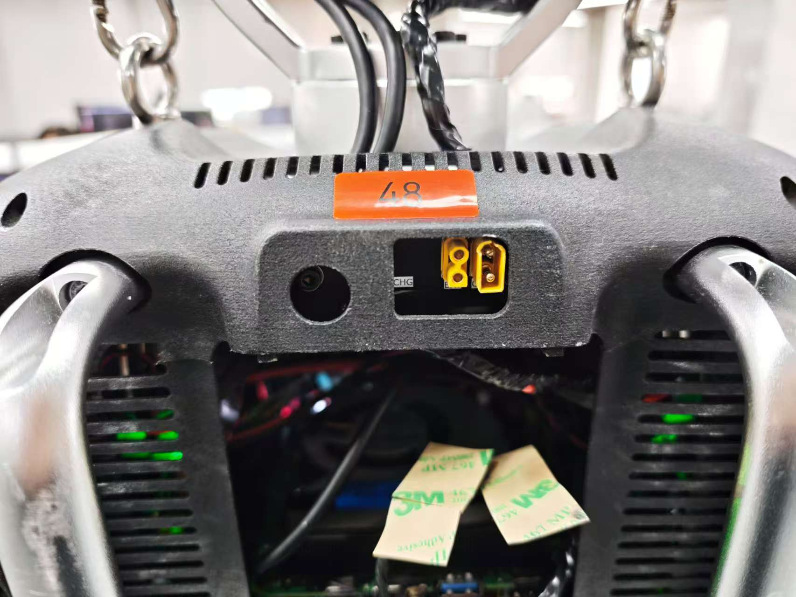
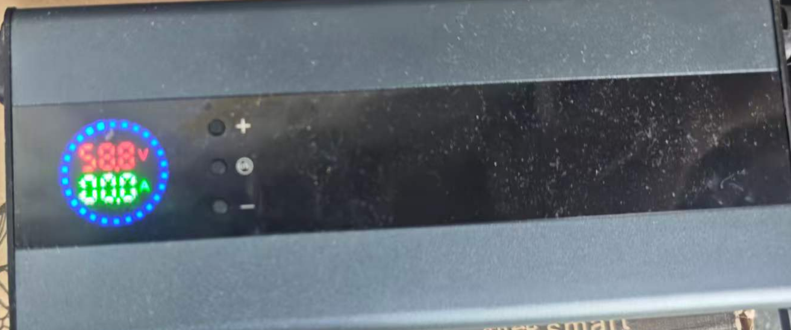
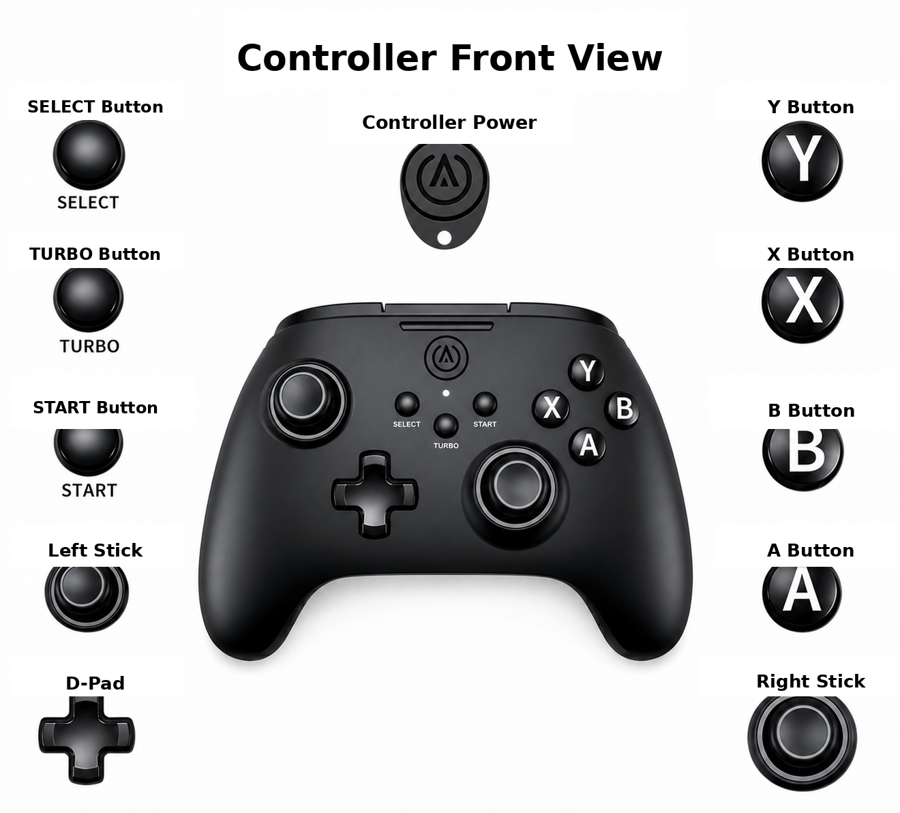
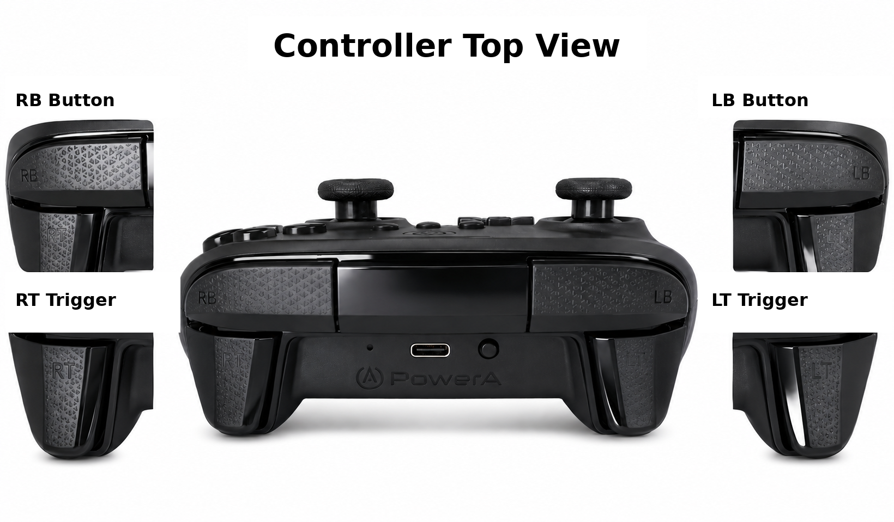

# Operation Guide    

This document contains instructions for unboxing, basic operations, safety precautions, and secondary development for the Genie 3 ELF3 robot.    
**Please read and follow the Robot Safety Instructions and Safety Guidelines before operating the robot**
---

## Unboxing Instructions

1. **Placement and Unboxing**: Open the box face up, remove the surrounding foam, and lift the robot out with **at least two people**.
    - **Pay strict attention to the cable positions during extraction** to avoid crushing or tearing.
    - After taking it out, it is recommended to **suspend the robot using a hanger** or lay it flat on the ground.

2. **Backplate Structure Introduction**:
    - The following figure shows the robot backplate structure (*(backplate and charging-port photo pending)*).
    - **Upper Display Screen**: Shows voltage, reference battery level, and temperature. Press the button on the right side of the screen to wake it up; it will automatically turn off after 10 seconds.
        - **Use the voltage value as the main battery-state reference**. The percentage / battery bars are for reference only and may not match the actual remaining capacity.
    - **Lower Right**: The power switch button for the main battery.
    - **Upper Body**: Charging port.

3. **Host System Information**:
    - The host operating system of the robot is **Ubuntu 22**.
    - **Username**: `bxi`
    - **Password**: `Contact the supplier to obtain`

---

## Power-on and Operation Steps

### 1. Turn on Battery Power & Host Power
- Press the battery power button. The battery will supply power normally, and the host will also power on simultaneously. Check the **voltage value** on the backplate display. The percentage / battery bars may be inaccurate, so use the voltage value as the reference.
- **Voltage note**:
    1. **New 58V machines**: The backplate display shows the current battery-pack voltage. When fully charged, the voltage is about **58V–60V**. The voltage gradually decreases during use. If the voltage is clearly low (**below 50V**), stop and charge the robot first.
    2. **Older 48V machines**: The backplate display shows the current battery-pack voltage. When fully charged, the voltage is about **48V–50V**. The voltage gradually decreases during use. If the voltage is clearly low (**below 40V**), stop and charge the robot first.

!!! tip "Charging Notes"
    The charger supports a charging voltage range of **42V-88V**. To adjust the charging voltage, **long-press the knob for 20 seconds** to enter adjustment mode.

    **Verify charger output voltage**: Connect the charger directly to a power source (without connecting to the robot) and check that the charger display is within the supplier-specified range:

    **Verify charger output voltage**: Connect the charger directly to a power source (without connecting to the robot) and check that the charger display is within the supplier-specified range:

    1. **Older machines with 48V batteries**: The recommended range is **48V–51V**. If the voltage is outside this range, adjust it before connecting the robot.
    2. **New machines with 58V batteries**: The recommended range is **58V–61V**. If the voltage is outside this range, adjust it before connecting the robot.

    **Note**: The percentage / battery bars may be inaccurate. Before powering on or moving the robot, use the voltage value as the primary battery-state reference.

    | Robot Backplate Charging Port | Charger Diagram |
    | :---: | :---: |
    | { width="300" } | { width="300" } |

### 2. Connect Remote Controller
Connect the remote controller to the robot PC via Bluetooth. The controller is pre-paired at the factory.
- **Long press the Xbox button** directly.
- Wait for the indicator light below the button to stay **solid**, which means the controller has successfully connected to the robot PC.

### 3. Run the Control Program
Watch the operation instruction video carefully.
The built-in control program of the robot has multiple modes: Walking, Zero Torque, Initial Posture, Zero-position, High-speed Run, Medium-speed Run, Dance, Recovery, Front Flip, Clap, Wave, etc., and will be continuously updated.

!!! warning "Important: Pre-Movement Preparation"
    - To prevent accidental falls, ensure the robot is hung on a gantry crane using a lanyard, sitting on a chair, or sitting upright on the ground. **It is highly recommended to use a hanger and suspend the robot at an appropriate height.**
    - **Remove all cables from the body** (such as charging cables) to prevent tangling during movement.
    - **Make sure the battery voltage is sufficient** (55V or above is recommended; use the backplate display voltage, not the percentage / battery bars) so the robot does not fall because it cannot complete certain motions due to insufficient power.
    - **Always prioritize safety** during operation. **No one should enter the robot's motion range**, and avoid getting hit by the swinging joints of the robot.

#### 3.1 Start the Program    
!!! warning "Important: Pre-Initial-Posture Check"
    - Ensure the robot’s limbs are not in a posture that may cause motor stalling when switching to the initial posture.
*(It is recommended to remain suspended)*: After the robot powers on, **press the Right Stick (RS/R3)**. Observe the chest light of the robot; if it lights up, the control program has started running. It enters **Zero Torque mode** by default. After starting the program, the robot won't react until another button is pressed.

#### 3.2 Initial Posture Initialization
*(It is recommended to remain suspended)*:
- **Press `RB` + `B` simultaneously** to make the robot enter the initial posture.
- **Check if the robot is normal**: Briefly observe if the motors have any anomalies (such as no response or abnormal noises).
- **Stand the robot up**: If everything is normal, stand the robot up in this state, with **both feet touching the ground**. The operator should assist in maintaining the initial-posture standing state to prevent external forces from disrupting the posture initialization.

#### 3.3 Switch to Motion State
*(At this point, initial-posture initialization is complete, it is still recommended to remain suspended, and you can release the lanyard after a successful and stable switch)*:
- **Walking State**: Press **`RB` + `X`** simultaneously. The robot enters the walking state, where it can move omnidirectionally on flat ground.
- **Dance State**: While the robot is in the walking state (please stop walking first), press **`LB` + `X`** simultaneously to switch to the dance state. After the dance terminates, it will automatically switch back to the walking state.
- **Pause Dance**: During dancing, you can press **`X`** to pause. (*Note: Pausing at an awkward posture may cause the robot to lose balance and fall.*) Press **`X`** again to resume dancing, or press **`RB` + `X`** to exit dancing and return to the walking state.

---

## Shutdown and De-energization

- Press **Start**, the control program will exit automatically, and the robot motors will **immediately de-energize**. The robot will naturally fall due to gravity.
    > **Note**: Before shutdown, place a chair under the robot or hang it on a hanger to ensure it does not fall hard onto the ground.
- **Restart**: Return to Section 3.1 to restart the program.

---

## Gamepad Motion Control

**Remote controller power indicator colors**: A solid light means the controller is connected successfully. White indicates 2.4G wireless connection, blue indicates Bluetooth connection, and green indicates USB wired connection. A flashing red battery indicator means the battery is low.

**Remote controller mode switch**: The mode switch is located on the bottom/back of the controller near the USB-C port. It has three positions: `USB`, `BT`, and `RF`.

- `USB`: USB wired connection mode, using a USB-C data cable to connect to the PC.
- `BT`: Bluetooth connection mode, used to connect to the robot PC via Bluetooth.
- `RF`: 2.4G wireless connection mode, used with a 2.4G USB receiver. The 2.4G USB receiver is located in the controller box by default.

| Mode Level | Mode Name | Button Combination | Switchable Modes | Notes |
| :--- | :--- | :--- | :--- | :--- |
| Normal | Walking | RB + X | **All modes** | Omnidirectional movement, with some obstacle-avoidance ability |
| Normal | Zero Torque | RB + A | Initial Posture / Zero-position | Joints output no torque and can be rotated freely |
| Normal | Initial Posture | RB + B | Walking / Zero Torque / Zero-position / Recovery | Joints hold the initial posture |
| Normal | Zero-position | RB + Y | Initial Posture / Zero Torque | All joints hold the zero position |
| Advanced | Dance | LB + X | Walking / Zero Torque / press `X` to pause or resume | Automatically returns to Walking after completion. While paused, the robot may move to maintain balance (Make sure there are no obstacles within 1 m around the robot) |
| Advanced | Recovery | LB + A | Zero Torque | Use only when the robot is lying face down or on its back. After standing up, it automatically returns to Walking (Make sure there are no obstacles within 1 m around the robot) |
| Advanced | High-speed Run | LB + Y | Walking | Up to about 4 m/s, with no obstacle-crossing ability |
| Advanced | Medium-speed Run | LB + B | Walking | Up to about 2 m/s, with no obstacle-crossing ability |
| Advanced | Front Flip | LT + Y | Zero Torque | Keep the front 3 m clear of obstacles. After completion, it automatically returns to Walking |
| Normal | Clap | RT + B | Walking / press `X` to pause or resume | Automatically returns to Walking after completion |
| Normal | Wave | RT + A | Walking / press `X` to pause or resume | Does not automatically return to Walking |

!!! tip "Advice for Beginners"
    When operating for the first time, hold the lanyard at all times to prevent falls. Be familiar with the controller button positions before operation. Press the stop button immediately if any anomaly occurs.

---

## Custom Program (SDK) Control

For developers who wish to control the robot via custom algorithms, ROS, or other programs.

The operating environment and low-level programs are pre-configured, fully supporting out-of-the-box usage.
- SDK and ROS2 example: <https://github.com/bxirobotics/bxi_rl_controller_ros2_example>

---

## Packing and Transportation

> [To be added: insert packing guide images here]

- **Avoid Limits**: Do not leave joints in mechanical dead zones or extreme limit positions.
- **Isolation Protection**: Insert original foam cushioning to prevent direct contact between metal casings, especially between two motor housings, during transportation.
