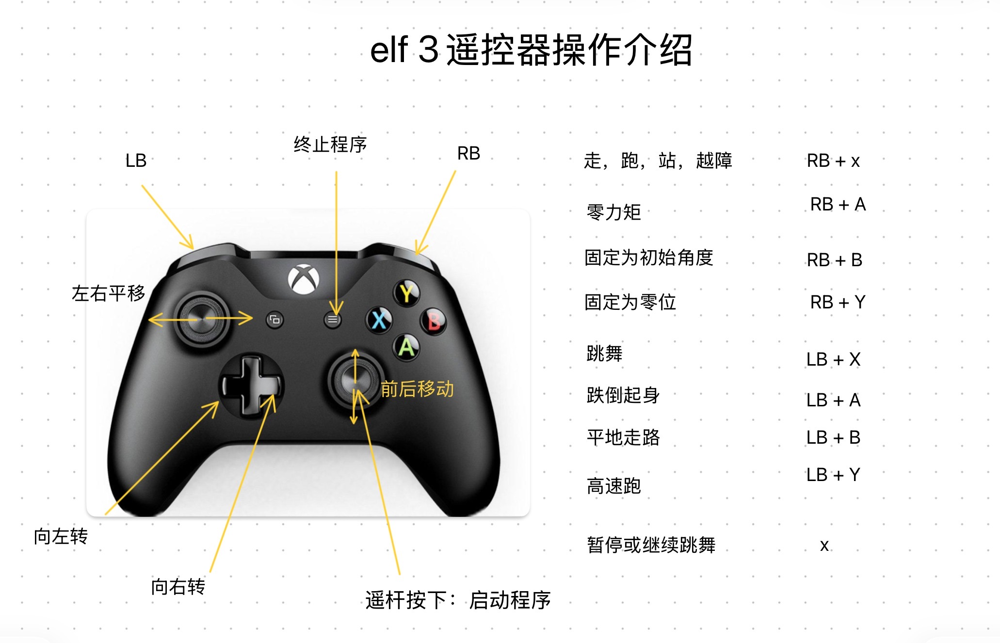

# 操作指南

本文档包含 ELF3 机器人的开箱、基础操作、安全注意事项及二次开发相关说明。

---

## 开箱说明

1. **摆放与取出**：正面朝上开箱，移除四周泡沫，**至少两人配合**抬出机器人。
    - 取出过程中**一定注意线缆位置**，避免压折或扯断。
    - 取出后，建议使用支架吊起机器人；或以平躺姿势放在平的地面上。

2. **背板结构介绍**：
    - 下图为机器人背板结构（*(暂缺实物图)*）。
    - **上侧显示屏**：为电压、电量和温度显示屏。按动显示屏右侧按钮亮屏显示电量，10秒后自动熄灭。
    - **右下方**：为整机电池的开关按钮。
    - **身体上方**：为充电接口。

3. **主机系统信息**：
    - 机器人的主机操作系统为 **Ubuntu 22**。
    - **Username**: `bxi`
    - **Password**: `联系供应商获取`

---

## 开机运行步骤

### 1. 打开电池电源 & 主机开机
- 按电池电源按钮，电池正常供电，电压应显示在 **45V 以上**；同时主机也会随之开机。
- 如果电压不足，建议先充电到 48V 以上再进行操作。
- 机器人 PC 机开机后，Linux 系统开始运行，**但是控制程序没有运行**。此时机器人关节扭矩是 0，处于**松弛状态**。建议此时将机器人挂在吊架上。

### 2. 连接遥控器手柄
将遥控器手柄和机器人 PC 机通过蓝牙连接。手柄出厂时已提前配对好。
- 直接**长按 Xbox 按钮**。
- 等待按钮下方指示灯**常亮**，即代表手柄和机器人 PC 机连接成功。

### 3. 运行控制程序
机器人自带的控制程序有若干模式：零力矩、PD 回零、走跑、跳舞等，并会持续更新。

!!! warning "重要：机器人起身运动前准备"
    - 为了防止意外摔落，确保机器人通过挂绳挂在龙门架、或坐在椅子上、或正坐在地上。**强烈建议使用吊架，并将机器人悬挂到合适高度**。
    - **移除机身所有电线**（例如充电头等），以防止在运动时发生拉扯。
    - 详细观看操作说明视频。运行过程中**一定注意安全**，避免机器人的关节挥舞击中身体。

#### 3.1 启动程序
*(建议此时仍处于吊装状态)*：机器人开机后，**点按右手柄摇杆 (RS/R3)**。观察机器人胸前灯，灯亮表明控制程序已经开始运行。此时默认进入**零力矩模式**。启动程序后，在未按下其它按键前，机器人不会有任何反应。

#### 3.2 初始位置 (零位) 初始化
*(建议此时仍处于吊装状态)*：
- **同时按 `RB` + `B`**，使机器人进入初始位置。
- **检测机器人是否正常**：简单观察各电机是否有异常（例如没有反应或发出异响等）。
- **将机器人站起**：若一切正常，在此状态下将机器人站立起。操作人员应协助保持机器人零位站立状态，避免外力破坏零位初始化。

#### 3.3 切换到运动状态
*(此步骤零位初始化已完成，最好仍处于吊装状态，切换成功并稳定后可以放开吊绳)*：
- **走跑控制状态**：同时按 **`RB` + `X`**。机器人进入走跑控制状态，此时可以在平地上行走和跑动。
- **跳舞状态**：在机器人走跑状态下（请先停住脚步），同时按 **`LB` + `X`**，切换为跳舞状态。跳舞结束后会自动切换回走路状态。
- **暂停跳舞**：跳舞过程中可以按 **`X`** 暂停。（注意：可能因为暂停时刻的位姿不妥而导致失去平衡摔倒）。暂停后再次按 **`X`** 恢复跳舞，或按 **`RB` + `X`** 退出跳舞回到走跑状态。

---

## 停机与失能

#### 4.1 终止停机 (失能按键)
- 按**终止按键**，控制程序会自动退出，机器人电机将**立即失能 (掉电)**，机器人将因为重力自然摔倒。
    > **注意**：正常停机前，应该将椅子放置于机器人下方，或将机器人挂到龙门架/吊架上，确保机器人失能后**不会重摔在地**。
- **再次启动**：需要回到第 3.1 节重新启动程序。

---

## 手柄运动按键说明

| 功能 | 操作方式 | 说明 |
| :--- | :--- | :--- |
| **前进 / 后退** | 右下角摇杆 | 推动遥杆控制前后；**长按**可提高直线运动速度 |
| **左 / 右转向** | 左下角十字方向键 | 按压方向键控制转向；**长按**可提高旋转速度 |

!!! tip "新手操作建议"
    首次操作时由于对机器人不熟悉，建议**全程用手牵住机器人身上的挂绳**，防止机器人在遇到障碍物或发生误操作时摔倒受损。操作之前务必熟悉遥控器按键位置。在机器人运行过程中若有任何异常，请**及时按停止按钮**，避免对人员、周围物体和机器人本身造成损坏。

---

## 使用自定义程序 (SDK) 控制机器人

本条适用于**不使用预制程序及遥控器手柄**，希望通过自定义算法、ROS 等程序控制机器人运动的开发者。

机器上的运行环境以及底层程序已经准备好，完全支持“开箱即用”。
- 配套 SDK 与 ROS2 示例链接：
  <https://github.com/bxirobotics/bxi_rl_controller_ros2_example>

---

## 装箱与运输说明

> 【补充：此处待插入装箱指导图片】

在闲置打包或运输时，请务必注意以下几点：
- **避免限位**：尽量使关节**不要**处于机械死区或极端的限位位置。
- **隔离保护**：通过塞入原厂的泡沫缓冲件，避免金属壳体（特别是两个电机壳体之间）发生直接接触。以免在长途运输过程中因颠簸造成硬碰撞与壳体变形，进而引发内部电气故障。
