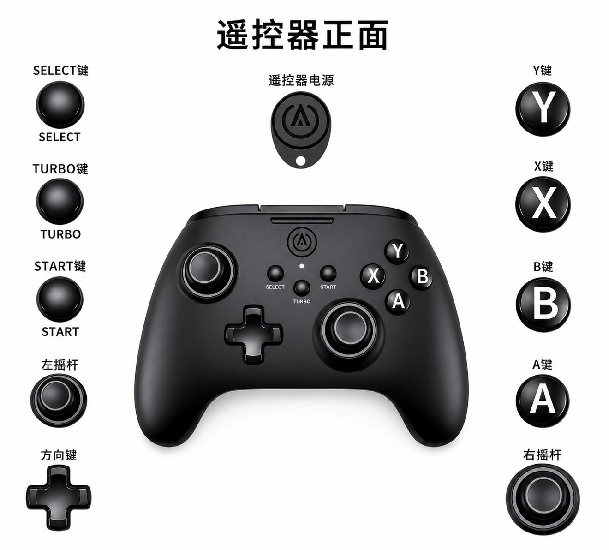
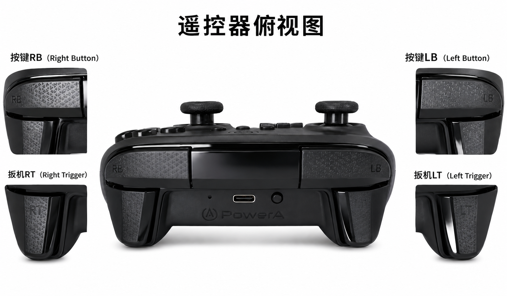

# 操作指南

本文档包含 精灵3 ELF3 机器人的开箱、基础操作、安全注意事项及二次开发相关说明。    
**在操作机器人之前请务必阅读并遵守《机器人安全须知及安全准则》**    

---

## 开箱说明

1. **摆放与取出**：正面朝上开箱，移除四周泡沫，**至少两人配合**抬出机器人。
    - 取出过程中**一定注意线缆位置，避免压折或扯断**。
    - 取出后，建议**使用支架吊起机器人**；或以平躺姿势放在平的地面上。

2. **背板结构介绍**：
    - 下图为机器人背板结构（*(待补充背板及充电口实物图)*）。
    - **上侧显示屏**：为电压、参考电量和温度显示屏。按动显示屏右侧按钮亮屏，10秒后自动熄灭。
        - **电压值是判断电池状态的主要依据**；屏幕上的电量百分比 / 电量格仅作参考，可能与实际剩余电量不一致。
    - **右下方**：为整机电池的开关按钮。
    - **身体上方**：为充电接口。

3. **主机系统信息**：
    - 机器人的主机操作系统为 **Ubuntu 22**。
    - **Username**: `bxi`
    - **Password**: `联系供应商获取`

---

## 开机运行步骤

### 1. 打开电池电源 & 主机开机    
- 按电池电源按钮，电池正常供电，同时主机也会随之开机。此时请查看背板显示屏的**电压值**，电量百分比 / 电量格可能不准，以电压值为准。
- **电压说明**：
    1. **58V 新机器**：背板显示屏显示的是电池组当前电压。充满电时，电压约 **58V–60V**；随着使用时间增加，电压会逐步下降。若电压明显偏低（**低于 50V**），请先停止操作并充电。
    2. **48V 老机器**：背板显示屏显示的是电池组当前电压。充满电时，电压约 **48V–50V**；随着使用时间增加，电压会逐步下降。若电压明显偏低（**低于 40V**），请先停止操作并充电。

!!! tip "充电说明"
    充电器支持 **42V–88V** 的充电电压范围。如需调节充电电压，可**长按旋钮 20 秒**进入调节模式。

    **验证充电器输出电压**：可直接将充电器接上电源（不接机器人），检查充电器显示电压是否在供应商指定范围内：

    1. **48V 电池的老机器**：推荐范围为 **48V–51V**。若超出此范围，请先调节后再连接机器人充电。
    2. **58V 电池的新机器**：推荐范围为 **58V–61V**。若超出此范围，请先调节后再连接机器人充电。

    **注意**：电量百分比 / 电量格显示可能不准确，开机和运动前请优先以电压值判断电池状态。

    | 机器人背板充电口 | 充电器示意图 |
    | :---: | :---: |
    | { width="300" } | { width="300" } |

### 2. 连接遥控器手柄
将遥控器手柄和机器人 PC 机通过蓝牙连接。手柄出厂时已提前配对好。
- 直接**长按 Xbox 按钮**。
- 等待按钮下方指示灯**常亮**，即代表手柄和机器人 PC 机连接成功。

### 3. 运行控制程序
详细观看操作说明视频。    
机器人自带的控制程序有若干模式：走路、零力矩、初始姿态、零位、高速奔跑、中速奔跑、跳舞、起身、前空翻、鼓掌、挥手等，并会持续更新。

!!! warning "重要：机器人起身运动前准备"
    - 为了防止意外摔落，确保机器人通过挂绳挂在龙门架、或坐在椅子上、或正坐在地上。**强烈建议使用吊架，并将机器人悬挂到合适高度**。
    - **移除机身所有电线**（例如充电头等），以防止在运动时发生拉扯；
    - **确保电池电压充足**（以背板显示屏的电压值为准，55V以上为宜，不以电量百分比 / 电量格为准），以避免机器人因电池功率不足无法完成某些动作造成的摔落；
    - 运行过程中**一定注意安全**，**机器人运动范围禁止有人**，避免机器人的关节挥舞击中身体；

#### 3.1 启动程序    
!!! warning "重要：切换初始姿态前检查"
    - 确保机器人的四肢未处于切换初始姿态时可能堵转的姿态。
*(建议此时仍处于吊装状态)*：机器人开机后，等待约 **30 秒**，待系统启动完成后，**向下点按右摇杆 (RS/R3)** 启动机器人。观察机器人胸前灯，灯亮表明控制程序已经开始运行。此时默认进入**零力矩模式**。胸前灯亮起后，等待约 **10 秒** 完成自检，再控制机器人切换初始姿态、走路等模式。

#### 3.2 初始姿态初始化
*(建议此时仍处于吊装状态)*：
- **同时按 `RB` + `B`**，使机器人进入初始姿态。
- **检测机器人是否正常**：简单观察各电机是否有异常（例如没有反应或发出异响等）。
- **将机器人站起**：若一切正常，在此状态下将机器人站立起，**双脚接触地面**。操作人员应协助保持机器人初始姿态站立状态，避免外力破坏姿态初始化。

#### 3.3 切换到运动状态
*(此步骤初始姿态初始化已完成，最好仍处于吊装状态，切换成功并稳定后可以放开吊绳)*：
- **走路状态**：同时按 **`RB` + `X`**。机器人进入走路状态，此时可以在平地上全向移动。

---

## 停机与失能

#### 4.1 终止停机 (失能按键)
- 按**start**，控制程序会自动退出，机器人电机将**立即失能 (掉电)**，机器人将因为重力自然摔倒。
    > **注意**：正常停机前，应该将椅子放置于机器人下方，或将机器人挂到龙门架/吊架上，确保机器人失能后**不会重摔在地**。
- **再次启动**：需要回到第 3.1 节重新启动程序。

---

## 手柄运动按键说明

**遥控器电源指示灯颜色说明**：常亮表示连接成功。白色表示 2.4G 无线连接，蓝色表示蓝牙连接，绿色表示 USB 有线连接；电池指示灯红色闪烁表示电量低。

**遥控器档位切换说明**：模式拨动开关位于遥控器底部/背面、USB-C 接口附近，共有 `USB`、`BT`、`RF` 三个档位。

- `USB`：USB 有线连接模式，使用 USB-C 数据线连接 PC。
- `BT`：蓝牙连接模式，用于通过蓝牙连接机器人 PC。
- `RF`：2.4G 无线连接模式，需配合 2.4G USB 接收器使用。2.4G USB 接收器默认位于遥控器盒内。

### 移动方向控制

在**走路**、**高速奔跑**和**中速奔跑**状态下，可使用以下输入控制机器人移动：

| 键位 | 操作 | 控制效果 |
| :--- | :--- | :--- |
| 右摇杆 | 向前或向后推动 | 前进 / 后退 |
| 左摇杆 | 向左或向右推动 | 左平移 / 右平移 |
| 方向键 | 按下 `←` 或 `→` | 左旋转 / 右旋转 |

!!! note "速度说明"
    机器人运动速度与摇杆推动幅度有关：摇杆推动幅度越大，速度越快；推动幅度越小，速度越慢。

| 模式等级 | 模式名称 | 按键组合 | 可切换的模式 | 备注 |
| :--- | :--- | :--- | :--- | :--- |
| 普通 | 走路 | RB + X | **所有模式** | 全向运动，一定的避障能力 |
| 普通 | 零力矩 | RB + A | 初始姿态 / 零位 | 关节无力矩输出，可随意转动 |
| 普通 | 初始姿态 | RB + B | 走路 / 零力矩 / 零位 / 起身 | 关节固定在初始姿态 |
| 普通 | 零位 | RB + Y | 初始姿态 / 零力矩 | 所有关节保持在零位 |
| 进阶 | 跳舞 | LB + X | 走路 / 零力矩 / 单按“X”键暂停或继续 | 结束后自动切回走路；暂停时机器人会移动来保持平衡（请确保机器人周围1米范围内没有障碍物） |
| 进阶 | 起身 | LB + A | 零力矩 | 需机器人趴着或躺在地上时切换；起身后自动切回走路（请确保机器人周围1米范围内没有障碍物） |
| 进阶 | 高速奔跑 | LB + Y | 走路 | 最高约 4 m/s，没有越障能力 |
| 进阶 | 中速奔跑 | LB + B | 走路 | 最高约 2 m/s，没有越障能力 |
| 进阶 | 前空翻 | LT + Y | 零力矩 | 需要前方 3 米范围内无障碍物；完成后自动切回走路 |
| 普通 | 鼓掌 | RT + B | 走路 / 单按“X”键暂停或继续 | 完成后自动切回走路 |
| 普通 | 挥手 | RT + A | 走路 / 单按“X”键暂停或继续 | 不会自动回到走路 |

!!! tip "新手操作建议"
    首次操作时由于对机器人不熟悉，建议**全程用手牵住机器人身上的挂绳**，防止机器人在遇到障碍物或发生误操作时摔倒受损。操作之前务必熟悉遥控器按键位置。在机器人运行过程中若有任何异常，请**及时按停止按钮**，避免对人员、周围物体和机器人本身造成损坏。

---

## 使用自定义程序 (SDK) 控制机器人

本条适用于**不使用预制程序及遥控器手柄**，希望通过自定义算法、ROS 等程序控制机器人运动的开发者。

机器上的运行环境以及底层程序已经准备好，完全支持“开箱即用”。
- 配套 SDK 与 ROS2 示例链接：
  <https://github.com/bxirobotics/bxi_rl_controller_ros2_example>

---

## 装箱与运输说明

> 【补充：此处待插入装箱指导图片】

在闲置打包或运输时，请务必注意以下几点：
- **避免限位**：尽量使关节**不要**处于机械死区或极端的限位位置。
- **隔离保护**：通过塞入原厂的泡沫缓冲件，避免金属壳体（特别是两个电机壳体之间）发生直接接触。以免在长途运输过程中因颠簸造成硬碰撞与壳体变形，进而引发内部电气故障。
