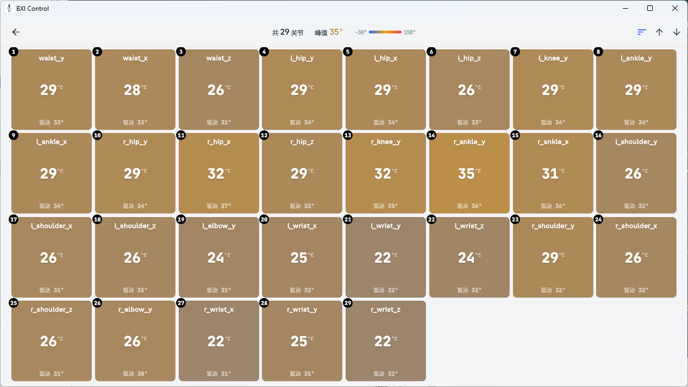

# BXI Control App User Guide

BXI Control is a professional remote control application for BXI robots, supporting Android and Windows platforms. Users can connect to robots via WiFi or Bluetooth for real-time remote control, video monitoring, telemetry data viewing, and firmware upgrades.

!!! warning "Important Notice"

    It is strongly recommended to use the control app only in an indoor environment with a stable WiFi connection. Avoid using it without WiFi — the tablet's Bluetooth signal is weak and prone to disconnection, which may lead to loss of control.

---
- Download: [Go to Download Page](https://download.bxirobotics.cn/%E6%8E%A7%E5%88%B6APP/Android)

## Interface Overview

The app has two main navigation tabs at the bottom:

| Tab | Description |
| :--- | :--- |
| **Control** | Robot connection entry point (core feature) |
| **My** | User profile, settings, diagnostics, and firmware upgrade |

---

## Connecting to a Robot

**First-time use** requires completing Bluetooth pairing via the "My" tab to connect the robot to a WiFi network. After pairing, use the "Control" tab daily to connect via WiFi or Bluetooth.

---

### First-Time Pairing (Bluetooth Provisioning)

On first connection, WiFi credentials are sent to the robot via Bluetooth so it can join the local network.

**Entry:** Bottom **"My"** tab → **Bluetooth Pairing**

**Steps:**

1. On the Bluetooth Pairing page, tap **"Scan for Bluetooth Devices"** and wait for nearby robots to appear.

    

2. Find the target robot in the list and tap **"Connect"**, then wait for the Bluetooth connection to establish.

3. Once connected, a WiFi configuration form appears:
    - **Network Name (SSID):** Select from the dropdown (the app auto-fills the phone's current WiFi), or enter manually;
    - **Password:** Enter the corresponding WiFi password.

    

4. Tap **"Connect to Wi-Fi"** — the robot receives the credentials via Bluetooth and connects automatically.

5. On success, the robot's IP address is displayed and the device is saved to the history list.

    

6. Tap **"Continue to Control"** to enter the control interface.

!!! tip "No re-pairing needed for future connections"
    After completing Bluetooth provisioning once, the device IP is saved to the history list. Simply tap Connect on the "Control" page for all future sessions.

---

### WiFi Connection (Daily Use)

After pairing, ensure your phone/PC and the robot are on the **same local network**, then connect via WiFi. WiFi mode supports live video and telemetry data.

**Entry:** Bottom **"Control"** tab (WiFi mode by default)

**Steps:**

1. On the "Control" page, tap **"Scan LAN"** to discover online robots, or check already-saved devices under "History Devices" for their online status.
2. Tap the **"Control"** button next to the target robot to enter the control interface.

!!! tip "Device offline troubleshooting"
    If a device does not appear or shows as offline, check that the robot is powered on and connected to WiFi, and that your phone/PC is on the same subnet.

**Manually editing device IP:**

In the history device list, swipe left on a device entry to reveal edit and delete actions; long-press also opens an edit menu to update the IP address.

!!! tip "Manual editing is rarely needed"
    The app updates device IPs automatically. Manual editing is only needed if automatic updates fail or in unusual network environments.

---

### Bluetooth Direct Connection (No WiFi Required)

Bluetooth mode requires no local network and is suitable for environments without WiFi, but **does not support video streaming or telemetry data**.

**Entry:** Bottom **"Control"** tab → switch to **Bluetooth mode**

**Steps:**

1. Tap the toggle in the top-right of the "Control" page to switch to Bluetooth mode.
2. Tap **"Scan for Bluetooth Devices"**, find the target robot, and tap **"Control"** to establish a Bluetooth connection and enter the control interface.

!!! warning "Bluetooth mode limitations"
    Bluetooth connection only supports sending motion control commands. **Video streaming and telemetry data are not supported.** Use WiFi mode if you need to view the robot's camera feed.

---

## Control Interface

After connecting, the app enters a full-screen landscape control interface. The main areas are:

### Interface Areas

| Area | Location | Function |
| :--- | :--- | :--- |
| **Main View** | Center | Live video in WiFi mode, or switchable to 3D robot pose view; blank placeholder in Bluetooth mode |
| **Secondary View** | Bottom-right overlay | 3D pose or video in WiFi mode; tap to swap with main view; unavailable in Bluetooth mode |
| **Left Virtual Joystick** | Bottom-left | Controls forward/backward/left/right translation |
| **Right Virtual Joystick** | Bottom-right | Controls rotation and height |
| **Left Island** | Left-center | Quick action menu, preset action menu, 3D view toggle |
| **Right Island** | Right-center | Telemetry toggle, gamepad overlay toggle, quick settings |
| **Top Bar (Left)** | Top-left | Back, refresh video, diagnostics shortcut |
| **Top Bar (Right)** | Top-right | Signal quality, battery level, Start/Stop |

---

### Top Bar

**Left side:**

- **Back:** Exit the control interface
- **Refresh Video:** Re-establish the WebRTC video connection
- **Diagnostics Shortcut:** Jump directly to the Status Check page (WiFi mode only)

!!! tip "About the diagnostics shortcut"
    This shortcut is equivalent to navigating via "My" → Status Check, but automatically sets DOMAIN_ID to **22** (the app's dedicated control domain), so you can quickly inspect the current control session without manual configuration.

**Right side:**

- **Signal Quality:** Shows RTT (ms) in WiFi mode or RSSI (dBm) in Bluetooth mode; color-coded green/orange/red
- **Battery Level:** Robot battery percentage; color changes with charge level
- **Start / Stop:** Send a start or stop command to the robot's control program

!!! warning "Start/Stop notes"
    - The system waits up to **35 seconds** for the robot to respond; a prompt appears on timeout;
    - A cooldown period between commands prevents accidental repeated sends;
    - After Stop, robot motors are disabled — ensure the robot is in a safe posture before stopping.

---

### Left Island

- **Preset Action Menu:** Lists available preset actions; only one can be active at a time; the active button is highlighted
- **3D View Toggle:** Switch the main view to the 3D robot pose visualization (WiFi mode only)

---

### Right Island

- **Telemetry Button:** Toggle the telemetry panel, which shows real-time speed (m/s), position (m), and voltage (V)
- **Gamepad Overlay Button:** Show/hide the gamepad input status overlay to monitor axis and button states
- **Quick Settings Button:** Open the settings interface

---

### Virtual Joystick

- **Left joystick:** Controls translational movement (forward/backward/left/right)
- **Right joystick:** Controls rotation (left/right turn) and height

**Left/Right-hand mode:** Switch joystick layout in Settings → Control to match your preferred grip.

!!! tip "Keyboard support (PC)"
    On Windows, keyboard control is also available:
    - `W` / `S`: Forward / Backward
    - `A` / `D`: Strafe Left / Right
    - Arrow `←` / `→`: Rotate Left / Right
    - Arrow `↑` / `↓`: Increase / Decrease height

---

### Gamepad Control

When an external gamepad (USB or Bluetooth) is connected, the app automatically detects it and sends commands at 30 Hz for smoother response.

**Default axis mapping:**

| Input | Function |
| :--- | :--- |
| Left stick up/down & left/right | Forward/backward & lateral translation |
| Right stick left/right | Rotation |
| Right stick up/down | Height |
| `LB` / `RB` combos | Trigger mode switches in combination with other buttons |

**Left/Right-hand mode:** Switch the gamepad grip layout in Settings → Control.

---

## Settings

Access settings via the **"My"** tab → **Device Settings**.

### Network

| Parameter | Description |
| :--- | :--- |
| **LAN Scan** | Scan for online robots on the same subnet |
| **Bluetooth Toggle** | Enable or disable Bluetooth |
| **Pair New Robot** | Start the Bluetooth provisioning flow to configure WiFi for a robot |

### Control

| Parameter | Description |
| :--- | :--- |
| **Speed Profile** | Switch between Walk and Run speed profiles |
| **Joystick Deadzone** | Center dead zone size (0.00–0.30) to prevent drift |
| **Output Speed Range** | Min/max limits for translational speed output |
| **Output Rotation Range** | Min/max limits for rotational speed output |
| **Enable Gamepad** | Enable or disable external gamepad input |
| **Show Gamepad Overlay** | Show/hide the gamepad input status overlay in the control interface |
| **Gamepad Hand Mode** | Switch between left-hand and right-hand grip layout |
| **Sector Profile** | Joystick direction snap mode (Standard 20° / Relaxed 32°); available in right-hand mode |

### Video

| Parameter | Description |
| :--- | :--- |
| **Video Quality** | Select video stream resolution (1080p) |
| **Show Video Stats** | Overlay bitrate/FPS statistics on the control interface |

### Appearance

| Parameter | Description |
| :--- | :--- |
| **Theme** | Switch color scheme (System / Light / Dark) |
| **Language** | Switch UI language (涓枃 / English) |

### About

Displays the app version, copyright information, and privacy policy links. Supports one-tap update check.

---

## Status Diagnostics

In the **"My"** tab, tap **"Status Check"** to enter the diagnostics interface. After selecting a robot and confirming the `DOMAIN_ID`, the following five diagnostic items are available:

### Logs

View the latest robot log file with real-time appending.

### Battery

Real-time display of battery SOC percentage, voltage, current, and temperature, with trend sparkline charts.

### Joint Temperature

Real-time display of each joint motor's temperature to identify overheating joints.

### 3D Pose

View the robot's joint and chassis pose in real time using a digital twin.

### Terminal

SSH into the robot to execute commands directly in a terminal — useful for debugging and troubleshooting.

!!! tip "Multi-domain access"
    The diagnostics interface supports switching between different ROS2 domains on the same robot without reconnecting.

---

## Firmware Upgrade (OTA)

In the **"My"** tab, tap **"Firmware Upgrade"** to enter the OTA interface.

**Steps:**

1. Select the robot(s) to upgrade (batch selection supported);
2. The app automatically fetches the current firmware version and available upgrade packages from the robot;
3. Check the packages you want to upgrade;
4. Tap **"Start Upgrade"** and wait for the process to complete.

!!! warning "Upgrade notes"
    - Keep the network connection stable throughout the upgrade; do not disconnect from the robot;
    - The robot's control service will be paused during the upgrade;
    - The robot will automatically restart the relevant services after the upgrade completes.

---

## Remote Assist

In the **"My"** tab, tap **"Remote Assist"** to open a remote session for BXI engineers to access the robot and assist with troubleshooting.

---

## App Update

The app automatically checks for new versions on startup (`download.bxirobotics.cn`, cached for 5 minutes). If a new version is found, an update prompt appears.

- Tap **"Update Now"** to download and install the new APK (Android);
- If automatic installation fails, tap **"Download Manually"** to download via browser.

---

