# BXI Control App User Guide (New Version)

BXI Control is used to add, connect to, control, and maintain BXI robots. This guide reflects the current App pages and routing for Android and Windows.

!!! info "Download the latest version"

    Download the latest Android package from the [BXI Control App download page](https://download.bxirobotics.cn/%E6%8E%A7%E5%88%B6APP/Android). The iOS version is under internal testing and optimization and will be released later.

!!! warning "Safety first"

    Remote control, mapping, touring, firmware upgrades, and remote assistance can affect robot state. Before starting, make sure the area around the robot is clear, the robot is in a safe pose, and power and network connections are stable. Screenshots in this guide are from a test environment; device names, addresses, and identifiers have been redacted.

## Before you use a robot for the first time

If this is your first robot, complete onboarding, Wi-Fi provisioning, and the first start with guidance from an experienced on-site operator. In this guide, the **controller** is the phone, tablet, or PC running the App; the **robot** is the physical device being added and controlled; **binding** saves that robot to the current account or controller so it can be connected again later.

For first-time use, follow this order:

1. Place the robot in a level, clear area without people, loose items, or objects that could be knocked over.
2. Open BXI Control on the controller and choose sign-in or Local mode.
3. Use **Add Device** to scan and bind the robot, then complete Wi-Fi provisioning as prompted.
4. Connect by **Wi-Fi** and open Device Home; check battery and Diagnostics first.
5. If the App reports legacy firmware, complete the firmware upgrade first.
6. Enter Remote Control and start the robot only when you understand the controls, the site is safe, and you are authorized to operate it.

!!! tip "When unsure, do not start the robot"

    If the robot cannot be found, a prompt is unclear, the network is unstable, or the robot pose looks abnormal, stop and contact the on-site owner or technical support. Opening pages, viewing state, and refreshing lists normally do not move the robot. Starting the robot, operating joysticks, upgrading firmware, and requesting remote assistance can change robot state.

## Page map

| Entry | Page | Purpose | Prerequisite |
| --- | --- | --- | --- |
| Home | Add Device | View power-on, Bluetooth, and Wi-Fi provisioning guidance | None |
| Home | My Devices | View, add, connect, and manage bound robots | Local mode or signed in |
| My Devices | Connection Method | Select Wi-Fi or Bluetooth direct connection | A robot is selected |
| Device Home | Operation Mode | Enter Remote Control or Touring mode | Connected |
| Device Home | Diagnostics | View logs, battery, joint temperature, 3D pose, and command line | Wi-Fi connection |
| Device Home / Home | Firmware Management | Review, select, and install packages | Device online; stable network |
| Control screen | Settings | Configure control, video, and developer parameters | None |
| Home | Profile | Tickets, language, app updates, and About BXI | Some services require sign-in in Local mode |

!!! note "Map management"

    The App also includes map list, viewer, editor, mapping, tour selection, and tour execution pages. Per the current scope, map-management functions are not described further in this guide.

## 1. Home

### 1.1 First launch

The welcome page is shown on first launch. If you already have a BXI account, enter a mobile number, accept the Terms of Service and Privacy Policy, and request a verification code. For first on-site use without an account, select **Enter Local Mode** at the bottom. Local mode does not create a cloud account automatically, but it can connect to robots already bound on this controller.

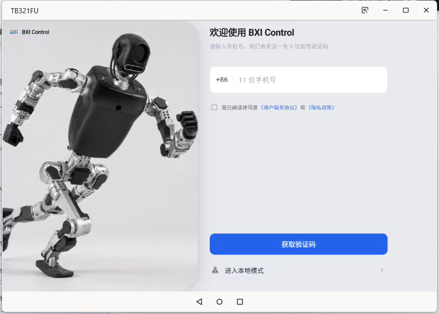

### 1.2 Home entries

After signing in or entering Local mode, the Home page provides **Add Device**, **My Devices**, **Firmware Upgrade**, **Diagnostics**, and **Profile**. The **Local Mode** label at top right means the App is using device bindings stored on this controller.

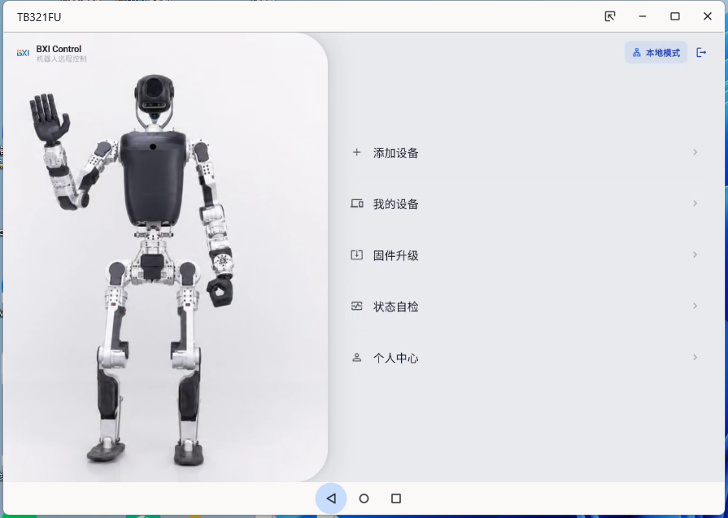

### Cloud mode and Local mode

| Item | Cloud mode | Local mode |
| --- | --- | --- |
| Identity and data | Sign in with a mobile verification code; bindings load from the cloud account | No sign-in; only bindings and maintenance credentials stored locally are used |
| Collaboration | Supports device sharing, QR-code joining of shared devices, and account services | Cannot join shared devices with a share code |
| Services | Tickets, unread notifications, and account profile are available | Tickets request sign-in; account services are unavailable |
| Control | Connect after account authorization | Directly connect to robots already bound locally over LAN or Bluetooth |
| Switching | Sign-in enters Cloud mode automatically | Sign out first; switching disconnects the current robot connection |

Local mode suits offline and field maintenance. Cloud mode suits multi-device collaboration, account management, and support services.

## 2. Add a robot

### 2.1 Add Device guidance

Select **Add Device** on Home. This lets the controller recognize and save the robot, and must be completed for first use. Before starting:

1. Turn on the robot controller and place the robot safely.
2. Enable Bluetooth and location permission on the phone or tablet.
3. Connect the controller to usable Wi-Fi. For Wi-Fi control, the controller and robot should be on the same LAN.
4. Select **Start Pairing** to scan for nearby robots.

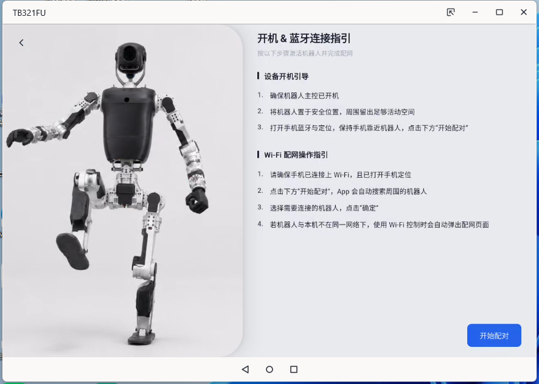

### 2.2 Scan and select a Bluetooth device

The scan page lists discoverable BXI robots and their signal strength. Select **Connect** for the target robot, then follow the on-screen flow to provision or bind it.

!!! tip "Can't find the robot?"

    Check that the robot is powered on, Bluetooth and location are enabled on the controller, and then move closer and select **Search again**.

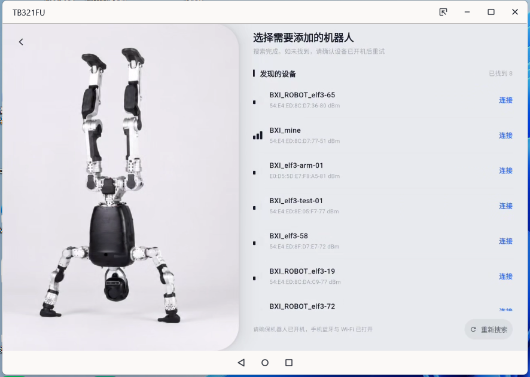

### 2.3 Provisioning and binding

After Bluetooth connection, confirm the target robot, enter or select Wi-Fi information, and wait for the robot to join the network. Think of this as finding the robot over Bluetooth first, then telling it which Wi-Fi network to join. Once binding is complete, the robot appears in **My Devices**.

!!! warning "Do not leave during provisioning"

    Do not close the App, turn off Bluetooth, or remove robot power while credentials are being written and the network is switching. If the flow fails, start again from **Add Device**.

## 3. Manage and connect devices

### 3.1 My Devices

**My Devices** shows bound robots as cards. Select a card to choose a connection method. It also provides entries such as pairing a new robot and scanning a maintenance credential. Online status only indicates discoverability; it is not a substitute for an on-site safety check.

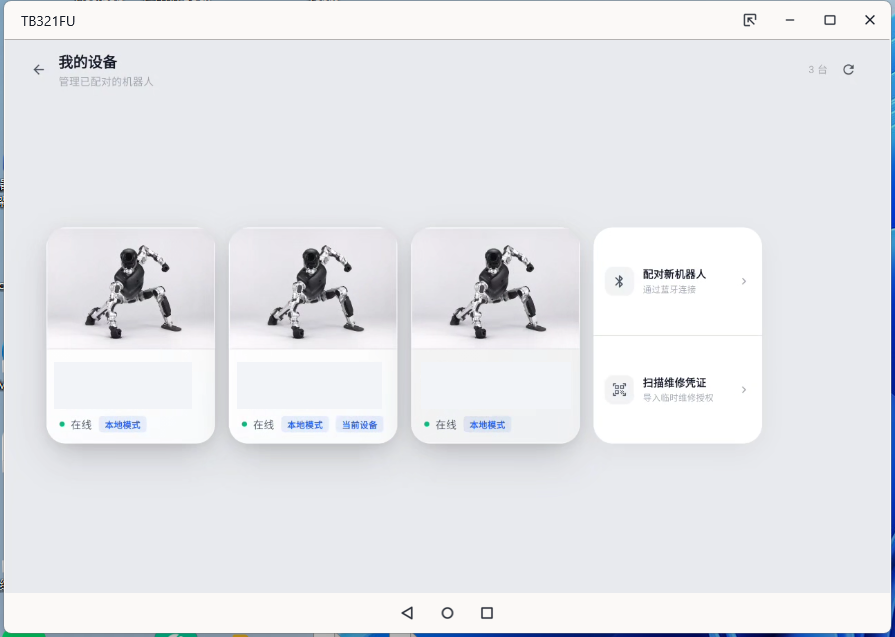

### 3.2 Choose a connection method

| Method | Best for | Capabilities and limits |
| --- | --- | --- |
| **Wi-Fi connection** | Controller and robot on the same LAN | Recommended; supports video, diagnostics, maps, and firmware management |
| **Bluetooth direct connection** | No usable LAN or nearby basic control | Basic close-range control only; no video and some network features are unavailable |

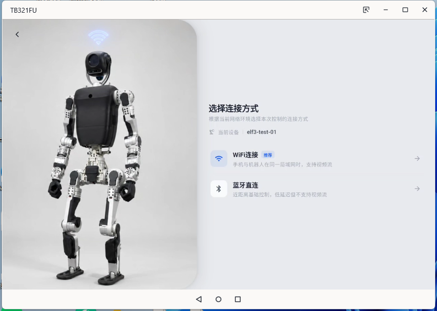

### 3.3 Wi-Fi auto-discovery and network changes

After selecting **Wi-Fi connection** (called **Wi-Fi Control** in some releases), the App automatically looks for the robot on the LAN currently used by the phone, tablet, or PC. A bound robot on the same subnet can then be connected for video, diagnostics, and firmware management.

To move a robot to another Wi-Fi network:

1. Connect the phone or tablet to the destination Wi-Fi.
2. Return to the robot's Connection Method page and select **Wi-Fi connection / Wi-Fi Control**.
3. If the App finds that the robot and controller are on different networks, it enters the Wi-Fi provisioning flow.
4. Confirm the destination network, finish provisioning, wait for the robot to join it, then start Wi-Fi control again.

!!! tip "Why connect the controller first?"

    The App uses the controller's current network as the target for discovery and provisioning. Switching the phone or tablet first reduces the need to enter an SSID manually and lets the App find the robot on the destination LAN immediately after provisioning.

### 3.4 Device Home

After a successful connection, Device Home provides entries for the current robot. On your first successful connection, check **Firmware Management** first, then learn Remote Control:

- **Operation Mode:** choose Remote Control or Touring mode;
- **Diagnostics:** view robot diagnostic data;
- **Firmware Management:** review and install robot packages;
- The top-right More menu can open Settings or Remote Assistance, depending on connection and permissions.

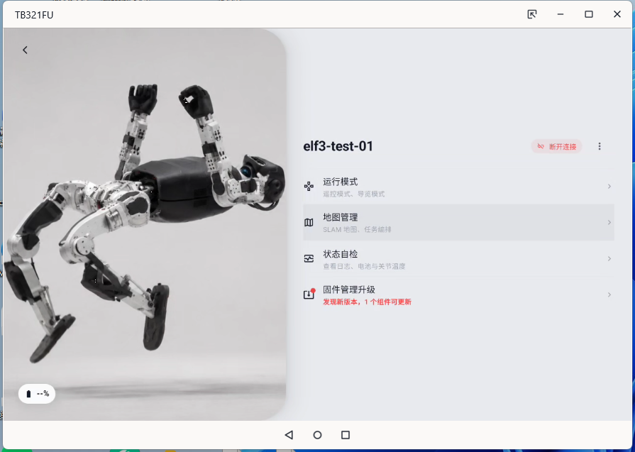

## 4. Selecting an operation mode and the remote-control interface

### 4.1 Operation modes

Select **Operation Mode** from Device Home to open the mode picker:

- **Remote Control:** operate the robot with virtual joysticks or an external gamepad. Read the Remote-control interface section below before first use.
- **Touring:** follow a prepared route. Core functionality is complete and is undergoing internal testing and optimization; it will be made generally available later.

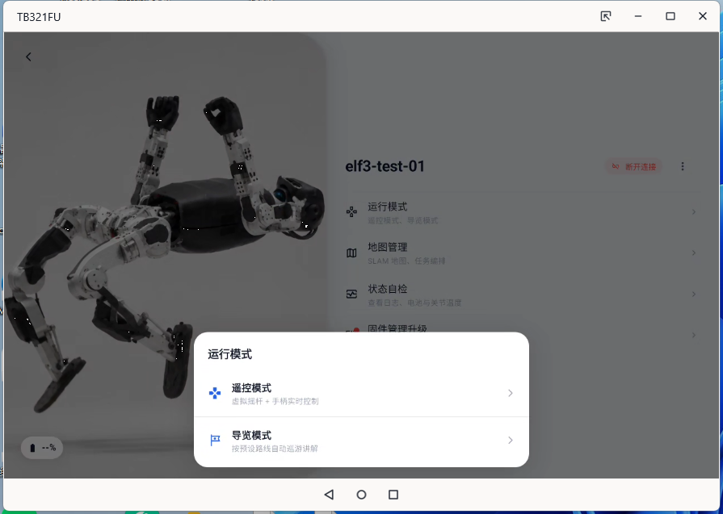

### 4.2 Remote-control interface

After entering **Remote Control**, do not operate the joysticks yet. First verify that the video or model view, network, and battery are normal, then enable the robot if required. Opening this screen does not enable the robot or issue movement commands.

| Area | Description |
| --- | --- |
| Top left | Back; **Refresh Video** recreates or refreshes Wi-Fi video; **Diagnostics** opens robot diagnostics. |
| Top right | Network quality (normally Wi-Fi RTT or Bluetooth RSSI), battery state, and **Start Robot / Stop Robot**. |
| Center | Main view. Switch between live video and a 3D digital-twin model; this does not change robot model, operation mode, or control parameters. |
| Bottom left and right | Virtual joysticks for translation, turning, height, and other motion; use only when the robot is enabled and the area is safe. |
| Right-side function island | Common actions, control settings, and the gamepad-status overlay. |

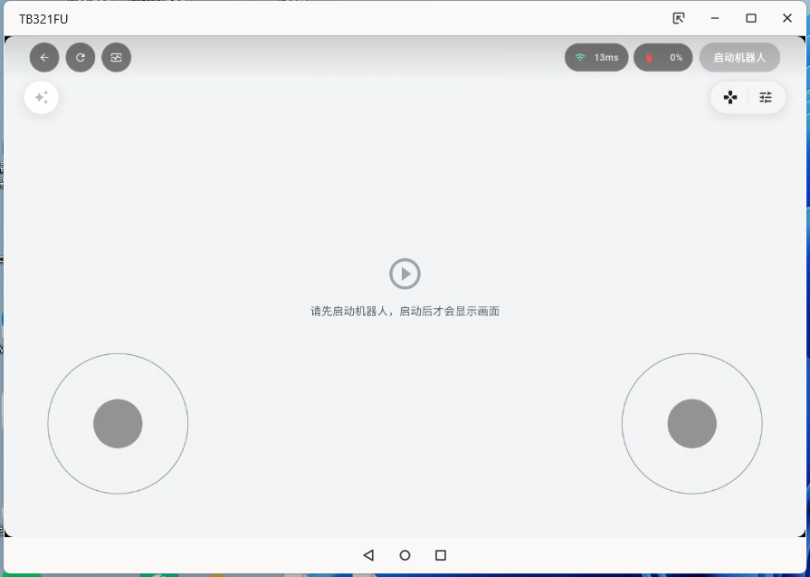

### 4.3 Top-bar functions and view switching

**Refresh Video** only refreshes the Wi-Fi video stream. Use it when video is missing, frozen, or needs to be fetched again after network recovery. Bluetooth direct connection has no video stream.

**Diagnostics** is a shortcut to robot-reported status. If battery, temperature, joint, or log data looks abnormal, stop remote-control activity, put the robot in a safe state, and then investigate.

Use the view switch for **live video** and the **3D digital-twin model**. Video is best for checking the surrounding environment, footing, and actual pose; the model is best for inspecting pose and joint state.

### 4.4 Gamepad, virtual joystick, and control settings

The screen supports virtual joysticks, keyboard input, and external gamepads. A USB or Bluetooth gamepad connects to the phone, tablet, or PC running the App. Open the gamepad-status overlay from the right-side function island to verify connection and input state.

In **Settings → Control**, configure gamepad enablement, sensitivity, dead zone, translation/rotation output ranges, and hold mode. When using a gamepad for the first time, inspect input feedback with the robot stopped and begin at a low speed.

!!! tip "Avoid residual input"

    When changing pages, losing window focus, or changing control method, release the gamepad or center the virtual joystick. Confirm that the robot is no longer receiving motion input before continuing.

### 4.5 Start, stop, and safety reminders

**Start Robot** makes the robot ready to receive control commands; once active, the button becomes **Stop Robot** to exit that state. Network and battery icons are informational only and cannot replace an assessment of the site and mechanical state.

!!! danger "Required checks before starting"

    Start only in a clear, level, controlled area. Confirm that people and obstacles are outside the motion area, the robot pose is normal with no entanglement or suspended parts, and battery and network are adequate. Start with low-speed, small movements to verify direction. After stopping, do not assume all mechanical risk has immediately disappeared; wait until the robot is stable and follow site safety procedures.

!!! danger "Motion control"

    Select **Start Robot** or operate joysticks only after confirming a safe environment and understanding the control mapping. Entering the Remote Control screen does not start the robot.

## 5. Settings

Open **Settings** from the remote-control shortcut or Profile. Available tabs include:

- **Control:** speed level, joystick sensitivity and dead zone, translation/rotation ranges, gamepad enablement, and hold mode;
- **Video:** video quality and video statistics;
- **Developer:** shown only after Developer mode is unlocked, for development and troubleshooting.

Use **Import**, **Export**, and **Reset** at lower left to manage local settings. Import only configurations from trusted sources.

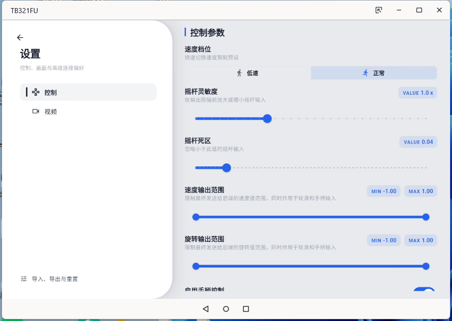

## 6. Diagnostics

Diagnostics reads robot runtime data over Wi-Fi. Use it after the first connection, before remote control, or when something appears abnormal. On first entry, confirm **DOMAIN_ID**; it is the identifier used for internal robot communication and must match the robot's ROS 2 communication domain. If you do not know this value, ask the on-site technical team rather than changing it.

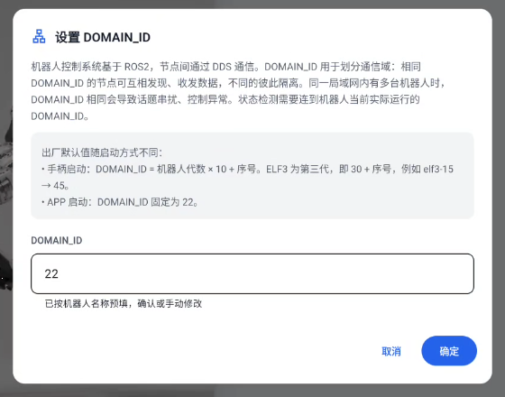

| Page | Content | Recommendation |
| --- | --- | --- |
| Logs | View robot logs | Review content before exporting because it may contain device information |
| Battery | Voltage, current, temperature, and trends | Include in pre-operation checks |
| Joint Temperature | Temperature state of each joint | Stop high-load operation if temperature is abnormal |
| 3D Pose | Digital-twin pose view | Inspect pose and joint state |
| Command Line | SSH terminal | Maintenance personnel only |

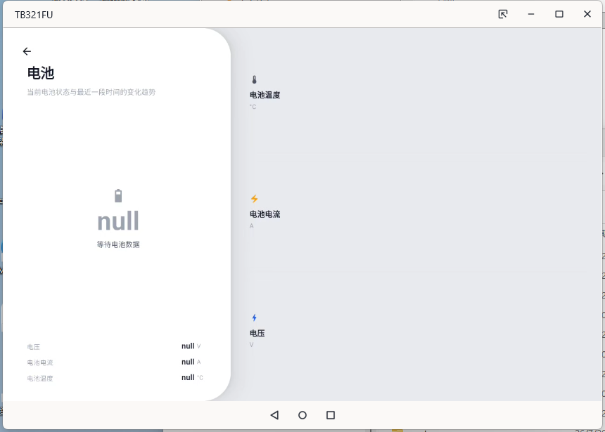

### 6.1 Diagnostics overview

The left panel identifies the diagnostic target and data-stream state; the right panel groups pages under View and Tools. **Waiting for data** or **No data** normally means that the robot has not reported that diagnostic data. Check Wi-Fi, DOMAIN_ID, and robot services instead of repeatedly operating remote control.

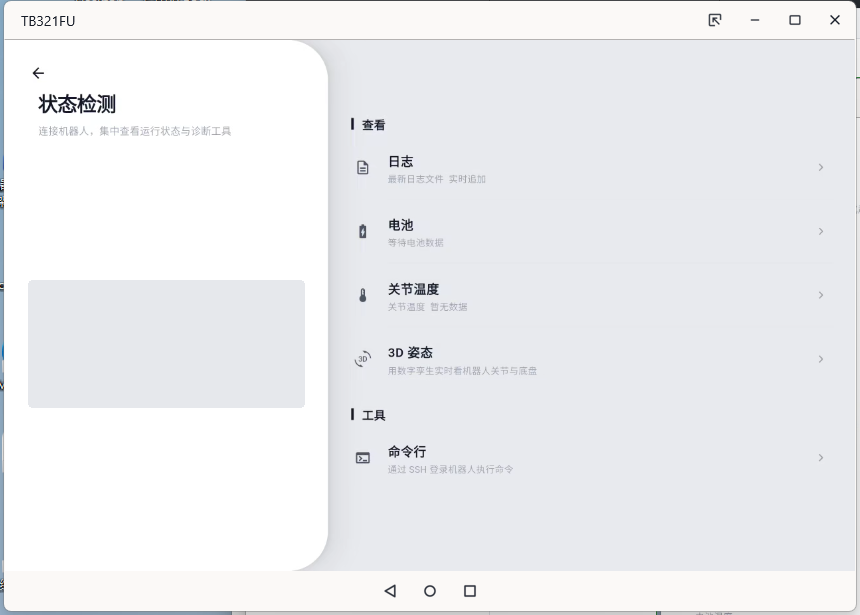

### 6.2 Logs

Select **Logs** to choose a current log file and view runtime records. Logs help investigate service startup, connection, and node errors. The file name and body in this screenshot are redacted.

!!! warning "Logs may contain sensitive data"

    Logs can include robot names, IP addresses, directories, command parameters, or runtime identifiers. Confirm the recipient is authorized and redact unnecessary device and network information before sharing with support or third parties.

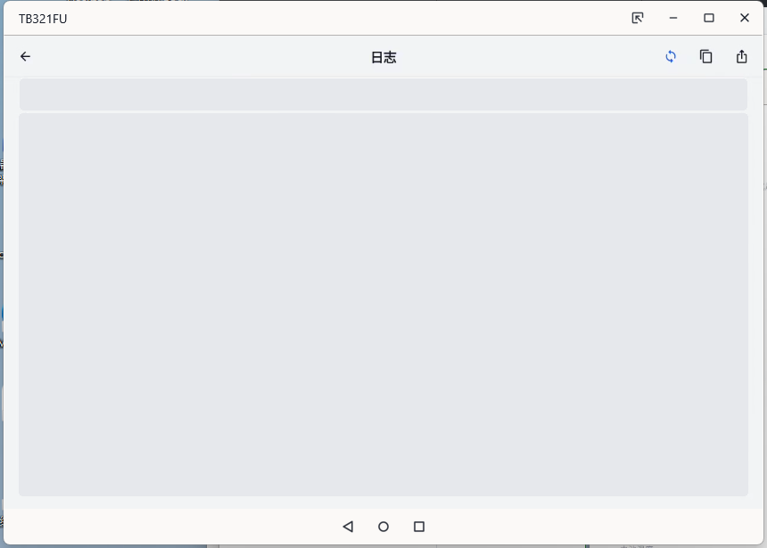

### 6.3 Joint Temperature

**Joint Temperature** displays temperatures reported for each joint. Use filtering and paging controls to inspect the records. Stop high-load movement and follow maintenance procedures for sustained high temperature, abnormal fluctuations, or missing data. The test screenshot shows the normal empty state; actual values depend on robot reporting.

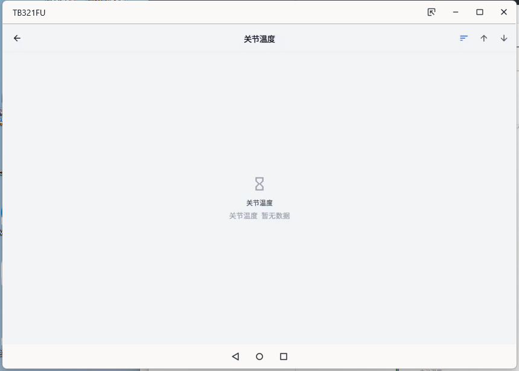

### 6.4 SSH Command Line

Selecting **Command Line** first shows the SSH credentials page. Enter an authorized username and password to create a secure terminal session; select **Save this robot's password** only if it should be retained on this controller. Opening the page neither connects nor runs a command. First-time users normally do not need this feature.

!!! danger "Maintenance personnel only"

    SSH commands can change robot configuration, stop services, or affect operational safety. Use them only with maintenance authorization, full understanding of the command, and a safe robot state. Never share passwords, IP addresses, ports, or complete terminal output in documentation, tickets, or chat.

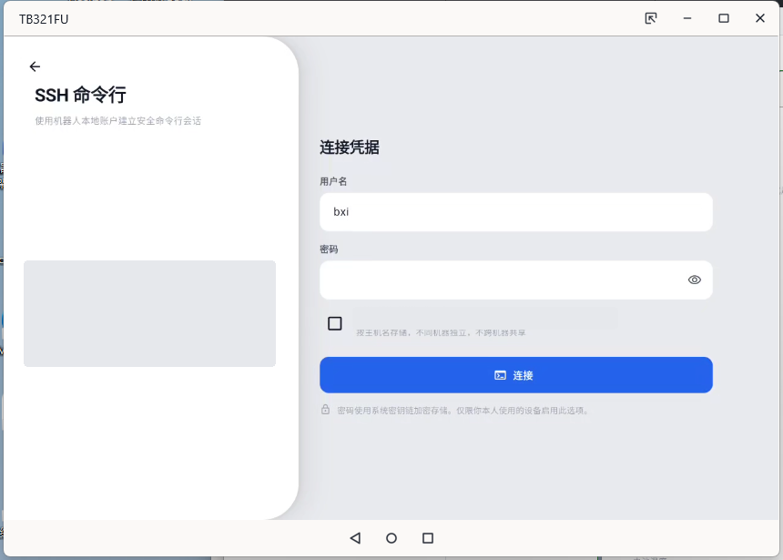

## 7. Firmware management and upgrade

**Firmware Management** on Device Home maintains the current robot. **Firmware Upgrade** on Home provides a batch-upgrade entry for multiple devices.

### 7.1 Firmware version and encryption requirement

When the new App detects a robot with legacy, unencrypted firmware, it shows an upgrade prompt and requires the firmware upgrade flow first. Complete the robot firmware upgrade before using connection, encryption, and sharing functions. Do not close the App, disconnect the network, or remove robot power during the upgrade.

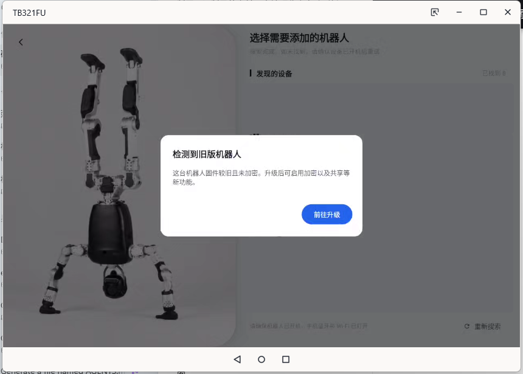

!!! warning "Encryption and credential protection"

    Even after encryption is enabled by a firmware upgrade, never expose Wi-Fi passwords, SSH passwords, device or Bluetooth addresses, tokens, or session identifiers in screenshots, tickets, logs, or chat. Use the App's authorization and sharing workflow and grant only the access required for the task.

### 7.2 Review upgrade packages

The page reads each package's current version, target version, and download size. Packages with an update indication can be upgraded separately or added to **Upgrade Selected**.

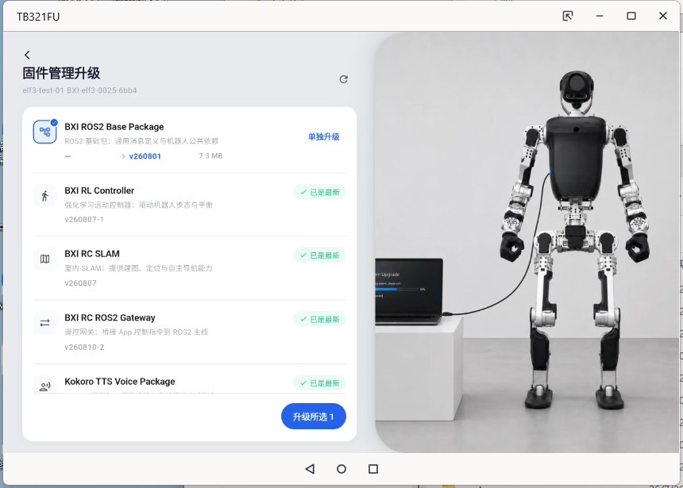

### 7.3 Confirm an upgrade

After selecting an individual package or Upgrade Selected, verify the packages, versions, and sizes. **Start Upgrade** submits a real upgrade task to the robot.

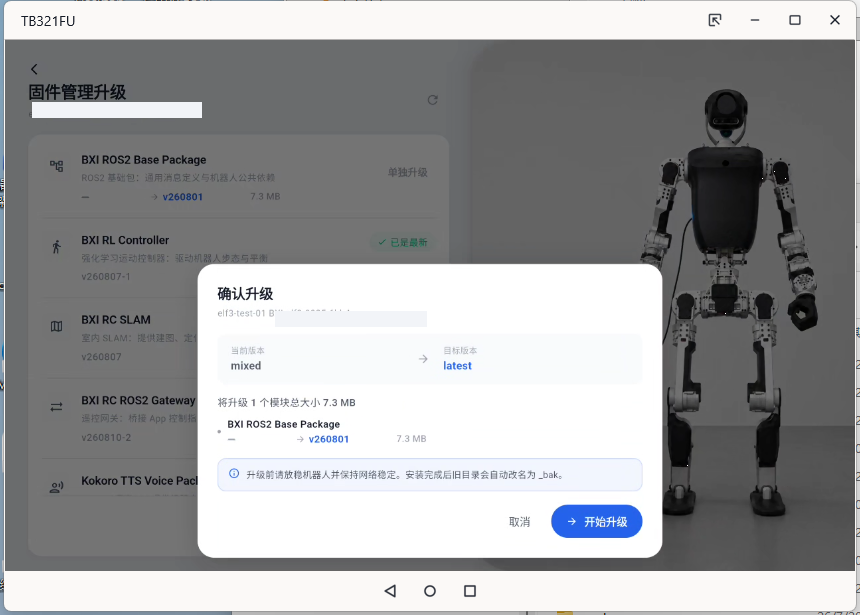

!!! warning "Pre-upgrade checklist"

    - Keep robot power and network stable.
    - Do not close the App, disconnect the network, or force-restart the robot during an upgrade.
    - If a restart is requested after upgrade, do it only when the robot is stationary and safe.
    - For a batch upgrade, validate on one test robot first.

## 8. Remote assistance

Remote Assistance is available only when the robot is connected over **Wi-Fi**; it is not shown for Bluetooth direct connection.

### 8.1 Entry

1. Open the target robot's Device Home.
2. Select **More** (three dots) at top right.
3. Select **Remote Assistance**.

The App carries the current robot's address, display name, and serial number into the Remote Assistance page and tries to establish its network session. If no current robot is selected, the page shows LAN and historical device lists for selection.

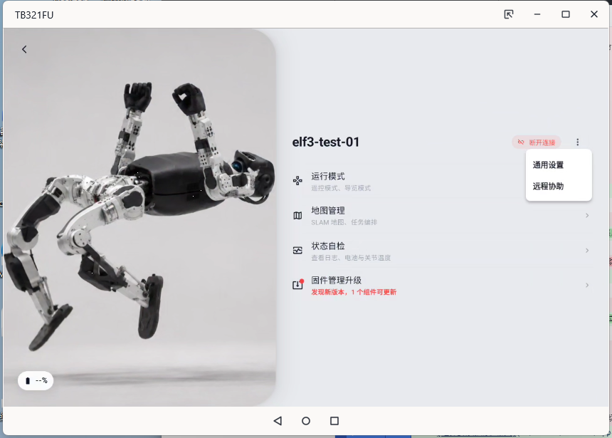

### 8.2 Request assistance

The page has three stages:

1. **Connect Robot:** confirm the target is online and establish a WebSocket session.
2. **Check Status:** show device identity, robot connection state, and network connectivity checks.
3. **Request Assistance:** read and accept the authorization notice, select **Request Assistance**, and review requested, active, and closed state in the session panel.

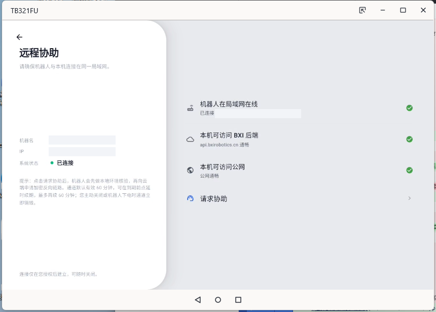

After selecting **Request Assistance**, the App displays an authorization notice. It can authorize support staff to communicate via a reverse SSH tunnel, read necessary diagnostic information such as system logs, control state, and sensor data, and start or stop robot services within the authorized scope. A session is created only after selecting **Agree and Request**.

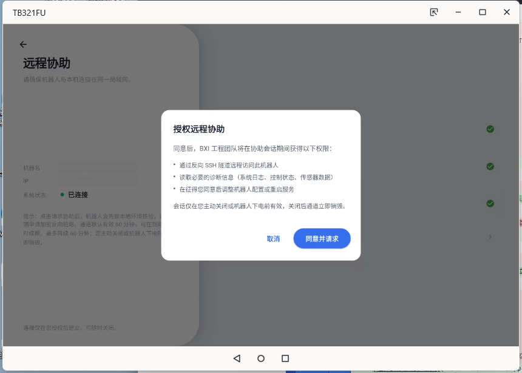

### 8.3 The robot maintains the session

Once authorized, the robot-side service starts the assistance channel. The App on the phone, tablet, or PC initiates authorization, shows session state, and provides a close entry. The session can survive App page changes and network reconnection; if the App restarts while the robot-side session is still valid, returning to Remote Assistance can recover its state.

The controller does not need to remain on the Remote Assistance page after the session is established. Keep network access available and avoid force-closing the App during assistance. Use the session's close action to end assistance; power-off or an explicit close on the robot destroys the channel.

When ready, the panel shows remaining time and provides **Extend +30 minutes** and **Close Now**. Ports, remaining time, and connection IDs are dynamic session information and must not be shared publicly.

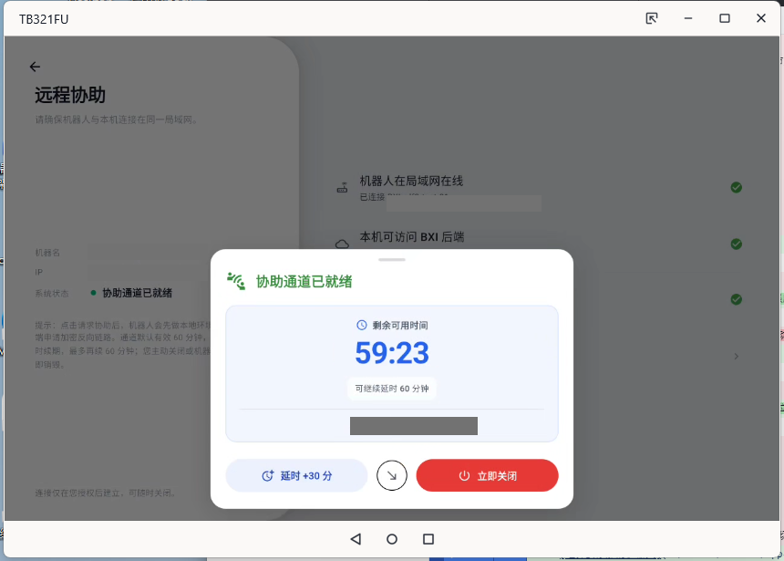

!!! warning "Remote-assistance authorization"

    Confirm both the recipient of authorization and the on-site state before requesting assistance. Remote Assistance opens the robot session needed for troubleshooting. Do not select **Request Assistance** without explicit authorization.

## 9. Profile, About, and service pages

**Profile** on Home includes:

- Official website link and ticket entry. Tickets require sign-in and Local mode asks the user to sign in.
- Language switching.
- Settings and manual App-update checks.
- **About BXI:** App version, open-source licenses, Privacy Policy, Terms of Service, export of personal data, and withdrawal of privacy consent.
- Signed-in users can sign out or cancel their account.

Developer mode is hidden by default. In the current implementation, repeatedly tapping the version number in **About BXI** unlocks developer settings; use them only for development or maintenance.

### 9.1 Ticket service

Open **Profile → Ticket Service**. Tickets are a cloud-account service: Local mode shows that sign-in is required; after sign-in, users can view unread counts, create tickets, and communicate with support.

The ticket list shows ticket number, subject, category, linked robot, state, and last update time. A new support reply creates an unread indicator in Profile; opening a ticket marks it read.

To create a ticket, provide:

1. Issue category.
2. Subject and detailed description.
3. Contact email.
4. Related robot, selected from bound robots or entered by serial number.
5. Optional attachments such as photos or log files.

After submitting, use the ticket detail to check progress and messages, reply, and attach files. When the issue is resolved, the user can confirm closure.

!!! tip "Submit a useful ticket"

    Include robot model/serial number, App version, network environment, reproduction steps, time of occurrence, and error messages. Remove passwords, tokens, and internal addresses before uploading logs or screenshots.

## 10. Page coverage and access conditions

Current App routes also include sign-in, SMS verification, permission guidance, device binding, single-device OTA, batch OTA, device sharing management, Remote Assistance, an RL controller workspace, ticket list/create/detail, Privacy Policy, and Terms of Service pages.

These pages depend on sign-in state, device binding, network, robot capability, or Developer mode. For publication-quality screenshots of restricted pages, use a dedicated test account and an isolated robot; do not trigger binding, sharing, remote sessions, upgrades, or control actions on production robots.

---

For connection or upgrade issues, record the App version, robot name, network environment, and reproduction steps, then contact support through the ticket entry in Profile.
