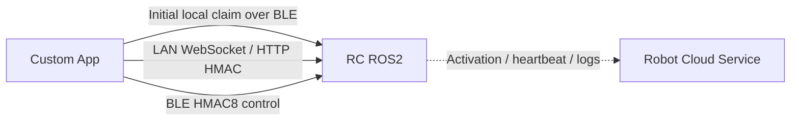

# New Software Backend Interfaces

This document explains how a custom app can connect to and control RC ROS2 directly, as well as the interfaces exposed by RC over the local network and BLE. Local control does not depend on account login, SMS verification, or an app cloud service.

!!! warning "Security boundary"

    All UIDs, serial numbers, and keys in this document are examples. Robot cloud credentials and server-side keys are not part of the app control interface and must never be embedded in an app, source code, or logs.

## 1. Integration architecture



- The app can control RC directly without account login or SMS verification.
- During the initial setup, the app writes a locally generated UID and `deviceKey` to the robot over BLE.
- After binding, the app signs WebSocket, HTTP, or BLE control requests with the `deviceKey`.
- The robot can independently perform activation, heartbeat, and log uploads. This connection is separate from local app control.

## 2. Enable BLE local claim mode

Robot-side configuration:

```text
BXI_BINDING_LOCAL_CLAIM=1
BXI_BINDING_LOCAL_CLAIM_WINDOW_SEC=600
```

Restart the RC service after changing the configuration. The local claim window starts when the BLE service starts; the example above allows 600 seconds. RC stops accepting a new local owner after the window expires.

Local claim requires all of the following:

- The robot has been activated.
- The robot is not currently bound to an owner.
- `BXI_BINDING_LOCAL_CLAIM=1`.
- The claim window has not expired.
- The app supplies a valid serial number, UID, credential ID, and 32-byte key.

Local claim is disabled by default. When enabled, RC accepts an initial claim only during the configured time window. After a successful claim, the setting can be changed back to `0` and the service restarted; the existing binding remains valid.

A local claim is stored with `sync_state=local_only`. The owner, `deviceKey`, and authorization list remain local to RC and do not participate in cloud binding synchronization. Cloud binding state will not overwrite or delete this data. Robot activation, heartbeat, and log uploads are unaffected.

## 3. Initial local claim over BLE

### 3.1 Generate a local app identity

The app must use a cryptographically secure system random source to generate and persist:

```text
ownerUid     = random positive integer in the range [1, 2^63-1]
ownerKey     = 32 random bytes
credentialId = unique random string of 1..128 characters
```

`ownerKey` becomes the `deviceKey` used for subsequent HMAC authentication. Store it in a platform security facility such as Android Keystore, iOS Keychain, or Windows Credential Locker. Do not generate a new value on every app start.

### 3.2 Provisioning GATT

UUID base: `…-b1a1-4003-8000-000000000000`.

| Service/characteristic | UUID suffix | Properties | Purpose |
|---|---:|---|---|
| Provisioning Service | `00000001` | service | Network provisioning and binding |
| PROV_CMD | `00000002` | write | App → RC TLV frames |
| PROV_EVT | `00000003` | read/notify | RC → App responses |

Frame format:

```text
[version u8=0x03][op u8][seq u8][TLV...]
Short TLV: [tag][len<=0xFE][value]
Long TLV: [tag][0xFF][len u16 little-endian][value]
```

| Request/response | opcode |
|---|---:|
| HELLO / HELLO_ACK | `0x01 / 0x81` |
| WIFI_SCAN / WIFI_LIST | `0x10 / 0x90` |
| WIFI_JOIN / WIFI_STATE | `0x11 / 0x91` |
| BIND_START / BIND_OK / BIND_FAIL | `0x20 / 0xA0 / 0xA1` |
| BIND_CANCEL | `0x21` |
| BIND_STATUS_GET / BIND_STATUS | `0x22 / 0xA2` |
| UNBIND / UNBIND_ACK | `0x23 / 0xA3` |

### 3.3 Local claim request

The app must first send `HELLO` and read the actual serial number from `HELLO_ACK`, then send:

```text
BIND_START op=0x20
TLV 0x01 = omitted or empty
TLV 0x02 = credentialId UTF-8
TLV 0x03 = HELLO_ACK.sn UTF-8
TLV 0x04 = ownerKey raw bytes, exactly 32B
TLV 0x05 = bindMode u8 = 1
TLV 0x06 = ownerUid u64 little-endian
```

On success, `BIND_OK` returns the serial number, owner UID, credential ID, binding nonce, binding time, and key fingerprint, but not the owner key. The app must verify that the returned values match the current request before saving the binding relationship.

Common `BIND_FAIL` codes:

| Code | Meaning |
|---:|---|
| 4 | Already bound to another UID |
| 5 | Robot is not activated |
| 6 | Internal error |
| 8 | Persistence failed |

Local mode cannot replace an existing owner. If the app loses the owner key, it cannot recover it from the cloud. The binding can only be removed by authorizing an unbind operation with the original key, or by clearing the local binding through the device maintenance process and claiming the robot again.

## 4. HMAC authentication after binding

RC control authentication uses only the `ownerUid`, robot serial number, and 32-byte `deviceKey`. It does not accept an app access token and does not use the robot's `robot_token`.

### 4.1 WebSocket HMAC

```text
message = ws|user_id|sn|ts|nonce
sig = Base64(HMAC-SHA256(deviceKeyRaw, UTF8(message)))
```

Connection query:

```text
user_id=<UID>&client_id=<client-id>&sn=<SN>&ts=<Unix milliseconds>&nonce=<random value>&sig=<URL-encoded Base64 signature>
```

```text
ws://<robot>:8081/?user_id=42&client_id=app&sn=BXI-A1&ts=...&nonce=...&sig=...
ws://<robot>:8081/ws/signaling?user_id=42&client_id=video_v1&sn=BXI-A1&ts=...&nonce=...&sig=...
```

The timestamp skew must not exceed 60 seconds. Use a new nonce for each connection. The serial number must match the binding record, and the UID must be present in the authorization list.

### 4.2 HTTP v2 HMAC

```text
bodyHash = lowercaseHex(SHA256(exactRawBodyBytes))
message = http.v2|UPPER_METHOD|PATH|bodyHash|user_id|sn|ts|nonce
sig = Base64(HMAC-SHA256(deviceKeyRaw, UTF8(message)))
```

The request query contains:

```text
auth_v=2&user_id=<UID>&sn=<SN>&ts=<Unix milliseconds>&nonce=<random value>&sig=<URL-encoded Base64 signature>
```

`PATH` excludes the query string. The SHA-256 hash must also be calculated for an empty body. Sign the exact final raw body bytes sent on the wire; do not reformat JSON after generating the signature.

### 4.3 BLE control HMAC

The protocol version is `0x03`, and all multibyte fields use little-endian byte order:

```text
22B header: <BBHffffH>
            ver, auth, seq, vx, vy, wz, height, buttons

24B header: <BBHffffHBB>
            base header + btn_slot + btn_val

tag = first8Bytes(HMAC-SHA256(deviceKeyRaw, headerBytes))
frame = headerBytes + tag
```

`auth`: `0` means no tag, `1` means HMAC4, and `2` means HMAC8. Use `auth=2` in production. Maintain an increasing u16 `seq` for each BLE connection. RC uses a `0x8000` half-window for wraparound handling and replay prevention.

## 5. Interfaces exposed by RC ROS2

| Interface | Address | Authentication | Purpose |
|---|---|---|---|
| Control WebSocket | `ws://<robot>:8081/` | WS HMAC | Control, telemetry, and status |
| WebRTC signaling | `ws://<robot>:8081/ws/signaling` | WS HMAC | Video negotiation |
| HTTP REST | `http://<robot>:8082` | HTTP v2 HMAC | OTA, maps, navigation, mapping, and tours |
| UDP discovery | UDP `:8083` | None | Discover IP address, ports, and serial number |
| BLE Provisioning | GATT `…0001` | Proximity and claim conditions | Network provisioning, binding, and unbinding |
| BLE Control | GATT `…0010` | HMAC8 | Proximity control |

### 5.1 UDP local network discovery

The app broadcasts the following payload to UDP `:8083`:

```json
{"type":"discover"}
```

RC broadcasts a beacon every two seconds and sends a unicast reply to discovery requests:

```json
{
  "type": "beacon",
  "hostname": "robot_elf3_02",
  "port": 8081,
  "seq": 42,
  "sn": "BXI-EXAMPLE-0001"
}
```

The beacon is for discovery only and does not prove the device's identity. Subsequent connections must still pass HMAC authentication.

### 5.2 WebSocket control

Standard message envelope:

```json
{
  "type": "control.cmd_vel",
  "ts": 1780000000000,
  "seq": 1,
  "payload": {}
}
```

App → RC:

| type | Main payload | Purpose |
|---|---|---|
| `control.cmd_vel` | `vx,vy,wz,height,mode,btn_1..btn_14` | Remote control; the sender becomes the active controller |
| `control.heartbeat` | None | Keep the control connection active |
| `control.authz_set` | `authorized_users[]` | Owner updates the authorization list |
| `control.preflight_abort` | None | Cancel a conflicting startup operation |
| `video.client_stats` | Video quality fields | Report receive quality |
| `ping` / `health` | `ts?` / None | RTT and health checks |
| `system.reboot` / `system.shutdown` | None | Privileged power operations |
| `offer` / `candidate` / `bye` | WebRTC fields | Signaling |
| `assist.request/cancel/status/extend` | Assistance parameters | Remote assistance |
| `logs.list/open/close` | `name/path/tail` | Log access |

Velocity control fields must be flat members of `payload`:

```json
{
  "type": "control.cmd_vel",
  "payload": {
    "vx": 0.2,
    "vy": 0.0,
    "wz": 0.1,
    "height": 1.0,
    "mode": "manual",
    "btn_1": 0,
    "btn_5": 1
  }
}
```

There is no `control.acquire` or `control.release` message. An authenticated client becomes the active controller when it sends `control.cmd_vel`. Disconnecting the control connection triggers a safe stop. The client should send a control frame or heartbeat at intervals shorter than 500 ms. By default, RC zeros the command after approximately 1500 ms without a ControlIntent.

Soft emergency stop:

| Action | Message |
|---|---|
| Engage | Zero-velocity `control.cmd_vel` with `mode:"estop"` |
| Maintain | Resend the zero-velocity estop frame approximately every 200 ms |
| Reset | Zero-velocity frame with `mode:"manual" + btn_1:1` |

Common RC → App messages:

| type | Purpose |
|---|---|
| `welcome` | Session and robot information |
| `telemetry.frame` | Battery, pose, velocity, mode, and faults |
| `control.status` | Safety, enable state, and input limits |
| `control.manifest` | Dynamic button and state-machine definitions |
| `control.state` | Live state-machine state |
| `control.authz_ack` | Authorization-list update result |
| `pong` / `health` / `error` | General responses |
| `nav.*` | Map, localization, path, mapping, and tour data |
| `offer/answer/candidate/peer_failed/stop` | WebRTC signaling |
| `video.stats` / `video.degraded` | Video status |

### 5.3 HTTP REST (port 8082)

Except for CORS `OPTIONS`, all business routes below use HTTP v2 HMAC:

| Method | Path | Purpose |
|---|---|---|
| GET | `/api/v1/ota/releases?robot=ELF3` | OTA catalog |
| GET | `/api/v1/ota/status` | OTA status |
| POST | `/api/v1/ota/start` | `{robot,version,reboot_after,package_names?}` |
| POST | `/api/v1/ota/reboot/precheck` | Pre-reboot checks |
| POST | `/api/v1/ota/reboot` | Reboot with `{robot}` |
| GET | `/api/v1/maps` | Map list |
| GET | `/api/v1/maps/{id}` | Complete map |
| GET | `/api/v1/maps/{id}/thumbnail.png` | Thumbnail |
| GET | `/api/v1/maps/{id}/tile/{z}/{x}/{y}.png` | Map tile |
| GET/PUT | `/api/v1/maps/{id}/{waypoints\|regions\|topology}` | Read or write sidecar data |
| POST | `/api/v1/maps/{id}/activate` | Activate localization and navigation |
| POST | `/api/v1/maps/{id}/rename` | `{name}` |
| DELETE | `/api/v1/maps/{id}` | Delete a map |
| POST | `/api/v1/nav/initial_pose` | `{x,y,yaw,frame_id?,cov?}` |
| POST | `/api/v1/nav/goal` | `{x,y,yaw,frame_id?}` |
| POST | `/api/v1/nav/cancel` | Cancel navigation |
| POST | `/api/v1/nav/pause` | `{data:bool}` |
| POST | `/api/v1/tour/start` | `{map_id,waypoint_ids,loop?}` |
| POST | `/api/v1/tour/{pause\|resume\|stop\|skip}` | Tour control |
| GET | `/api/v1/tour/status` | Tour status |
| POST | `/api/v1/mapping/start` | `{base_map_id?}` |
| POST | `/api/v1/mapping/stop` | Stop mapping |
| POST | `/api/v1/mapping/save` | `{name,base_map_id?}` |
| POST | `/api/v1/mapping/pause` | `{data:bool}` |
| POST | `/api/v1/mapping/clear_terrain` | Clear terrain |
| GET | `/api/v1/mapping/status` | Mapping status |
| PUT | `/api/v1/runtime/mode` | `{mode,map_id?,request_id?}` |
| GET | `/api/v1/runtime/status` | Runtime mode and localization quality |

The app and RC should both reject navigation and tour actions until localization is complete.

### 5.4 BLE Control GATT

| Service/characteristic | UUID suffix | Properties | Purpose |
|---|---:|---|---|
| Control Service | `00000010` | service | BLE control |
| CONTROL_CMD | `00000011` | write | HMAC control frame |
| CONTROL_GUEST_AUTH | `00000012` | write | Guest authorization proof |
| CONTROL_STATUS | `00000013` | read/notify | 3-byte status frame |
| CONTROL_MANIFEST | `00000014` | read/notify | Dynamic button manifest |
| CONTROL_SM_STATE | `00000015` | read/notify | State-machine state |

Status frame:

```text
[ver u8=0x03][flags u8][safety u8]
```

`flags`: `0x01 RUNNING`, `0x02 LOCKED`, `0x04 FAILED`, `0x08 PENDING`, and `0x10 UNAUTHORIZED`.

## 6. Minimum app control flow

1. Temporarily enable local claim mode on the robot and restart the RC service.
2. Generate and securely store an `ownerUid`, a 32-byte `deviceKey`, and a `credentialId` in the app.
3. Read the actual serial number from BLE `HELLO_ACK`.
4. Send a local-mode `BIND_START` and validate `BIND_OK`.
5. The local claim setting can be disabled and the service restarted; the existing binding remains valid.
6. Find the robot using a UDP beacon, BLE HELLO, or a previously saved address.
7. Generate WS, HTTP, or BLE HMAC authentication using the UID, serial number, and `deviceKey`.
8. Connect to `:8081` to receive status and send `control.cmd_vel`; call `:8082` when needed, or send BLE HMAC8 control frames directly.

## 7. Security requirements

- Never place robot cloud credentials or server-side keys in the app.
- Store the `deviceKey` only in the app's system security storage and in the robot's local storage. Never write it to logs or analytics.
- Use the current time and a new random nonce for every WS connection and HTTP request.
- For HTTP, sign the exact final body bytes that will be sent.
- Keep WS, HTTP, and BLE HMAC authentication enabled in production builds.
- Local claim can only claim an unbound robot; it cannot forcibly replace the owner with another UID.
- Local mode cannot recover keys from the cloud. The app should provide a secure backup notice and an entry point for device reset.
