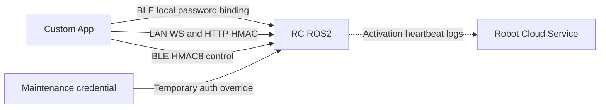

# New Software Backend Interfaces

This document explains how a custom app can connect to and control RC ROS2 directly, as well as the interfaces exposed by RC over the local network and BLE. Local control does not depend on account login, SMS verification, or an app cloud service.

!!! warning "Security boundary"

    All UIDs, serial numbers, and keys in this document are examples. Robot cloud credentials and server-side keys are not part of the app control interface and must never be embedded in an app, source code, or logs.

## 1. Architecture and binding states



- A custom app can control RC over LAN or BLE without account login, SMS verification, or a BXI App API request.
- The robot still uses the official robot API for activation, heartbeat, and log upload. This cloud connection is independent of local app control.
- Local binding does not require a robot-side environment switch and has no temporary claim window.
- Neither an app access token nor the robot `robot_token` is accepted as an RC control signature.

RC has three persistent binding states:

| State | `binding_mode` | Meaning |
|---|---|---|
| Unbound | `unbound` | Initial cloud or local password binding is allowed |
| Cloud-bound | `cloud` | Bound with a binding credential issued by the official backend |
| Locally bound | `local` | Bound directly between the app and RC with a password, without a cloud user relationship |

Maintenance mode is not a fourth binding state. It is a time-limited authentication override that works while the robot is `unbound`, `cloud`, or `local`. It does not modify the original binding, and RC automatically falls back to the original authentication state when the maintenance credential becomes invalid.

## 2. BLE Provisioning protocol

### 2.1 Provisioning GATT

UUID base: `…-b1a1-4003-8000-000000000000`.

| Service/characteristic | UUID suffix | Properties | Purpose |
|---|---:|---|---|
| Provisioning Service | `00000001` | service | Network provisioning and binding |
| PROV_CMD | `00000002` | write | App → RC TLV frames |
| PROV_EVT | `00000003` | read/notify | RC → App responses |

The legacy connectable BLE advertisement includes the complete Provisioning Service UUID `00000001-b1a1-4003-8000-000000000000`, while the scan response carries the Complete Local Name. The app should filter by this UUID first, then connect, discover GATT, and send `HELLO`. The Control Service UUID is not advertised and must be obtained through GATT service discovery after connecting.

The default advertised name is `BXI_<hostname>`. The hostname is limited to letters, digits, `-`, and `_`, and the name is truncated after 29 UTF-8 bytes. Treat the name as display-only metadata, not device identity; use the serial number returned by `HELLO_ACK` as the authoritative identity.

Frame format:

```text
[version u8=0x03][op u8][seq u8][TLV...]
Short TLV: [tag][len<=0xFE][value]
Long TLV: [tag][0xFF][len u16 little-endian][value]
```

| Request/response | opcode |
|---|---:|
| HELLO / HELLO_ACK | `0x01 / 0x81` |
| WIFI_SCAN / WIFI_LIST | `0x10 / 0x90` |
| WIFI_JOIN / WIFI_STATE | `0x11 / 0x91` |
| BIND_START / BIND_OK / BIND_FAIL | `0x20 / 0xA0 / 0xA1` |
| BIND_CANCEL | `0x21` |
| BIND_STATUS_GET / BIND_STATUS | `0x22 / 0xA2` |
| UNBIND / UNBIND_ACK | `0x23 / 0xA3` |

### 2.2 HELLO_ACK

The app should send `HELLO` first and read the actual serial number and binding state from `HELLO_ACK`:

| TLV | Type | Meaning |
|---:|---|---|
| `0x01` | UTF-8 | Serial number |
| `0x02` | u8 | `bound_flag`: 0 unbound, 1 bound |
| `0x03` | 16B | Device-key fingerprint, right-padded with zeroes |
| `0x04` | UTF-8 | Current IP address |
| `0x05` | UTF-8 | RC firmware version |
| `0x06` | u32 LE | Supported-opcode bitmap |
| `0x07` | u8 | `binding_mode`: 0 unbound, 1 cloud, 2 local |
| `0x08` | bytes | Local-binding KDF salt; empty for other states |
| `0x09` | u32 LE | Local-binding KDF iterations; 0 for other states |
| `0x0A` | u8 | KDF ID; 0 for other states |

`BIND_STATUS_GET` returns `BIND_STATUS` with these fields:

| TLV | Type | Meaning |
|---:|---|---|
| `0x01` | u8 | `bound_flag` |
| `0x02` | UTF-8 | Serial number |
| `0x03` | u64 LE | Owner UID |
| `0x04` | u64 LE | Unix binding time |
| `0x05` | 8B | Device-key fingerprint |
| `0x06` | u8 | `binding_mode`: 0 unbound, 1 cloud, 2 local |
| `0x07` | bytes | KDF salt |
| `0x08` | u32 LE | KDF iterations |
| `0x09` | u8 | KDF ID |

## 3. Local password binding

### 3.1 Fixed identity and password derivation

Local binding uses the fixed owner UID:

```text
ownerUid = 2147483646
```

The password must contain 8 to 64 printable ASCII characters, with every byte in the `0x20..0x7e` range. Derive the 32-byte `deviceKey` as follows:

```text
KDF        = PBKDF2-HMAC-SHA256
password   = UTF-8 password bytes
salt       = 16 cryptographically random bytes
iterations = 200000
dkLen      = 32 bytes
KDF ID     = 1
```

`credentialId` uniquely identifies this local binding and must contain 1 to 128 characters. It contains no secret and may be a UUID or an equivalent unique random string.

Store the derived `deviceKey` in platform secure storage such as Android Keystore, iOS Keychain, or Windows Credential Locker. Never put the password, derived key, or a maintenance credential in logs, analytics, or a plaintext settings file.

### 3.2 BIND_START

The app must first send `HELLO` and read the actual serial number from `HELLO_ACK`, then send:

```text
BIND_START op=0x20
TLV 0x01 = empty; only cloud binding uses a binding credential
TLV 0x02 = credentialId UTF-8
TLV 0x03 = HELLO_ACK.sn UTF-8
TLV 0x04 = deviceKey raw bytes, exactly 32B
TLV 0x05 = bindMode u8 = 1 for a local-binding request
TLV 0x06 = ownerUid u64 LE = 2147483646
TLV 0x07 = KDF salt raw bytes, exactly 16B
TLV 0x08 = iterations u32 LE = 200000
TLV 0x09 = KDF ID u8 = 1
```

RC accepts this request only when the robot has been activated and is currently `unbound`. A local request cannot replace an existing `cloud` or `local` binding, and cloud synchronization does not overwrite a local binding.

On success, RC stores `binding_mode=local`, `sync_state=local_only`, and `bind_method=ble_local_password_v1`. `BIND_OK` returns the serial number, owner UID, credential ID, binding nonce, binding time, and key fingerprint, but never the key. Save the device relationship only after verifying that the response matches the current request.

Common `BIND_FAIL` codes:

| Code | Meaning |
|---:|---|
| 1 | Invalid local fields, UID, key, or KDF parameters |
| 4 | Already bound to another UID |
| 5 | Robot is not activated |
| 6 | Internal error |
| 8 | Persistence failed |

### 3.3 Reconnecting to a locally bound robot

Another app reads the salt, iteration count, and KDF ID from `HELLO_ACK` or `BIND_STATUS`, derives the same `deviceKey` from the user-entered password, and compares the returned fingerprint. It must not save the credential or start control until that check succeeds.

The password and key are never uploaded to the cloud, so local mode has no cloud recovery path. If the password is lost, use a client that still holds the original key to authorize unbinding, or clear the local binding through a controlled maintenance process and bind again.

### 3.4 Unbinding and targeted cloud clearing

When the robot is bound, an owner holding the current `deviceKey` can send an authenticated BLE `UNBIND`:

```text
UNBIND op = 0x23
TLV 0x01  = ts, Unix seconds, u64 little-endian
TLV 0x02  = mac, 16 bytes

payload = "unbind|" || UTF8(sn) || "|" || ts_le_8B
mac = HMAC-SHA256(deviceKeyRaw, payload)[0:16]
```

RC accepts requests within 60 seconds of the robot's current time. While bound, missing TLVs, an out-of-window timestamp, or an invalid HMAC is rejected silently without `UNBIND_ACK`; the sender must handle this as a timeout. The app currently waits five seconds by default. In the unbound/factory state, RC returns `UNBIND_ACK` directly. On success, RC deletes `binding.json` and clears the local sharing-grant records.

- Local-app unbinding does not create, remove, or synchronize any cloud user relationship.
- RC reports `bindingMode` in heartbeat requests and also reports `localBindingCredentialId` while locally bound.
- For an administrator-requested remote clear, RC requires both `binding_mode=local` and an exact match with the current credential ID. A stale command cannot delete a newer replacement binding.

## 4. HMAC authentication after binding

RC control authentication uses a credential UID, robot serial number, and 32-byte key. It does not accept an app access token and does not use the robot's `robot_token`. Normal control uses the owner credential in the binding record; maintenance control uses the temporary credential described in section 6.

### 4.1 WebSocket HMAC

```text
message = ws|user_id|sn|ts|nonce
sig = Base64(HMAC-SHA256(deviceKeyRaw, UTF8(message)))
```

Connection query:

```text
user_id=<UID>&client_id=<client-id>&sn=<SN>&ts=<Unix milliseconds>&nonce=<random value>&sig=<URL-encoded Base64 signature>
```

```text
ws://<robot>:8081/?user_id=42&client_id=app&sn=BXI-A1&ts=...&nonce=...&sig=...
ws://<robot>:8081/ws/signaling?user_id=42&client_id=video_v1&sn=BXI-A1&ts=...&nonce=...&sig=...
```

The timestamp skew must not exceed 60 seconds. Use a new nonce for each connection. The serial number must match the binding record, and the UID must be present in the authorization list.

### 4.2 HTTP v2 HMAC

```text
bodyHash = lowercaseHex(SHA256(exactRawBodyBytes))
message = http.v2|UPPER_METHOD|PATH|bodyHash|user_id|sn|ts|nonce
sig = Base64(HMAC-SHA256(deviceKeyRaw, UTF8(message)))
```

The request query contains:

```text
auth_v=2&user_id=<UID>&sn=<SN>&ts=<Unix milliseconds>&nonce=<random value>&sig=<URL-encoded Base64 signature>
```

`PATH` excludes the query string. The SHA-256 hash must also be calculated for an empty body. Sign the exact final raw body bytes sent on the wire; do not reformat JSON after generating the signature.

### 4.3 BLE control HMAC

The protocol version is `0x03`, and all multibyte fields use little-endian byte order:

```text
22B header: <BBHffffH>
            ver, auth, seq, vx, vy, wz, height, buttons

24B header: <BBHffffHBB>
            base header + btn_slot + btn_val

tag = first8Bytes(HMAC-SHA256(deviceKeyRaw, headerBytes))
frame = headerBytes + tag
```

`auth`: `0` means no tag, `1` means HMAC4, and `2` means HMAC8. Use `auth=2` in production. Maintain an increasing u16 `seq` for each BLE connection. RC uses a `0x8000` half-window for wraparound handling and replay prevention.

### 4.4 Offline guest sharing

The owner can issue a local `BXIS1.<base64url(JSON)>` share token. It lets a guest use WS, HTTP, and BLE without learning the owner's `deviceKey`. The payload fields are:

```json
{
  "v": 1,
  "sn": "BXI-EXAMPLE-0001",
  "role": "co_owner",
  "iat": 1780000000,
  "exp": 1780000120,
  "epoch": 0,
  "jti": "unique random value for this token",
  "k": "64 hexadecimal characters encoding the subkey",
  "sig": "Base64 HMAC-SHA256 signature",
  "conn": {"i": "192.168.88.162", "p": 8081}
}
```

`conn` is an optional connection hint and is not signed. `k` is the connection subkey delivered to the guest. The robot does not trust this field directly; it independently derives the subkey from its local owner key and verifies the handshake signature:

```text
shareKey = HMAC-SHA256(deviceKeyRaw, "bxi-share-key-v1|<epoch>")
tokenSig = Base64(HMAC-SHA256(shareKey,
           "bxishare.v1|<sn>|<role>|<iat>|<exp>|<epoch>|<jti>"))
subkey   = HMAC-SHA256(shareKey, "bxi-share-tx-v1|<jti>")
```

- For WS and HTTP, generate signatures as described in sections 4.1 and 4.2, but use `subkey` and include the complete `share_token` in the query.
- For BLE, first write a `{user_id,sn,ts,nonce,sig,share_token}` JSON proof to `CONTROL_GUEST_AUTH`. After it succeeds, use `subkey` for HMAC8 on that connection.
- `epoch` must equal `share_epoch` in the robot's `binding.json`. Incrementing the epoch lets the owner revoke every older share token at once.
- The robot registers the `jti` when the guest first connects before `exp`. A registered guest may reconnect during a sliding authorization period, currently 30 days by default and configurable through `BXI_SHARE_GRANT_TTL_SEC`. An expired token that was never registered is rejected.
- A share token contains the guest control subkey. Treat it like a password and never upload it to logs or analytics.

## 5. Interfaces exposed by RC ROS2

| Interface | Address | Authentication | Purpose |
|---|---|---|---|
| Control WebSocket | `ws://<robot>:8081/` | WS HMAC | Control, telemetry, and status |
| WebRTC signaling | `ws://<robot>:8081/ws/signaling` | WS HMAC | Video negotiation |
| HTTP REST | `http://<robot>:8082` | HTTP v2 HMAC | OTA, maps, navigation, mapping, and tours |
| UDP discovery | UDP `:8083` | None | Discover IP address, ports, and serial number |
| BLE Provisioning | GATT `…0001` | Proximity and claim conditions | Network provisioning, binding, and unbinding |
| BLE Control | GATT `…0010` | HMAC8 | Proximity control |

### 5.1 UDP local network discovery

The app broadcasts the following payload to UDP `:8083`:

```json
{"type":"discover"}
```

RC broadcasts a beacon every two seconds and sends a unicast reply to discovery requests:

```json
{
  "type": "beacon",
  "hostname": "robot_elf3_02",
  "port": 8081,
  "seq": 42,
  "sn": "BXI-EXAMPLE-0001"
}
```

The beacon is for discovery only and does not prove the device's identity. Subsequent connections must still pass HMAC authentication.

### 5.2 WebSocket control

Standard message envelope:

```json
{
  "type": "control.cmd_vel",
  "ts": 1780000000000,
  "seq": 1,
  "payload": {}
}
```

App → RC:

| type | Main payload | Purpose |
|---|---|---|
| `control.cmd_vel` | `vx,vy,wz,height,mode,btn_1..btn_14` | Remote control; the sender becomes the active controller |
| `control.heartbeat` | None | Keep the control connection active |
| `control.authz_set` | `authorized_users[]` | Owner updates the authorization list |
| `control.preflight_abort` | None | Cancel a conflicting startup operation |
| `video.client_stats` | `fps,loss_percent,rtt_ms,bitrate_kbps,width,height` | Report receiver quality once per second for robot-side adaptive bitrate |
| `ping` / `health` | `ts?` / None | RTT and health checks |
| `system.reboot` / `system.shutdown` | None | Privileged power operations |
| `offer` / `candidate` / `bye` | WebRTC fields | Signaling |
| `assist.request/cancel/status/extend` | Assistance parameters | Remote assistance |
| `logs.list/open/close` | `name/path/tail` | Log access |
| `peek.set_domain` / `peek.clear` | `domain_id` / None | Set or clear cross-ROS-domain inspection |

Velocity control fields must be flat members of `payload`:

```json
{
  "type": "control.cmd_vel",
  "payload": {
    "vx": 0.2,
    "vy": 0.0,
    "wz": 0.1,
    "height": 1.0,
    "mode": "manual",
    "btn_1": 0,
    "btn_5": 1
  }
}
```

There is no `control.acquire` or `control.release` message. An authenticated client becomes the active controller when it sends `control.cmd_vel`. Disconnecting the control connection triggers a safe stop. The client should send a control frame or `control.heartbeat` at intervals shorter than 500 ms. A heartbeat creates a `heartbeat_only` ControlIntent: it refreshes the deadman timer without overwriting autonomous navigation with a zero-velocity command.

The gateway no longer implements a software E-stop or latched reset. Values `mode=2` and `safety_state=3` remain permanently unused; E-stop and freeze semantics belong entirely to the motion-control layer. The gateway retains only the connection deadman: after 1500 ms without a ControlIntent by default, it enters `STATE_TIMEOUT=2` and zeros the command. Including the two-tick debounce and slew-rate deceleration, worst-case stopping time is approximately 2.1 seconds.

`/ws/signaling` accepts only `offer`, `candidate`, `bye`, and `ping`. Send `logs.*`, `peek.*`, power, and control commands through the regular `/` control channel.

Common RC → App messages:

| type | Purpose |
|---|---|
| `welcome` | Session and robot information |
| `telemetry.frame` | Battery, pose, velocity, mode, and faults |
| `control.status` | Safety, enable state, and input limits |
| `control.manifest` | Dynamic button and state-machine definitions |
| `control.state` | Live state-machine state |
| `control.authz_ack` | Authorization-list update result |
| `control.preflight_conflict` | Conflicting processes detected before startup |
| `control.controller_disconnected` | Active controller disconnected; other clients should refresh control state |
| `system.reboot.ack` / `system.shutdown.ack` | Power-command acceptance result |
| `assist.status` | Remote-assistance tunnel status |
| `logs.list_response` / `logs.chunk` / `logs.error` | Log list, content chunks, and errors |
| `peek.error` | Cross-ROS-domain inspection startup failure |
| `pong` / `health` / `error` | General responses |
| `nav.*` | Map, localization, path, mapping, and tour data; see the list below |
| `offer/answer/candidate/peer_failed/stop` | WebRTC signaling |
| `video.stats` / `video.degraded` | Video status |

The complete set of `nav.*` message types is:

```text
nav.map                 nav.scan
nav.pose                nav.path.global
nav.path.local          nav.costmap.global
nav.costmap.local       nav.footprint
nav.cloud               nav.status
nav.tour.status         nav.mapping.status
nav.runtime.status      nav.reloc_required
```

Grid and point-cloud payloads use gzip+base64. When a new control connection is established, the gateway replays the most recent navigation states that have latched semantics.

Digital-twin telemetry uses length-prefixed binary frames rather than JSON. The first byte is one of these tags:

| tag | Content |
|---:|---|
| `0xB0` | BMS |
| `0xB1` | Joint temperatures |
| `0xB2` | Joint positions, approximately 20 Hz |
| `0xB3` | IMU orientation |

### 5.3 HTTP REST (port 8082)

Except for CORS `OPTIONS`, all business routes below use HTTP v2 HMAC:

Request-body limits depend on the route: 64 KB for regular and OTA routes, 8 MB for map and mapping routes, and 64 MB after decompressing a gzip grid. Oversized requests are rejected.

| Method | Path | Purpose |
|---|---|---|
| GET | `/api/v1/ota/releases?robot=ELF3` | OTA catalog |
| GET | `/api/v1/ota/status` | OTA status |
| POST | `/api/v1/ota/start` | `{robot,version,reboot_after,package_names?}` |
| POST | `/api/v1/ota/reboot/precheck` | Pre-reboot checks |
| POST | `/api/v1/ota/reboot` | Reboot with `{robot}` |
| GET | `/api/v1/maps` | Map list |
| GET | `/api/v1/maps/{id}` | Complete map |
| GET | `/api/v1/maps/{id}/thumbnail.png` | Thumbnail |
| GET | `/api/v1/maps/{id}/tile/{z}/{x}/{y}.png` | Map tile |
| GET/PUT | `/api/v1/maps/{id}/{waypoints\|regions\|topology}` | Read or write sidecar data; `waypoints` is the default route |
| GET | `/api/v1/maps/{id}/routes` | List routes as `{routes:[{id,name,updated_sec,waypoint_count}]}` |
| POST | `/api/v1/maps/{id}/routes` | Copy a route with `{name,source_route_id?}`; the source defaults to `default`; each map allows at most 64 custom routes and returns 409 `route_limit_reached` at the limit |
| GET | `/api/v1/maps/{id}/routes/{route_id}` | Read `{id,name,updated_sec,waypoints,segments}` |
| PUT | `/api/v1/maps/{id}/routes/{route_id}` | Write `{name?,waypoints,segments?}`; returns 204 |
| POST | `/api/v1/maps/{id}/routes/{route_id}/rename` | Rename a route with `{name}` |
| DELETE | `/api/v1/maps/{id}/routes/{route_id}` | Delete a custom route; `default` returns 409 |
| POST | `/api/v1/maps/{id}/activate` | Activate localization and navigation; a 202 response may still be `localizing` |
| POST | `/api/v1/maps/{id}/rename` | `{name}` |
| DELETE | `/api/v1/maps/{id}` | Delete a map; returns 409 for the active version or a map with child versions |
| POST | `/api/v1/nav/initial_pose` | `{x,y,yaw,frame_id?,cov?}` |
| POST | `/api/v1/nav/goal` | `{x,y,yaw,frame_id?}` |
| POST | `/api/v1/nav/cancel` | Cancel navigation |
| POST | `/api/v1/nav/pause` | `{data:bool}` |
| POST | `/api/v1/nav/retry` | Cancel the old goal, clear global/local costmaps, and resend the last direct goal |
| POST | `/api/v1/tour/start` | `{map_id,waypoint_ids,route_id?,loop?,speed_scale?}`; `route_id` defaults to `default`; speed scale is `[0.2,1.0]` |
| POST | `/api/v1/tour/{pause\|resume\|stop\|skip\|retry}` | Tour control; `retry` keeps the current waypoint and replans after clearing costmaps |
| GET | `/api/v1/tour/status` | Tour status |
| POST | `/api/v1/mapping/start` | `{base_map_id?}` |
| POST | `/api/v1/mapping/stop` | Stop mapping |
| POST | `/api/v1/mapping/save` | `{name,base_map_id?}` |
| POST | `/api/v1/mapping/pause` | `{data:bool}` |
| POST | `/api/v1/mapping/clear_terrain` | Clear terrain |
| GET | `/api/v1/mapping/status` | Mapping status |
| PUT | `/api/v1/runtime/mode` | `{mode,map_id?,request_id?}` |
| GET | `/api/v1/runtime/status` | Runtime mode and localization quality |

A map bundle always contains `manifest.json`, `map.pcd`, `map.pgm`, and `map.yaml`. A `legacy_2d_only` map containing only the old PGM/YAML format cannot be activated, used for navigation, or extended; it must be rebuilt with the 3D mapping flow. Extending a map creates an immutable child version and inherits the parent waypoints, regions, topology, and custom-route snapshots.

Route IDs must match `[A-Za-z0-9_-]{1,64}`. The `default` route continues to use the legacy `/maps/{id}/waypoints` endpoint; custom routes are stored under `<id>.routes/<route_id>.json`. The default route may be renamed but not deleted. Both `tour/status` and WS `nav.tour.status` include `route_id`; clients treat a missing field from old status payloads as `default`. When an old firmware returns 404 for the routes API, the new App uses only the default route.

The main fields returned by `GET /api/v1/runtime/status` and WS `nav.runtime.status` are:

```text
current_mode, desired_mode, transition_id, active_map_id,
localized, fitness_score, inlier_ratio, driver_healthy, last_error
```

A 202 response from `POST /api/v1/maps/{id}/activate` means only that the runtime-mode transition was accepted; localization is not complete yet. The app must wait until `active_map_id` is correct and `driver_healthy=true`, and treat `nav.reloc_required.required=false` as the authoritative relocation-success signal. It must not send navigation goals or start a tour while `localized=false`.

### 5.4 BLE Control GATT

| Service/characteristic | UUID suffix | Properties | Purpose |
|---|---:|---|---|
| Control Service | `00000010` | service | BLE control |
| CONTROL_CMD | `00000011` | write | HMAC control frame |
| CONTROL_GUEST_AUTH | `00000012` | write | Guest authorization proof |
| CONTROL_STATUS | `00000013` | read/notify | 3-byte status frame |
| CONTROL_MANIFEST | `00000014` | read/notify | Dynamic button manifest |
| CONTROL_SM_STATE | `00000015` | read/notify | State-machine state |

`CONTROL_MANIFEST` and `CONTROL_SM_STATE` use chunked transfer with chunks of approximately 180 bytes:

```text
[total_len:u16 little-endian][offset:u16 little-endian][chunk...]
```

Write each chunk into the receive buffer at `offset`, and parse the JSON only after all `total_len` bytes have arrived.

Status frame:

```text
[ver u8=0x03][flags u8][safety u8]
```

`flags`: `0x01 RUNNING`, `0x02 LOCKED`, `0x04 FAILED`, `0x08 PENDING`, and `0x10 UNAUTHORIZED`.

## 6. Maintenance mode

Maintenance mode supports factory testing, repair, and on-site service. It works regardless of whether the robot is unbound, cloud-bound, or locally bound. It does not modify `binding.json`, cloud membership, or the original owner. The maintenance credential takes priority only for that maintenance session; after it becomes invalid, the robot continues using its original binding authentication.

### 6.1 Generate a credential on the robot

Use the deployment wrapper from the robot shell:

```bash
sudo /opt/bxi/bxi_rc_ros2/scripts/bxi_maintenance.sh enable
sudo /opt/bxi/bxi_rc_ros2/scripts/bxi_maintenance.sh enable --minutes 120
```

- The default lifetime is 1440 minutes, or 24 hours.
- The allowed range is 30 to 10080 minutes, with a maximum of 7 days.
- The command creates `/var/lib/bxi/maintenance.json` with mode `0600` and prints a text credential beginning with `BXIM1.` only once when it is created.
- When stdout is an interactive terminal and `qrencode` is installed, it also prints a complete ANSI UTF-8 QR code. The text credential is always printed.
- Transfer the complete credential to the app by protected copy or QR code. No account login, SMS verification, or cloud approval is required.

The wrapper uses `/opt/bxi/bxi_rc_ros2` by default. CI or custom installations can override it with `BXI_RC_ROS2_INSTALL_DIR`. If the ROS2/install environment is already sourced, `bxi-maintenance` may also be run directly.

Status does not print the key again:

```bash
sudo /opt/bxi/bxi_rc_ros2/scripts/bxi_maintenance.sh status
```

Revoke it immediately:

```bash
sudo /opt/bxi/bxi_rc_ros2/scripts/bxi_maintenance.sh disable
```

Removing a maintenance code from an app only deletes that app's local copy. It does not revoke the robot-side credential. To revoke early, run `disable` on the robot or generate a new credential to replace the old one.

### 6.2 BXIM1 credential

The credential format is:

```text
BXIM1.<base64url(JSON, without padding)>
```

The decoded JSON contains:

```json
{
  "version": 1,
  "credential_id": "32 lowercase hexadecimal characters",
  "user_id": 2147483645,
  "sn": "BXI-EXAMPLE-0001",
  "key_hex": "64 hexadecimal characters encoding a 32-byte key",
  "created_at": 1780000000,
  "expires_at": 1780007200
}
```

The app must strictly validate the prefix, exact field set, UID, serial number, key length, creation time, and expiry. The credential contains a control key and must be handled like a password: never upload it, log it, or keep it in long-term plaintext storage.

### 6.3 Maintenance authentication

WebSocket and HTTP use the exact HMAC formats in section 4 with the following values from the maintenance credential:

```text
user_id = 2147483645
sn      = token.sn
key     = hexDecode(token.key_hex)
```

For BLE maintenance control, first write UTF-8 JSON to `CONTROL_GUEST_AUTH`. Its signature uses the WS message format:

```json
{
  "maintenance": true,
  "user_id": "2147483645",
  "sn": "BXI-EXAMPLE-0001",
  "ts": "1780000000000",
  "nonce": "a new random value",
  "sig": "Base64 HMAC-SHA256 signature"
}
```

After connection-scoped maintenance authentication succeeds, send the HMAC8 control frames described in section 4.3 using the maintenance key. Existing WS and BLE maintenance sessions are invalidated when the credential expires, is deleted, or is replaced.

### 6.4 Permission boundary

A maintenance credential allows:

- motion control, state, video, and telemetry;
- log access, reboot, and shutdown;
- remote assistance;
- OTA and HTTP management operations;
- maps, navigation, mapping, and tours.

A maintenance credential does not allow:

- `control.authz_set`;
- device sharing or authorization-list changes;
- owner unbinding;
- creating, replacing, or changing a `cloud` or `local` binding.

## 7. Minimum integration flows

Local password binding:

1. Read the actual serial number, binding state, and KDF metadata from BLE `HELLO_ACK`.
2. Only for an `unbound` robot, ask the user to set a local password and generate a 16-byte salt.
3. Derive the key with PBKDF2, send the complete local `BIND_START`, and validate `BIND_OK`.
4. Save the serial number, BLE-device mapping, credential ID, and securely stored key only after binding succeeds.
5. Find the robot through a UDP beacon, BLE HELLO, or a previously saved address.
6. Generate WS, HTTP, or BLE HMAC authentication with the UID, serial number, and key.
7. Connect to `:8081` for state and control; call `:8082` when required, or send BLE HMAC8 control frames.

Maintenance access:

1. Generate a time-limited `BXIM1` credential on the robot.
2. Import and validate it locally in the app without an app-cloud request.
3. Authenticate WS, HTTP, or BLE using the maintenance UID, serial number, and key.
4. Run `sudo /opt/bxi/bxi_rc_ros2/scripts/bxi_maintenance.sh disable` on the robot when service is complete.

## 8. Developer quick start

The following example uses only the Python standard library for signing and HTTP calls. The same byte-level rules can be ported directly to Android, iOS, Flutter, or another platform. Use the platform's native WebSocket client for the WS connection.

### 8.1 Generate a WS URL and call an HTTP JSON API

```python
import base64
import hashlib
import hmac
import json
import secrets
import time
from urllib.parse import urlencode
from urllib.request import Request, urlopen


def hmac_b64(key: bytes, message: str) -> str:
    return base64.b64encode(
        hmac.new(key, message.encode("utf-8"), hashlib.sha256).digest()
    ).decode("ascii")


def ws_url(host: str, user_id: str, sn: str, key: bytes,
           client_id: str = "my_app", path: str = "/",
           share_token: str | None = None) -> str:
    ts = str(int(time.time() * 1000))
    nonce = secrets.token_urlsafe(18)
    query = {
        "user_id": user_id,
        "client_id": client_id,
        "sn": sn,
        "ts": ts,
        "nonce": nonce,
        "sig": hmac_b64(key, f"ws|{user_id}|{sn}|{ts}|{nonce}"),
    }
    if share_token:
        query["share_token"] = share_token
    return f"ws://{host}:8081{path}?{urlencode(query)}"


def http_json(host: str, method: str, path: str, payload,
              user_id: str, sn: str, key: bytes,
              share_token: str | None = None):
    method = method.upper()
    body = (b"" if payload is None else
            json.dumps(payload, ensure_ascii=False,
                       separators=(",", ":")).encode("utf-8"))
    ts = str(int(time.time() * 1000))
    nonce = secrets.token_urlsafe(18)
    body_hash = hashlib.sha256(body).hexdigest()
    canonical = (
        f"http.v2|{method}|{path}|{body_hash}|{user_id}|{sn}|{ts}|{nonce}"
    )
    query = {
        "auth_v": "2",
        "user_id": user_id,
        "sn": sn,
        "ts": ts,
        "nonce": nonce,
        "sig": hmac_b64(key, canonical),
    }
    if share_token:
        query["share_token"] = share_token
    request = Request(
        f"http://{host}:8082{path}?{urlencode(query)}",
        data=body if payload is not None else None,
        headers={"Content-Type": "application/json"},
        method=method,
    )
    with urlopen(request, timeout=10) as response:
        return json.loads(response.read())


HOST = "192.168.88.162"
UID = "2147483646"
SN = "BXI-EXAMPLE-0001"
KEY = bytes.fromhex("11" * 32)  # Example only; load production keys from secure storage

print(ws_url(HOST, UID, SN, KEY))
print(http_json(HOST, "GET", "/api/v1/maps", None, UID, SN, KEY))
```

The `body` used for signing is exactly the `body` that is sent. Do not reformat JSON after calculating the signature. For a guest call, pass the share token's `subkey` as `key` and also supply `share_token`.

### 8.2 WS remote control and heartbeat

After connecting with the URL generated in section 8.1, send a regular JSON text frame:

```json
{"type":"control.cmd_vel","ts":1780000000000,"seq":1,"payload":{"vx":0.2,"vy":0.0,"wz":0.1,"height":1.0,"mode":"manual","btn_1":0}}
```

Send velocity commands continuously while the joystick is moving. When idle, send a heartbeat at least once every 500 ms; it does not overwrite an autonomous navigation command:

```json
{"type":"control.heartbeat","ts":1780000000500,"seq":2,"payload":{}}
```

Do not send `mode:"estop"` or use `btn_1` for E-stop reset. Those gateway semantics have been removed.

### 8.3 Map activation, relocation, and navigation

Recommended sequence:

```python
maps = http_json(HOST, "GET", "/api/v1/maps", None, UID, SN, KEY)
http_json(HOST, "POST", "/api/v1/maps/demo_map/activate", None,
          UID, SN, KEY)

# Continue consuming the control WS; do not use a fixed sleep(20):
# 1. Wait for nav.runtime.status.payload.active_map_id == "demo_map"
# 2. Wait for current_mode in {"localizing", "navigation"}
# 3. Confirm driver_healthy == true and last_error is empty

http_json(HOST, "POST", "/api/v1/nav/initial_pose",
          {"x": 0.0, "y": 0.0, "yaw": 0.0, "frame_id": "map"},
          UID, SN, KEY)

# Wait for nav.reloc_required.payload.required == false and the latest
# nav.runtime.status.payload.localized == true before sending a goal.
http_json(HOST, "POST", "/api/v1/nav/goal",
          {"x": 2.0, "y": 1.0, "yaw": 0.0, "frame_id": "map"},
          UID, SN, KEY)
```

Track navigation progress through `nav.status`. If map activation, initial pose, or localization fails, show `last_error` and stop the sequence instead of sending more goals that the server will reject.

## 9. Security requirements

- Never place robot cloud credentials or server-side keys in the app.
- Store the `deviceKey` and maintenance key only in the app's system security storage and in the robot's local storage. Never write either value to logs or analytics.
- Use the current time and a new random nonce for every WS connection and HTTP request.
- For HTTP, sign the exact final body bytes that will be sent.
- Keep WS, HTTP, and BLE HMAC authentication enabled in production builds.
- Local password binding can only bind an unbound robot; it cannot forcibly replace the owner.
- Local mode cannot recover keys from the cloud. The app should provide a secure backup notice and an entry point for device reset.
- Save a BLE-device mapping only after password verification or a successful `BIND_OK`; canceling password setup must not leave a false bound or recoverable-device record.
- Keep `BXIM1` credentials short-lived and revoke them when the task is complete instead of relying only on expiry.
