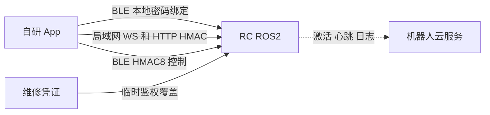

# 新版软件后端接口

本文说明自研 App 如何直接连接并控制 RC ROS2，以及 RC 在局域网和 BLE 上暴露的接口。本地控制方案不依赖账号登录、短信验证或 App 云服务。

!!! warning "安全边界"

    文档中的 UID、SN 和 key 都是示例。机器人云端凭据和服务端密钥不属于 App 控制接口，不得写入 App、源码或日志。

## 1. 接入架构与绑定状态



- 自研 App 可以不登录账号、不请求短信验证码，也不调用 BXI App API，直接在局域网或 BLE 上控制 RC。
- 机器人仍使用官方机器人 API 完成激活、心跳和日志上传。App 本地控制与机器人云链路彼此独立。
- 本地绑定不需要在 RC 上打开环境变量开关，也没有临时认领时间窗。
- App access token 和机器人 `robot_token` 都不能用作 RC 控制签名。

RC 只有三种持久绑定状态：

| 状态 | `binding_mode` | 含义 |
|---|---|---|
| 未绑定 | `unbound` | 可以进行首次云端绑定或本地密码绑定 |
| 云端绑定 | `cloud` | 由官方后端签发 binding credential 完成绑定 |
| 本地绑定 | `local` | 由 App 和 RC 直接完成密码绑定，不创建云端用户关系 |

维修模式不是第四种绑定。它是有有效期的临时鉴权覆盖层，可以在机器人处于 `unbound`、`cloud` 或 `local` 时使用，不修改原绑定；维修凭证失效后自动回到原绑定的鉴权状态。

## 2. BLE Provisioning 协议

### 2.1 Provisioning GATT

UUID 基址：`…-b1a1-4003-8000-000000000000`。

| 服务/特征 | UUID 尾号 | 属性 | 用途 |
|---|---:|---|---|
| Provisioning Service | `00000001` | service | 配网与绑定 |
| PROV_CMD | `00000002` | write | App → RC TLV 帧 |
| PROV_EVT | `00000003` | read/notify | RC → App 响应 |

BLE legacy connectable ADV 会广播完整 Provisioning Service UUID `00000001-b1a1-4003-8000-000000000000`，scan response 携带 Complete Local Name。App 应优先按该 UUID 筛选设备，再连接 GATT 并发送 `HELLO`；Control Service UUID 不在广播包中，需在连接后通过 GATT service discovery 获取。

默认广播名为 `BXI_<hostname>`；hostname 只保留字母、数字、`-` 和 `_`，名称最多 29 个 UTF-8 字节，超出部分会被截断。广播名只用于展示，不能作为设备身份；真实身份以 `HELLO_ACK` 返回的 SN 为准。

帧格式：

```text
[version u8=0x03][op u8][seq u8][TLV...]
短 TLV: [tag][len<=0xFE][value]
长 TLV: [tag][0xFF][len u16 little-endian][value]
```

| 请求/响应 | opcode |
|---|---:|
| HELLO / HELLO_ACK | `0x01 / 0x81` |
| WIFI_SCAN / WIFI_LIST | `0x10 / 0x90` |
| WIFI_JOIN / WIFI_STATE | `0x11 / 0x91` |
| BIND_START / BIND_OK / BIND_FAIL | `0x20 / 0xA0 / 0xA1` |
| BIND_CANCEL | `0x21` |
| BIND_STATUS_GET / BIND_STATUS | `0x22 / 0xA2` |
| UNBIND / UNBIND_ACK | `0x23 / 0xA3` |

### 2.2 HELLO_ACK

App 应先发送 `HELLO`，从 `HELLO_ACK` 读取真实 SN 和绑定状态：

| TLV | 类型 | 含义 |
|---:|---|---|
| `0x01` | UTF-8 | SN |
| `0x02` | u8 | `bound_flag`，0 未绑定，1 已绑定 |
| `0x03` | 16B | device key fingerprint，右侧零填充 |
| `0x04` | UTF-8 | 当前 IP |
| `0x05` | UTF-8 | RC 固件版本 |
| `0x06` | u32 LE | 支持的 opcode bitmap |
| `0x07` | u8 | `binding_mode`：0 未绑定，1 云端，2 本地 |
| `0x08` | bytes | 本地绑定 KDF salt；非本地绑定为空 |
| `0x09` | u32 LE | 本地绑定 KDF 迭代次数；非本地绑定为 0 |
| `0x0A` | u8 | KDF ID；非本地绑定为 0 |

`BIND_STATUS_GET` 返回的 `BIND_STATUS` 使用以下字段：

| TLV | 类型 | 含义 |
|---:|---|---|
| `0x01` | u8 | `bound_flag` |
| `0x02` | UTF-8 | SN |
| `0x03` | u64 LE | owner UID |
| `0x04` | u64 LE | Unix 绑定时间 |
| `0x05` | 8B | device key fingerprint |
| `0x06` | u8 | `binding_mode`：0 未绑定，1 云端，2 本地 |
| `0x07` | bytes | KDF salt |
| `0x08` | u32 LE | KDF 迭代次数 |
| `0x09` | u8 | KDF ID |

## 3. 本地密码绑定

### 3.1 固定身份与密码派生

本地绑定使用固定 owner UID：

```text
ownerUid = 2147483646
```

用户设置的密码必须为 8 到 64 个可打印 ASCII 字符，即每个字节均在 `0x20..0x7e` 范围。App 使用密码派生 32 字节 `deviceKey`：

```text
KDF        = PBKDF2-HMAC-SHA256
password   = 密码的 UTF-8 字节
salt       = 密码学安全随机生成的 16 字节
iterations = 200000
dkLen      = 32 字节
KDF ID     = 1
```

`credentialId` 是本次本地绑定的唯一标识，长度为 1 到 128 个字符。它不包含密钥，可使用 UUID 或同等唯一随机字符串。

App 必须把 `deviceKey` 保存到系统安全存储，例如 Android Keystore、iOS Keychain 或 Windows Credential Locker。不能把密码、派生 key 或维修凭证写入日志、analytics 或普通明文配置。

### 3.2 BIND_START

App 必须先用 `HELLO` 读取 `HELLO_ACK` 返回的真实 SN，再发送：

```text
BIND_START op=0x20
TLV 0x01 = 空；仅云端绑定使用 binding credential
TLV 0x02 = credentialId UTF-8
TLV 0x03 = HELLO_ACK.sn UTF-8
TLV 0x04 = deviceKey raw bytes，正好 32B
TLV 0x05 = bindMode u8 = 1，表示本地绑定请求
TLV 0x06 = ownerUid u64 LE = 2147483646
TLV 0x07 = KDF salt raw bytes，正好 16B
TLV 0x08 = iterations u32 LE = 200000
TLV 0x09 = KDF ID u8 = 1
```

RC 仅在机器人已经激活且当前为 `unbound` 时接受本地绑定。它不会用本地请求覆盖已有的 `cloud` 或 `local` 绑定，也不会因为云端同步而覆盖本地绑定。

成功后，RC 写入 `binding_mode=local`、`sync_state=local_only` 和 `bind_method=ble_local_password_v1`。`BIND_OK` 返回 SN、owner UID、credential ID、binding nonce、绑定时间和 key fingerprint，但不会返回 key。App 必须校验响应与本次请求一致后，才保存设备关系。

常见 `BIND_FAIL`：

| 码 | 含义 |
|---:|---|
| 1 | 本地绑定字段、UID、key 或 KDF 参数不合法 |
| 4 | 已被其他 UID 绑定 |
| 5 | 机器人未激活 |
| 6 | 内部错误 |
| 8 | 持久化失败 |

### 3.3 已绑定机器人重新连接

另一台 App 要连接本地绑定机器人时，从 `HELLO_ACK` 或 `BIND_STATUS` 读取 salt、iterations 和 KDF ID，使用用户输入的同一密码重新派生 `deviceKey`，并校验返回的 fingerprint。校验成功后才能保存凭据并开始控制。

密码和 key 不会上传到云端，因此本地模式没有云端找回能力。丢失密码后，只能使用仍持有原 key 的客户端授权解绑，或通过受控维护流程清除本地绑定后重新绑定。

### 3.4 解绑与云端定向清除

已绑定时，持有当前 `deviceKey` 的 owner 可以发送经鉴权的 BLE `UNBIND`：

```text
UNBIND op = 0x23
TLV 0x01  = ts，Unix 秒，u64 little-endian
TLV 0x02  = mac，16 bytes

payload = "unbind|" || UTF8(sn) || "|" || ts_le_8B
mac = HMAC-SHA256(deviceKeyRaw, payload)[0:16]
```

RC 接受与当前机器人时间相差不超过 60 秒的请求。已绑定时，TLV 缺失、时间超窗或 HMAC 不匹配都会被静默拒绝，RC 不返回 `UNBIND_ACK`，发送端应按超时处理；App 当前默认等待 5 秒。处于未绑定/factory 状态时，RC 直接返回 `UNBIND_ACK`。解绑成功后，RC 删除 `binding.json` 并清空本地分享授权记录。

- 本地 App 解绑不会创建、删除或同步任何云端用户关系。
- RC 心跳会报告 `bindingMode`；本地绑定时还会报告 `localBindingCredentialId`。
- 管理端远程清除本地绑定时，RC 只接受 `binding_mode=local` 且 credential ID 与当前绑定完全一致的命令。陈旧命令不会删除后来重新创建的绑定。

## 4. 绑定后的 HMAC 鉴权

RC 的控制鉴权使用凭据 UID、机器人 SN 和 32 字节 key，不接受 App access token，也不使用机器人的 `robot_token`。普通控制使用绑定记录中的 owner 凭据；维修控制使用第 6 节的临时维修凭据。

### 4.1 WebSocket HMAC

```text
message = ws|user_id|sn|ts|nonce
sig = Base64(HMAC-SHA256(deviceKeyRaw, UTF8(message)))
```

连接 query：

```text
user_id=<UID>&client_id=<client-id>&sn=<SN>&ts=<Unix毫秒>&nonce=<随机值>&sig=<URL编码后的Base64签名>
```

```text
ws://<robot>:8081/?user_id=42&client_id=app&sn=BXI-A1&ts=...&nonce=...&sig=...
ws://<robot>:8081/ws/signaling?user_id=42&client_id=video_v1&sn=BXI-A1&ts=...&nonce=...&sig=...
```

时间偏差不得超过 60 秒；每次连接使用新的 nonce。SN 必须与绑定记录一致，UID 必须在授权列表中。

### 4.2 HTTP v2 HMAC

```text
bodyHash = lowercaseHex(SHA256(exactRawBodyBytes))
message = http.v2|UPPER_METHOD|PATH|bodyHash|user_id|sn|ts|nonce
sig = Base64(HMAC-SHA256(deviceKeyRaw, UTF8(message)))
```

请求 query 包含：

```text
auth_v=2&user_id=<UID>&sn=<SN>&ts=<Unix毫秒>&nonce=<随机值>&sig=<URL编码后的Base64签名>
```

`PATH` 不包含 query。空 body 也必须计算 SHA-256。签名必须使用最终实际发送的原始 body 字节，不能在签名后重新格式化 JSON。

### 4.3 BLE 控制 HMAC

协议版本为 `0x03`，所有多字节字段为小端：

```text
22B header: <BBHffffH>
            ver, auth, seq, vx, vy, wz, height, buttons

24B header: <BBHffffHBB>
            基础头 + btn_slot + btn_val

tag = first8Bytes(HMAC-SHA256(deviceKeyRaw, headerBytes))
frame = headerBytes + tag
```

`auth`：`0` 无 tag、`1` HMAC4、`2` HMAC8。生产使用 `auth=2`。每个 BLE 连接维护递增的 u16 `seq`，RC 使用半窗 `0x8000` 处理回绕和防重放。

## 5. RC ROS2 暴露的接口

| 接口 | 地址 | 鉴权 | 用途 |
|---|---|---|---|
| 控制 WebSocket | `ws://<robot>:8081/` | WS HMAC | 控制、遥测、状态 |
| WebRTC signaling | `ws://<robot>:8081/ws/signaling` | WS HMAC | 视频协商 |
| HTTP REST | `http://<robot>:8082` | HTTP v2 HMAC | OTA、地图、导航、建图、巡游 |
| UDP 发现 | UDP `:8083` | 无 | 发现 IP、端口和 SN |
| BLE Provisioning | GATT `…0001` | 近场认领条件 | 配网、绑定、解绑 |
| BLE Control | GATT `…0010` | HMAC8 | 近场遥控 |

### 5.1 UDP 局域网发现

App 向 UDP `:8083` 广播：

```json
{"type":"discover"}
```

RC 每 2 秒广播，并对 discover 单播回复：

```json
{
  "type": "beacon",
  "hostname": "robot_elf3_02",
  "port": 8081,
  "seq": 42,
  "sn": "BXI-EXAMPLE-0001"
}
```

beacon 只用于发现，不能证明设备身份；后续连接仍必须验证 HMAC。

### 5.2 WebSocket 控制

普通消息信封：

```json
{
  "type": "control.cmd_vel",
  "ts": 1780000000000,
  "seq": 1,
  "payload": {}
}
```

App → RC：

| type | 主要 payload | 用途 |
|---|---|---|
| `control.cmd_vel` | `vx,vy,wz,height,mode,btn_1..btn_14` | 遥控；发送者成为当前控制者 |
| `control.heartbeat` | 无 | 保持控制链活跃 |
| `control.authz_set` | `authorized_users[]` | owner 更新授权列表 |
| `control.preflight_abort` | 无 | 取消启动冲突操作 |
| `video.client_stats` | 视频质量字段 | 上报接收质量 |
| `ping` / `health` | `ts?` / 无 | RTT 和健康检查 |
| `system.reboot` / `system.shutdown` | 无 | 特权电源操作 |
| `offer` / `candidate` / `bye` | WebRTC 字段 | signaling |
| `assist.request/cancel/status/extend` | 协助参数 | 远程协助 |
| `logs.list/open/close` | `name/path/tail` | 日志查看 |

速度控制字段必须平铺：

```json
{
  "type": "control.cmd_vel",
  "payload": {
    "vx": 0.2,
    "vy": 0.0,
    "wz": 0.1,
    "height": 1.0,
    "mode": "manual",
    "btn_1": 0,
    "btn_5": 1
  }
}
```

没有 `control.acquire` 或 `control.release`。通过鉴权的客户端发送 `control.cmd_vel` 即成为活动控制者；控制连接断开会触发安全停车。客户端应以小于 500ms 的间隔发送控制帧或 heartbeat，默认约 1500ms 没有 ControlIntent 后超时归零。

软急停：

| 动作 | 发送内容 |
|---|---|
| 触发 | `mode:"estop"` 的零速 `control.cmd_vel` |
| 保持 | 每约 200ms 重发 estop 零速帧 |
| 复位 | `mode:"manual" + btn_1:1` 的零速帧 |

RC → App 常用消息：

| type | 用途 |
|---|---|
| `welcome` | 会话和机器人信息 |
| `telemetry.frame` | 电池、位姿、速度、模式、故障 |
| `control.status` | safety、启停和输入限制 |
| `control.manifest` | 动态按钮和状态机定义 |
| `control.state` | 状态机实时状态 |
| `control.authz_ack` | 授权列表更新结果 |
| `pong` / `health` / `error` | 通用响应 |
| `nav.*` | 地图、定位、路径、建图和巡游数据 |
| `offer/answer/candidate/peer_failed/stop` | WebRTC signaling |
| `video.stats` / `video.degraded` | 视频状态 |

### 5.3 HTTP REST（端口 8082）

除 CORS `OPTIONS` 外，以下业务路由均使用 HTTP v2 HMAC：

| 方法 | 路径 | 用途 |
|---|---|---|
| GET | `/api/v1/ota/releases?robot=ELF3` | OTA 目录 |
| GET | `/api/v1/ota/status` | OTA 状态 |
| POST | `/api/v1/ota/start` | `{robot,version,reboot_after,package_names?}` |
| POST | `/api/v1/ota/reboot/precheck` | 重启前检查 |
| POST | `/api/v1/ota/reboot` | `{robot}` 重启 |
| GET | `/api/v1/maps` | 地图列表 |
| GET | `/api/v1/maps/{id}` | 完整地图 |
| GET | `/api/v1/maps/{id}/thumbnail.png` | 缩略图 |
| GET | `/api/v1/maps/{id}/tile/{z}/{x}/{y}.png` | 地图瓦片 |
| GET/PUT | `/api/v1/maps/{id}/{waypoints\|regions\|topology}` | sidecar 读写 |
| POST | `/api/v1/maps/{id}/activate` | 激活定位和导航 |
| POST | `/api/v1/maps/{id}/rename` | `{name}` |
| DELETE | `/api/v1/maps/{id}` | 删除地图 |
| POST | `/api/v1/nav/initial_pose` | `{x,y,yaw,frame_id?,cov?}` |
| POST | `/api/v1/nav/goal` | `{x,y,yaw,frame_id?}` |
| POST | `/api/v1/nav/cancel` | 取消导航 |
| POST | `/api/v1/nav/pause` | `{data:bool}` |
| POST | `/api/v1/tour/start` | `{map_id,waypoint_ids,loop?}` |
| POST | `/api/v1/tour/{pause\|resume\|stop\|skip}` | 巡游控制 |
| GET | `/api/v1/tour/status` | 巡游状态 |
| POST | `/api/v1/mapping/start` | `{base_map_id?}` |
| POST | `/api/v1/mapping/stop` | 停止建图 |
| POST | `/api/v1/mapping/save` | `{name,base_map_id?}` |
| POST | `/api/v1/mapping/pause` | `{data:bool}` |
| POST | `/api/v1/mapping/clear_terrain` | 清除地形 |
| GET | `/api/v1/mapping/status` | 建图状态 |
| PUT | `/api/v1/runtime/mode` | `{mode,map_id?,request_id?}` |
| GET | `/api/v1/runtime/status` | 运行模式和定位质量 |

定位未完成时，App 与 RC 都应拒绝导航和巡游动作。

### 5.4 BLE Control GATT

| 服务/特征 | UUID 尾号 | 属性 | 用途 |
|---|---:|---|---|
| Control Service | `00000010` | service | BLE 控制 |
| CONTROL_CMD | `00000011` | write | HMAC 控制帧 |
| CONTROL_GUEST_AUTH | `00000012` | write | 访客授权证明 |
| CONTROL_STATUS | `00000013` | read/notify | 3B 状态帧 |
| CONTROL_MANIFEST | `00000014` | read/notify | 动态按钮 manifest |
| CONTROL_SM_STATE | `00000015` | read/notify | 状态机状态 |

状态帧：

```text
[ver u8=0x03][flags u8][safety u8]
```

`flags`：`0x01 RUNNING`、`0x02 LOCKED`、`0x04 FAILED`、`0x08 PENDING`、`0x10 UNAUTHORIZED`。

## 6. 维修模式

维修模式用于出厂测试、返修和现场服务。它不关心机器人当前是未绑定、云端绑定还是本地绑定，也不会改写 `binding.json`、云端成员或原 owner。维修凭证有效时优先用于该维修会话；凭证失效后，机器人继续使用原有绑定鉴权。

### 6.1 在机器人上生成凭证

在机器人终端使用随部署安装的包装脚本：

```bash
sudo /opt/bxi/bxi_rc_ros2/scripts/bxi_maintenance.sh enable
sudo /opt/bxi/bxi_rc_ros2/scripts/bxi_maintenance.sh enable --minutes 120
```

- 默认有效期为 1440 分钟，即 24 小时。
- 可设置 30 到 10080 分钟，即最长 7 天。
- 命令生成 `/var/lib/bxi/maintenance.json`，文件权限为 `0600`，并只在创建时输出一次 `BXIM1.` 开头的文本凭证。
- stdout 是交互式终端且已安装 `qrencode` 时，命令还会输出完整 ANSI UTF-8 二维码；文本凭证始终会输出。
- App 可通过扫码或受保护的复制方式导入完整凭证；不需要账号登录、短信验证码或云端批准。

包装脚本默认使用 `/opt/bxi/bxi_rc_ros2`，CI 或自定义安装可通过 `BXI_RC_ROS2_INSTALL_DIR` 覆盖。已 source ROS2/安装环境时，也可直接运行 `bxi-maintenance`。

查看状态不会再次输出 key：

```bash
sudo /opt/bxi/bxi_rc_ros2/scripts/bxi_maintenance.sh status
```

立即撤销：

```bash
sudo /opt/bxi/bxi_rc_ros2/scripts/bxi_maintenance.sh disable
```

删除 App 中保存的维修码只会清理该 App 的本地副本，不会撤销机器人上的维修凭证。需要提前撤销时必须在机器人上执行 `disable`，或生成一份新凭证替换旧凭证。

### 6.2 BXIM1 凭证

凭证格式为：

```text
BXIM1.<base64url(JSON，无 padding)>
```

解码后的 JSON 字段如下：

```json
{
  "version": 1,
  "credential_id": "32位小写十六进制字符串",
  "user_id": 2147483645,
  "sn": "BXI-EXAMPLE-0001",
  "key_hex": "编码32字节key的64位十六进制字符串",
  "created_at": 1780000000,
  "expires_at": 1780007200
}
```

App 导入时必须严格校验前缀、字段集合、UID、SN、key 长度、创建时间和有效期。维修码本身包含控制密钥，必须按密码处理，不得上传、记录或长期明文保存。

### 6.3 维修鉴权

WebSocket 和 HTTP 使用第 4 节完全相同的 HMAC 格式，只需改用维修凭证中的：

```text
user_id = 2147483645
sn      = token.sn
key     = hexDecode(token.key_hex)
```

BLE 维修控制先向 `CONTROL_GUEST_AUTH` 写入 UTF-8 JSON，签名仍使用 WS 消息格式：

```json
{
  "maintenance": true,
  "user_id": "2147483645",
  "sn": "BXI-EXAMPLE-0001",
  "ts": "1780000000000",
  "nonce": "每次新的随机值",
  "sig": "Base64 HMAC-SHA256 签名"
}
```

连接级维修鉴权成功后，再用维修 key 发送第 4.3 节的 HMAC8 控制帧。维修凭证过期、被删除或被新凭证替换后，已经建立的 WS 和 BLE 维修会话也会失效。

### 6.4 权限边界

维修凭证允许：

- 运动控制、状态、视频和遥测；
- 日志查看、系统重启和关机；
- 远程协助；
- OTA 和 HTTP 管理操作；
- 地图、导航、建图和巡游。

维修凭证不允许：

- `control.authz_set`；
- 分享设备或修改授权用户；
- 以 owner 身份解绑；
- 创建、覆盖或改变 `cloud` / `local` 绑定。

## 7. 最小接入流程

本地密码绑定：

1. App 通过 BLE `HELLO_ACK` 读取真实 SN、绑定状态和 KDF 元数据。
2. 仅当状态为 `unbound` 时，提示用户设置本地密码并生成 16 字节 salt。
3. 使用 PBKDF2 派生 key，发送完整的本地 `BIND_START`，并校验 `BIND_OK`。
4. 绑定成功后再保存 SN、BLE 设备映射、credential ID 和系统安全存储中的 key。
5. 通过 UDP beacon、BLE HELLO 或已保存地址找到机器人。
6. 使用 UID、SN 和 key 生成 WS、HTTP 或 BLE HMAC。
7. 连接 `:8081` 接收状态并发送控制消息，按需调用 `:8082`，或发送 BLE HMAC8 控制帧。

维修接入：

1. 在机器人上生成限时 `BXIM1` 凭证。
2. App 本地导入并校验凭证，不请求 App 云端。
3. 使用维修 UID、SN 和 key 建立 WS、HTTP 或 BLE 鉴权会话。
4. 完成维修后在机器人上执行 `sudo /opt/bxi/bxi_rc_ros2/scripts/bxi_maintenance.sh disable`。

## 8. 安全要求

- 不得把机器人云端凭据或任何服务端密钥放入 App。
- `deviceKey` 和维修 key 只能保存在 App 系统安全存储和机器人本地，不得写入日志或 analytics。
- 每次 WS/HTTP 请求使用当前时间和新的随机 nonce。
- HTTP 必须对最终实际发送的 body bytes 签名。
- 发布版本必须保持 WS、HTTP 和 BLE HMAC 鉴权开启。
- 本地密码绑定只能绑定未绑定机器人，不能强行覆盖 owner。
- 本地模式没有云端 key 恢复能力；应用应提供安全备份提示和设备重置入口。
- App 应在密码验证或 `BIND_OK` 成功后再保存 BLE 设备映射，取消密码设置不应留下已绑定或可恢复的假记录。
- `BXIM1` 凭证应尽量短期使用；任务完成后主动撤销，而不是只等待过期。
