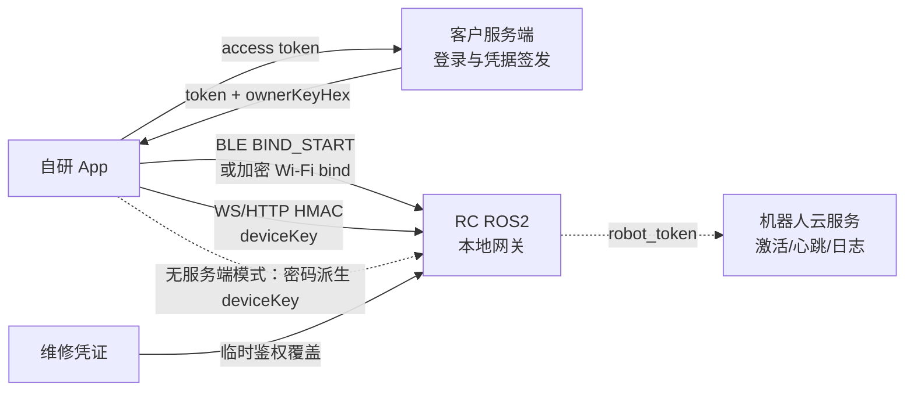

# 新版软件后端接口

本文说明自研 App 如何直接连接并控制 RC ROS2，以及 RC 在局域网和 BLE 上暴露的接口。本地控制方案不依赖账号登录、短信验证或 App 云服务。

## 阅读顺序

如果只是先把控制链路跑通，按下面顺序实现即可：

1. **拿到 owner 凭据**：有客户服务端时调用凭据接口，拿到 `ownerKeyHex`；不接入服务端时使用本地密码派生 `deviceKey`。
2. **完成一次绑定**：通过 BLE Provisioning，或使用第 5.3.1 节的加密 Wi-Fi 配对接口。
3. **连接控制 WS**：用 `deviceKey` 生成 HMAC query，连接 `ws://<robot>:8081/`。
4. **发送控制帧**：`control.cmd_vel` 的速度字段必须直接放在 `payload` 下；空闲时持续发送 `control.heartbeat`。

完整的 Python 示例在第 8 节。HTTP 地图、导航、OTA 等接口只需要复用同一个 `deviceKey`，但签名格式与 WS 不同。

!!! warning "安全边界"

    文档中的 UID、SN 和 key 都是示例。机器人云端凭据和服务端密钥不属于 App 控制接口，不得写入 App、源码或日志。

## 1. 接入架构与绑定状态



- **服务端凭据模式**：App 登录客户服务端，服务端签发 `token`、`ownerKeyHex` 和 UID；App 只把绑定所需字段交给机器人。服务端的签名根密钥永远不下发。
- **本地密码模式**：App 不登录、不请求短信，也不调用任何服务端；使用本地密码派生 `deviceKey`，直接在 BLE 或加密 Wi-Fi 上绑定。
- 绑定完成后，日常 WS、HTTP 和 BLE 控制都在 App 与 RC 之间进行，不需要每次访问服务端。
- 机器人仍可使用自己的 `robot_token` 调用机器人云服务完成激活、心跳和日志上传；这条链路与 App 控制链路独立。
- 本地绑定不需要在 RC 上打开环境变量开关，也没有临时认领时间窗。
- App access token 和机器人 `robot_token` 都不能用作 RC 控制签名。

RC 只有三种持久绑定状态：

| 状态 | `binding_mode` | 含义 |
|---|---|---|
| 未绑定 | `unbound` | 可以进行首次云端绑定或本地密码绑定 |
| 云端绑定 | `cloud` | 由官方服务端签发 binding credential 完成绑定 |
| 本地绑定 | `local` | 由 App 和 RC 直接完成密码绑定，不创建云端用户关系 |

维修模式不是第四种绑定。它是有有效期的临时鉴权覆盖层，可以在机器人处于 `unbound`、`cloud` 或 `local` 时使用，不修改原绑定；维修凭证失效后自动回到原绑定的鉴权状态。

## 2. BLE Provisioning 协议

### 2.1 Provisioning GATT

UUID 基址：`…-b1a1-4003-8000-000000000000`。

| 服务/特征 | UUID 尾号 | 属性 | 用途 |
|---|---:|---|---|
| Provisioning Service | `00000001` | service | 配网与绑定 |
| PROV_CMD | `00000002` | write | App → RC TLV 帧 |
| PROV_EVT | `00000003` | read/notify | RC → App 响应 |

BLE legacy connectable ADV 会广播完整 Provisioning Service UUID `00000001-b1a1-4003-8000-000000000000`，scan response 携带 Complete Local Name。App 应优先按该 UUID 筛选设备，再连接 GATT 并发送 `HELLO`；Control Service UUID 不在广播包中，需在连接后通过 GATT service discovery 获取。

默认广播名为 `BXI_<hostname>`；hostname 只保留字母、数字、`-` 和 `_`，名称最多 29 个 UTF-8 字节，超出部分会被截断。广播名只用于展示，不能作为设备身份；真实身份以 `HELLO_ACK` 返回的 SN 为准。

帧格式：

```text
[version u8=0x03][op u8][seq u8][TLV...]
短 TLV: [tag][len<=0xFE][value]
长 TLV: [tag][0xFF][len u16 little-endian][value]
```

| 请求/响应 | opcode |
|---|---:|
| HELLO / HELLO_ACK | `0x01 / 0x81` |
| WIFI_SCAN / WIFI_LIST | `0x10 / 0x90` |
| WIFI_JOIN / WIFI_STATE | `0x11 / 0x91` |
| BIND_START / BIND_OK / BIND_FAIL | `0x20 / 0xA0 / 0xA1` |
| BIND_CANCEL | `0x21` |
| BIND_STATUS_GET / BIND_STATUS | `0x22 / 0xA2` |
| UNBIND / UNBIND_ACK | `0x23 / 0xA3` |

### 2.2 HELLO_ACK

App 应先发送 `HELLO`，从 `HELLO_ACK` 读取真实 SN 和绑定状态：

| TLV | 类型 | 含义 |
|---:|---|---|
| `0x01` | UTF-8 | SN |
| `0x02` | u8 | `bound_flag`，0 未绑定，1 已绑定 |
| `0x03` | 16B | device key fingerprint，右侧零填充 |
| `0x04` | UTF-8 | 当前 IP |
| `0x05` | UTF-8 | RC 固件版本 |
| `0x06` | u32 LE | 支持的 opcode bitmap |
| `0x07` | u8 | `binding_mode`：0 未绑定，1 云端，2 本地 |
| `0x08` | bytes | 本地绑定 KDF salt；非本地绑定为空 |
| `0x09` | u32 LE | 本地绑定 KDF 迭代次数；非本地绑定为 0 |
| `0x0A` | u8 | KDF ID；非本地绑定为 0 |

`BIND_STATUS_GET` 返回的 `BIND_STATUS` 使用以下字段：

| TLV | 类型 | 含义 |
|---:|---|---|
| `0x01` | u8 | `bound_flag` |
| `0x02` | UTF-8 | SN |
| `0x03` | u64 LE | owner UID |
| `0x04` | u64 LE | Unix 绑定时间 |
| `0x05` | 8B | device key fingerprint |
| `0x06` | u8 | `binding_mode`：0 未绑定，1 云端，2 本地 |
| `0x07` | bytes | KDF salt |
| `0x08` | u32 LE | KDF 迭代次数 |
| `0x09` | u8 | KDF ID |

## 3. 本地密码绑定

### 3.1 固定身份与密码派生

本地绑定使用固定 owner UID：

```text
ownerUid = 2147483646
```

用户设置的密码必须为 8 到 64 个可打印 ASCII 字符，即每个字节均在 `0x20..0x7e` 范围。App 使用密码派生 32 字节 `deviceKey`：

```text
KDF        = PBKDF2-HMAC-SHA256
password   = 密码的 UTF-8 字节
salt       = 密码学安全随机生成的 16 字节
iterations = 200000
dkLen      = 32 字节
KDF ID     = 1
```

`credentialId` 是本次本地绑定的唯一标识，长度为 1 到 128 个字符。它不包含密钥，可使用 UUID 或同等唯一随机字符串。

App 必须把 `deviceKey` 保存到系统安全存储，例如 Android Keystore、iOS Keychain 或 Windows Credential Locker。不能把密码、派生 key 或维修凭证写入日志、analytics 或普通明文配置。

### 3.2 BIND_START

App 必须先用 `HELLO` 读取 `HELLO_ACK` 返回的真实 SN，再发送：

```text
BIND_START op=0x20
TLV 0x01 = 空；仅云端绑定使用 binding credential
TLV 0x02 = credentialId UTF-8
TLV 0x03 = HELLO_ACK.sn UTF-8
TLV 0x04 = deviceKey raw bytes，正好 32B
TLV 0x05 = bindMode u8 = 1，表示本地绑定请求
TLV 0x06 = ownerUid u64 LE = 2147483646
TLV 0x07 = KDF salt raw bytes，正好 16B
TLV 0x08 = iterations u32 LE = 200000
TLV 0x09 = KDF ID u8 = 1
```

RC 仅在机器人已经激活且当前为 `unbound` 时接受本地绑定。它不会用本地请求覆盖已有的 `cloud` 或 `local` 绑定，也不会因为云端同步而覆盖本地绑定。

成功后，RC 写入 `binding_mode=local`、`sync_state=local_only` 和 `bind_method=ble_local_password_v1`。`BIND_OK` 返回 SN、owner UID、credential ID、binding nonce、绑定时间和 key fingerprint，但不会返回 key。App 必须校验响应与本次请求一致后，才保存设备关系。

常见 `BIND_FAIL`：

| 码 | 含义 |
|---:|---|
| 1 | 本地绑定字段、UID、key 或 KDF 参数不合法 |
| 4 | 已被其他 UID 绑定 |
| 5 | 机器人未激活 |
| 6 | 内部错误 |
| 8 | 持久化失败 |

### 3.3 已绑定机器人重新连接

另一台 App 要连接本地绑定机器人时，从 `HELLO_ACK` 或 `BIND_STATUS` 读取 salt、iterations 和 KDF ID，使用用户输入的同一密码重新派生 `deviceKey`，并校验返回的 fingerprint。校验成功后才能保存凭据并开始控制。

密码和 key 不会上传到云端，因此本地模式没有云端找回能力。丢失密码后，只能使用仍持有原 key 的客户端授权解绑，或通过受控维护流程清除本地绑定后重新绑定。

### 3.4 解绑与云端定向清除

已绑定时，持有当前 `deviceKey` 的 owner 可以发送经鉴权的 BLE `UNBIND`：

```text
UNBIND op = 0x23
TLV 0x01  = ts，Unix 秒，u64 little-endian
TLV 0x02  = mac，16 bytes

payload = "unbind|" || UTF8(sn) || "|" || ts_le_8B
mac = HMAC-SHA256(deviceKeyRaw, payload)[0:16]
```

RC 接受与当前机器人时间相差不超过 60 秒的请求。已绑定时，TLV 缺失、时间超窗或 HMAC 不匹配都会被静默拒绝，RC 不返回 `UNBIND_ACK`，发送端应按超时处理；App 当前默认等待 5 秒。处于未绑定/factory 状态时，RC 直接返回 `UNBIND_ACK`。解绑成功后，RC 删除 `binding.json` 并清空本地分享授权记录。

- 本地 App 解绑不会创建、删除或同步任何云端用户关系。
- RC 心跳会报告 `bindingMode`；本地绑定时还会报告 `localBindingCredentialId`。
- 管理端远程清除本地绑定时，RC 只接受 `binding_mode=local` 且 credential ID 与当前绑定完全一致的命令。陈旧命令不会删除后来重新创建的绑定。

## 4. 绑定后的 HMAC 鉴权

RC 的控制鉴权使用凭据 UID、机器人 SN 和 32 字节 key，不接受 App access token，也不使用机器人的 `robot_token`。普通控制使用绑定记录中的 owner 凭据；维修控制使用第 6 节的临时维修凭据。

### 4.1 WebSocket HMAC

```text
message = ws|user_id|sn|ts|nonce
sig = Base64(HMAC-SHA256(deviceKeyRaw, UTF8(message)))
```

连接 query：

```text
user_id=<UID>&client_id=<client-id>&sn=<SN>&ts=<Unix毫秒>&nonce=<随机值>&sig=<URL编码后的Base64签名>
```

```text
ws://<robot>:8081/?user_id=42&client_id=app&sn=BXI-A1&ts=...&nonce=...&sig=...
ws://<robot>:8081/ws/signaling?user_id=42&client_id=video_v1&sn=BXI-A1&ts=...&nonce=...&sig=...
```

时间偏差不得超过 60 秒；每次连接使用新的 nonce。SN 必须与绑定记录一致，UID 必须在授权列表中。

### 4.2 HTTP v2 HMAC

```text
bodyHash = lowercaseHex(SHA256(exactRawBodyBytes))
message = http.v2|UPPER_METHOD|PATH|bodyHash|user_id|sn|ts|nonce
sig = Base64(HMAC-SHA256(deviceKeyRaw, UTF8(message)))
```

请求 query 包含：

```text
auth_v=2&user_id=<UID>&sn=<SN>&ts=<Unix毫秒>&nonce=<随机值>&sig=<URL编码后的Base64签名>
```

`PATH` 不包含 query。空 body 也必须计算 SHA-256。签名必须使用最终实际发送的原始 body 字节，不能在签名后重新格式化 JSON。

### 4.3 BLE 控制 HMAC

协议版本为 `0x03`，所有多字节字段为小端：

```text
22B header: <BBHffffH>
            ver, auth, seq, vx, vy, wz, height, buttons

24B header: <BBHffffHBB>
            基础头 + btn_slot + btn_val

tag = first8Bytes(HMAC-SHA256(deviceKeyRaw, headerBytes))
frame = headerBytes + tag
```

`auth`：`0` 无 tag、`1` HMAC4、`2` HMAC8。生产使用 `auth=2`。每个 BLE 连接维护递增的 u16 `seq`，RC 使用半窗 `0x8000` 处理回绕和防重放。

### 4.4 离线分享访客鉴权

Owner 可以在本地签发 `BXIS1.<base64url(JSON)>` 分享码，让访客在不知道 owner `deviceKey` 的情况下使用 WS、HTTP 和 BLE。载荷字段为：

```json
{
  "v": 1,
  "sn": "BXI-EXAMPLE-0001",
  "role": "co_owner",
  "iat": 1780000000,
  "exp": 1780000120,
  "epoch": 0,
  "jti": "每张分享码的唯一随机值",
  "k": "64位十六进制subkey",
  "sig": "Base64 HMAC-SHA256签名",
  "conn": {"i": "192.168.88.162", "p": 8081}
}
```

`conn` 是可选的连接提示，不参与签名。`k` 是交付给访客的连接子密钥；机器人不信任该字段，而是用本机 owner key 独立派生并比较握手签名：

```text
shareKey = HMAC-SHA256(deviceKeyRaw, "bxi-share-key-v1|<epoch>")
tokenSig = Base64(HMAC-SHA256(shareKey,
           "bxishare.v1|<sn>|<role>|<iat>|<exp>|<epoch>|<jti>"))
subkey   = HMAC-SHA256(shareKey, "bxi-share-tx-v1|<jti>")
```

- WS/HTTP 按第 4.1、4.2 节生成签名，但 key 改为 `subkey`，query 额外携带完整 `share_token`。
- BLE 先向 `CONTROL_GUEST_AUTH` 写入 `{user_id,sn,ts,nonce,sig,share_token}` JSON proof；成功后该连接的 HMAC8 改用 `subkey`。
- `epoch` 必须等于机器人 `binding.json` 中的 `share_epoch`；owner 增加 epoch 可一次吊销所有旧分享。
- 首次在 `exp` 前成功连接后，机器人会登记该 `jti`。已加入访客之后可在滑动授权期内重连，当前默认 30 天，可由 `BXI_SHARE_GRANT_TTL_SEC` 调整；从未成功加入的过期分享码会被拒绝。
- 分享码本身包含访客控制子密钥，应按密码处理，不得上传日志或 analytics。

## 5. RC ROS2 暴露的接口

| 接口 | 地址 | 鉴权 | 用途 |
|---|---|---|---|
| 控制 WebSocket | `ws://<robot>:8081/` | WS HMAC | 控制、遥测、状态 |
| WebRTC signaling | `ws://<robot>:8081/ws/signaling` | WS HMAC | 视频协商 |
| HTTP REST | `http://<robot>:8082` | HTTP v2 HMAC | OTA、地图、导航、建图、巡游 |
| 加密 Wi-Fi 配对 | `http://<robot>:8082/api/v1/pairing/*` | X25519 + AES-256-GCM | 建立配对会话、绑定、解绑 |
| UDP 发现 | UDP `:8083` | 无 | 发现 IP、端口和 SN |
| BLE Provisioning | GATT `…0001` | 近场认领条件 | 配网、绑定、解绑 |
| BLE Control | GATT `…0010` | HMAC8 | 近场遥控 |
| ROS 2 离线 TTS | `/tts/say`、`/tts/result` | ROS 2 Domain | 提交播报请求并接收播放结果 |

### 5.1 UDP 局域网发现

App 向 UDP `:8083` 广播：

```json
{"type":"discover"}
```

RC 每 2 秒广播，并对 discover 单播回复：

```json
{
  "type": "beacon",
  "hostname": "robot_elf3_02",
  "port": 8081,
  "seq": 42,
  "sn": "BXI-EXAMPLE-0001",
  "pairing_protocol": 1
}
```

beacon 只用于发现，不能证明设备身份；后续连接仍必须验证 HMAC。

`pairing_protocol=1` 表示机器人支持第 5.3.1 节的加密 Wi-Fi 配对。局域网扫描还可建立一次无需 HMAC 的 `ws://<robot>:8081/?user_id=probe` 探测连接；RC 返回 `{type:"welcome",user_id:"probe",session_id,hostname}` 后立即关闭。该连接只能探测设备，不能发送控制命令。

### 5.2 WebSocket 控制

普通消息信封：

```json
{
  "type": "control.cmd_vel",
  "ts": 1780000000000,
  "seq": 1,
  "payload": {}
}
```

App → RC：

| type | 主要 payload | 用途 |
|---|---|---|
| `control.cmd_vel` | `vx,vy,wz,height,mode,btn_1..btn_14` | 遥控；发送者成为当前控制者 |
| `control.heartbeat` | 无 | 保持控制链活跃 |
| `control.authz_set` | `authorized_users[]` | owner 更新授权列表 |
| `control.preflight_abort` | 无 | 取消启动冲突操作 |
| `video.client_stats` | `fps,loss_percent,rtt_ms,bitrate_kbps,width,height,freeze_count` | 每秒上报接收端视频质量，仅用于诊断和 `video.stats`；不会修改固定编码码率 |
| `ping` / `health` | `ts?` / 无 | RTT 和健康检查 |
| `system.reboot` / `system.shutdown` | 无 | 特权电源操作 |
| `offer` / `candidate` / `bye` | WebRTC 字段 | signaling |
| `assist.request/cancel/status/extend` | 协助参数 | 远程协助 |
| `logs.list/open/close` | `name/path/tail` | 日志查看 |
| `peek.set_domain` / `peek.clear` | `domain_id` / 无 | 设置或清除跨 ROS domain 查看 |

速度控制字段必须平铺：

```json
{
  "type": "control.cmd_vel",
  "payload": {
    "vx": 0.2,
    "vy": 0.0,
    "wz": 0.1,
    "height": 1.0,
    "mode": "manual",
    "btn_1": 0,
    "btn_5": 1
  }
}
```

没有 `control.acquire` 或 `control.release`。通过鉴权的客户端发送 `control.cmd_vel` 即成为活动控制者；控制连接断开会触发安全停车。客户端应以小于 500ms 的间隔发送控制帧或 `control.heartbeat`。heartbeat 会生成 `heartbeat_only` ControlIntent，只刷新 deadman，不用零速覆盖正在运行的自主导航。

网关不再实现软急停或锁存复位：`mode=2` 和 `safety_state=3` 永久空缺，急停/冻结完全由运控处理。网关只保留链路 deadman：默认 1500ms 无 ControlIntent 后进入 `STATE_TIMEOUT=2` 并归零；叠加 2-tick 抗抖和 slew 减速后，最坏停车约 2.1 秒。

`/ws/signaling` 只接受 `offer`、`candidate`、`bye`、`ping`。`logs.*`、`peek.*`、电源和控制命令必须走普通 `/` 控制通道。

RC → App 常用消息：

| type | 用途 |
|---|---|
| `welcome` | 会话和机器人信息 |
| `telemetry.frame` | 电池、位姿、速度、模式、故障 |
| `control.status` | safety、启停和输入限制 |
| `control.manifest` | 动态按钮和状态机定义 |
| `control.state` | 状态机实时状态 |
| `control.authz_ack` | 授权列表更新结果 |
| `control.preflight_conflict` | 启动前检测到的冲突进程 |
| `control.controller_disconnected` | 当前控制者断开，通知其他客户端刷新控制状态 |
| `system.reboot.ack` / `system.shutdown.ack` | 电源命令受理结果 |
| `assist.status` | 远程协助隧道状态 |
| `logs.list_response` / `logs.chunk` / `logs.error` | 日志列表、内容分片和错误 |
| `peek.error` | 跨 ROS domain 查看启动失败 |
| `pong` / `health` / `error` | 通用响应 |
| `nav.*` | 地图、定位、路径、建图和巡游数据，详见下表 |
| `offer/answer/candidate/peer_failed/stop` | WebRTC signaling |
| `video.stats` / `video.degraded` | 视频状态 |

`nav.*` 的完整类型：

```text
nav.map                 nav.scan
nav.pose                nav.path.global
nav.costmap.global      nav.costmap.local
nav.footprint           nav.cloud
nav.status              nav.tour.status
nav.mapping.status      nav.runtime.status
nav.reloc_required
```

栅格和点云 payload 使用 gzip+base64。新控制连接建立时，网关会补发最近一份具有 latched 语义的导航状态。

数字孪生遥测使用长度前缀二进制帧而不是 JSON，首字节 tag 为：

| tag | 内容 |
|---:|---|
| `0xB0` | BMS |
| `0xB1` | 关节温度 |
| `0xB2` | 关节位置，约 20Hz |
| `0xB3` | IMU 朝向 |

### 5.3 HTTP REST（端口 8082）

除 CORS `OPTIONS` 和下表三条 `/api/v1/pairing/*` 精确路由外，业务路由均使用 HTTP v2 HMAC。配对路由在尚无 `deviceKey` 时无法使用 HTTP HMAC，因此改用第 5.3.1 节的 X25519 会话和 AES-256-GCM 载荷保护：

请求 body 上限按路由区分：普通和 OTA 路由 64KB，地图与建图路由 8MB，gzip 栅格解压后最多 64MB。超过限制会被拒绝。

| 方法 | 路径 | 用途 |
|---|---|---|
| POST | `/api/v1/pairing/session` | 创建 60 秒加密配对会话；无需 HTTP HMAC |
| POST | `/api/v1/pairing/bind` | 在配对会话内提交加密绑定载荷 |
| DELETE | `/api/v1/pairing/binding` | 在配对会话内提交加密 owner 解绑证明 |
| GET | `/api/v1/ota/releases?robot=ELF3` | OTA 目录 |
| GET | `/api/v1/ota/status` | OTA 状态 |
| POST | `/api/v1/ota/start` | `{robot,version,reboot_after,package_names?}` |
| POST | `/api/v1/ota/reboot/precheck` | 重启前检查 |
| POST | `/api/v1/ota/reboot` | `{robot}` 重启 |
| GET | `/api/v1/maps` | 地图列表 |
| GET | `/api/v1/maps/{id}` | 完整地图 |
| GET | `/api/v1/maps/{id}/thumbnail.png` | 缩略图 |
| GET | `/api/v1/maps/{id}/tile/{z}/{x}/{y}.png` | 地图瓦片 |
| GET/PUT | `/api/v1/maps/{id}/{waypoints\|regions\|topology}` | sidecar 读写；`waypoints` 是默认路线 |
| GET | `/api/v1/maps/{id}/routes` | 路线列表：`{routes:[{id,name,updated_sec,waypoint_count}]}` |
| POST | `/api/v1/maps/{id}/routes` | `{name,source_route_id?}` 复制路线，源路线默认 `default`；每张地图最多 64 条自定义路线，超限返回 409 `route_limit_reached` |
| GET | `/api/v1/maps/{id}/routes/{route_id}` | 读取 `{id,name,updated_sec,waypoints,segments}` |
| PUT | `/api/v1/maps/{id}/routes/{route_id}` | `{name?,waypoints,segments?}` 写入路线，返回 204 |
| POST | `/api/v1/maps/{id}/routes/{route_id}/rename` | `{name}` 重命名路线 |
| DELETE | `/api/v1/maps/{id}/routes/{route_id}` | 删除自定义路线；`default` 返回 409 |
| POST | `/api/v1/maps/{id}/activate` | 激活定位和导航；返回 202 时仍在 `localizing` |
| POST | `/api/v1/maps/{id}/rename` | `{name}` |
| DELETE | `/api/v1/maps/{id}` | 删除地图；活动版本或存在子版本时返回 409 |
| POST | `/api/v1/nav/initial_pose` | `{x,y,yaw,frame_id?,cov?}` |
| POST | `/api/v1/nav/goal` | `{x,y,yaw?,frame_id?}` |
| POST | `/api/v1/nav/cancel` | 取消导航 |
| POST | `/api/v1/nav/pause` | `{data:bool}` |
| POST | `/api/v1/nav/retry` | 取消旧目标、清全局/局部 costmap，并重发最后一个单点导航目标 |
| POST | `/api/v1/tour/start` | `{map_id,waypoint_ids,route_id?,loop?,speed_scale?,waypoint_headings?}`；`route_id` 默认 `default`，速度比例 `[0.2,1.0]`，`waypoint_headings` 将选中航点 ID 映射到有限弧度值 |
| POST | `/api/v1/tour/{pause\|resume\|stop\|skip\|retry}` | 巡游控制；`retry` 保留当前航点并清图重规划 |
| GET | `/api/v1/tour/status` | 巡游状态 |
| GET | `/api/v1/tour/actions` | 当前 `control.manifest` 派生的导航动作目录 |
| POST | `/api/v1/mapping/start` | `{base_map_id?}` |
| POST | `/api/v1/mapping/stop` | 停止建图 |
| POST | `/api/v1/mapping/save` | `{name,base_map_id?}` |
| POST | `/api/v1/mapping/pause` | `{data:bool}` |
| POST | `/api/v1/mapping/clear_terrain` | `{radius}`；`radius` 必须为正有限数 |
| GET | `/api/v1/mapping/status` | 建图状态 |
| PUT | `/api/v1/runtime/mode` | `{mode,map_id?,request_id?}`；`mode` 为 `idle`、`new_mapping`、`navigation` 或 `extend_mapping`，后两者必须提供 `map_id` |
| GET | `/api/v1/runtime/status` | 运行模式和定位质量 |

地图 bundle 固定包含 `manifest.json`、`map.pcd`、`map.pgm` 和 `map.yaml`。只有旧二维 PGM/YAML 的 `legacy_2d_only` 地图不能激活、导航或续建，必须重新完成三维建图。续建会生成不可变子版本，并继承父版本的 waypoints、regions、topology 和自定义路线快照。

路线 ID 必须匹配 `[A-Za-z0-9_-]{1,64}`。默认路线 `default` 继续读写旧接口 `/maps/{id}/waypoints`，自定义路线保存在 `<id>.routes/<route_id>.json`；默认路线可重命名但不可删除。`tour/status` 和 WS `nav.tour.status` 都包含 `route_id`，旧状态缺少该字段时按 `default` 处理。新 App 遇到旧固件的 routes API 返回 404 时，只使用默认路线。

`GET /api/v1/runtime/status` 与 WS `nav.runtime.status` 的主要字段为：

```text
current_mode, desired_mode, transition_id, active_map_id,
localized, fitness_score, inlier_ratio, driver_healthy, last_error
```

`POST /api/v1/maps/{id}/activate` 返回 202 只表示运行模式切换已接受，不表示定位完成。App 必须继续等待 `active_map_id` 正确、`driver_healthy=true`，并以 `nav.reloc_required.required=false` 作为重定位成功的权威信号；`localized=false` 时不得发送导航目标或启动巡游。

#### 5.3.1 加密 Wi-Fi 配对

只有下列三个精确的方法与路径绕过 HTTP v2 HMAC；其他 `/api/v1/pairing/*` 请求不会获得配对旁路。应用层载荷仍经过加密和认证。

`POST /api/v1/pairing/session` 的明文握手 body：

| 字段 | 说明 |
|---|---|
| `protocol` | 固定为 `1` |
| `mode` | `cloud` 或 `local` |
| `client_public_key` | Base64 编码的 32B X25519 公钥 |
| `client_nonce` | Base64 编码的 16B 随机数 |
| `capability_payload` | 未绑定机器人使用 `cloud` 模式时必填；云端绑定 token 的 payload 部分 |
| `auth` | 已绑定且非恢复会话时必填；见下方 HMAC |
| `recover` | 仅本地绑定恢复读取时可设为 `true`；该会话不能绑定或解绑 |

已绑定会话的 `auth` 为小写十六进制 HMAC-SHA256：

```text
HMAC(deviceKey, "wifi-session-v1|" || mode || "|" ||
     client_public_key_bytes || "|" || client_nonce_bytes)
```

成功响应包含 `protocol`、32 位十六进制 `session_id`、Base64 `robot_public_key`、Base64 `robot_nonce`、`expires_at`、Base64 12B `nonce` 和 `ciphertext`。会话密钥按以下规则派生：

```text
shared = X25519(client_private_key, robot_public_key)
session_key = HKDF-SHA256(
  IKM  = shared || PSK,
  salt = client_nonce || robot_nonce,
  info = "bxi-wifi-pairing-v1|" || hex_decode(session_id),
  len  = 32
)
```

`PSK` 取值：已绑定且非恢复会话使用 `deviceKey`；未绑定 `cloud` 会话使用绑定 token 的 Base64 签名字节；未绑定 `local` 或只读恢复会话为空。

`POST /api/v1/pairing/bind` 和 `DELETE /api/v1/pairing/binding` 的请求与响应均使用以下信封：

```json
{"session_id":"32位十六进制","nonce":"Base64 12B","ciphertext":"Base64 AES-GCM 密文与 tag"}
```

AES-256-GCM 的明文必须是 UTF-8 JSON 对象；RC 生成响应时使用无空白、键排序的规范 JSON。AAD 必须逐字节为：

```text
bxi.pairing.v1|<HTTP_METHOD>|<PATH>|<session_id>
```

`bind` 解密后的载荷：

- `cloud`：`sn`、`credential_id`、32B 十六进制 `owner_key`、完整 `token`；
- `local`：`sn`、`owner_uid`、`credential_id`、32B 十六进制 `owner_key`、`kdf_salt`、`kdf_iterations`、`kdf_id`。

`binding` 解绑载荷为 `proof`，其值是以下 HMAC-SHA256 的十六进制结果：

```text
HMAC(deviceKey, "wifi-unbind-v1|" || session_id || "|" || sn)
```

会话有效期为 60 秒；执行一次 `bind` 或 `binding` 请求后即被消费，不能重放。

### 5.4 BLE Control GATT

| 服务/特征 | UUID 尾号 | 属性 | 用途 |
|---|---:|---|---|
| Control Service | `00000010` | service | BLE 控制 |
| CONTROL_CMD | `00000011` | write/write-without-response | HMAC 控制帧 |
| CONTROL_GUEST_AUTH | `00000012` | write | 访客授权证明 |
| CONTROL_STATUS | `00000013` | read/notify | 3B 状态帧 |
| CONTROL_MANIFEST | `00000014` | read/notify | 动态按钮 manifest |
| CONTROL_SM_STATE | `00000015` | read/notify | 状态机状态 |

`CONTROL_CMD` 推荐发送 24B 扩展头；RC 仅为兼容旧 App 继续接受没有 `btn_slot`、`btn_val` 的 22B 基础头：

```text
[ver u8=0x03][auth u8][seq u16 LE]
[vx f32 LE][vy f32 LE][wz f32 LE][height f32 LE]
[buttons u16 LE][btn_slot u8][btn_val u8][HMAC tag]
```

`auth=0/1/2` 分别表示无 tag、HMAC-SHA256 截断 4B、截断 8B；HMAC 覆盖完整的 22B 或 24B 头。默认已绑定机器人要求 `auth=2`，未绑定出厂态只接受 `auth=0`。`seq` 为防重放的单调 u16；普通按钮使用 `buttons` 位图，多值动作使用 `btn_slot` 和 `btn_val`。

`CONTROL_MANIFEST` 和 `CONTROL_SM_STATE` 使用分块传输，每块约 180B：

```text
[total_len:u16 little-endian][offset:u16 little-endian][chunk...]
```

接收端按 `offset` 写入缓冲区，累计到 `total_len` 后再解析完整 JSON。

状态帧：

```text
[ver u8=0x03][flags u8][safety u8]
```

`flags`：`0x01 RUNNING`、`0x02 LOCKED`、`0x04 FAILED`、`0x08 PENDING`、`0x10 UNAUTHORIZED`、`0x20 PREFLIGHT_CONFLICT`。`PREFLIGHT_CONFLICT` 表示启动前检测到残留机器人进程，App 应先确认，再重发强制启动动作。

### 5.5 ROS 2 离线 TTS

`bxi_offline_tts` 订阅 `/tts/say`，消息类型为 `std_msgs/msg/String`。直接发送文本时默认使用女声；如需显式选择音色，请将 `data` 设置为 JSON 字符串。

| JSON 字段 | 类型 | 说明 |
|---|---|---|
| `text` | string | 要播报的文本，必填 |
| `voice` | string | `female`（女声）或 `male`（男声）；默认 `female` |
| `speed` | number | 语速范围 `0.5`～`2.0`；默认 `1.0` |

```bash
# 女声（默认）
ros2 topic pub --once /tts/say std_msgs/msg/String "{data: '欢迎参观'}"

# 显式指定女声
ros2 topic pub --once /tts/say std_msgs/msg/String \
  "data: '{\"text\":\"欢迎参观\",\"voice\":\"female\",\"speed\":1.0}'"

# 指定男声
ros2 topic pub --once /tts/say std_msgs/msg/String \
  "data: '{\"text\":\"欢迎参观\",\"voice\":\"male\",\"speed\":1.0}'"
```

实际播放结束或失败后，节点通过 `/tts/result` 发布 `std_msgs/msg/String` JSON 结果：

```json
{"text":"欢迎参观","success":true,"message":""}
```

导览路线的 waypoint `actions` 也可选择音色：

```json
{"id":"say-welcome","type":"voice","content":"欢迎参观","voice":"male"}
```

`voice` 省略时按 `female` 处理；导览语音动作当前固定使用 `speed=1.0`。

## 6. 维修模式

维修模式用于出厂测试、返修和现场服务。它不关心机器人当前是未绑定、云端绑定还是本地绑定，也不会改写 `binding.json`、云端成员或原 owner。维修凭证有效时优先用于该维修会话；凭证失效后，机器人继续使用原有绑定鉴权。

### 6.1 在机器人上生成凭证

在机器人终端使用随部署安装的包装脚本：

```bash
sudo /opt/bxi/bxi_rc_ros2/scripts/bxi_maintenance.sh enable
sudo /opt/bxi/bxi_rc_ros2/scripts/bxi_maintenance.sh enable --minutes 120
```

- 默认有效期为 1440 分钟，即 24 小时。
- 可设置 30 到 10080 分钟，即最长 7 天。
- 命令生成 `/var/lib/bxi/maintenance.json`，文件权限为 `0600`，并只在创建时输出一次 `BXIM1.` 开头的文本凭证。
- stdout 是交互式终端且已安装 `qrencode` 时，命令还会输出完整 ANSI UTF-8 二维码；文本凭证始终会输出。
- App 可通过扫码或受保护的复制方式导入完整凭证；不需要账号登录、短信验证码或云端批准。

包装脚本默认使用 `/opt/bxi/bxi_rc_ros2`，CI 或自定义安装可通过 `BXI_RC_ROS2_INSTALL_DIR` 覆盖。已 source ROS2/安装环境时，也可直接运行 `bxi-maintenance`。

查看状态不会再次输出 key：

```bash
sudo /opt/bxi/bxi_rc_ros2/scripts/bxi_maintenance.sh status
```

立即撤销：

```bash
sudo /opt/bxi/bxi_rc_ros2/scripts/bxi_maintenance.sh disable
```

删除 App 中保存的维修码只会清理该 App 的本地副本，不会撤销机器人上的维修凭证。需要提前撤销时必须在机器人上执行 `disable`，或生成一份新凭证替换旧凭证。

### 6.2 BXIM1 凭证

凭证格式为：

```text
BXIM1.<base64url(JSON，无 padding)>
```

解码后的 JSON 字段如下：

```json
{
  "version": 1,
  "credential_id": "32位小写十六进制字符串",
  "user_id": 2147483645,
  "sn": "BXI-EXAMPLE-0001",
  "key_hex": "编码32字节key的64位十六进制字符串",
  "created_at": 1780000000,
  "expires_at": 1780007200
}
```

App 导入时必须严格校验前缀、字段集合、UID、SN、key 长度、创建时间和有效期。维修码本身包含控制密钥，必须按密码处理，不得上传、记录或长期明文保存。

### 6.3 维修鉴权

WebSocket 和 HTTP 使用第 4 节完全相同的 HMAC 格式，只需改用维修凭证中的：

```text
user_id = 2147483645
sn      = token.sn
key     = hexDecode(token.key_hex)
```

BLE 维修控制先向 `CONTROL_GUEST_AUTH` 写入 UTF-8 JSON，签名仍使用 WS 消息格式：

```json
{
  "maintenance": true,
  "user_id": "2147483645",
  "sn": "BXI-EXAMPLE-0001",
  "ts": "1780000000000",
  "nonce": "每次新的随机值",
  "sig": "Base64 HMAC-SHA256 签名"
}
```

连接级维修鉴权成功后，再用维修 key 发送第 4.3 节的 HMAC8 控制帧。维修凭证过期、被删除或被新凭证替换后，已经建立的 WS 和 BLE 维修会话也会失效。

### 6.4 权限边界

维修凭证允许：

- 运动控制、状态、视频和遥测；
- 日志查看、系统重启和关机；
- 远程协助；
- OTA 和 HTTP 管理操作；
- 地图、导航、建图和巡游。

维修凭证不允许：

- `control.authz_set`；
- 分享设备或修改授权用户；
- 以 owner 身份解绑；
- 创建、覆盖或改变 `cloud` / `local` 绑定。

## 7. 最小接入流程

本地密码绑定：

1. App 通过 BLE `HELLO_ACK` 读取真实 SN、绑定状态和 KDF 元数据。
2. 仅当状态为 `unbound` 时，提示用户设置本地密码并生成 16 字节 salt。
3. 使用 PBKDF2 派生 key，发送完整的本地 `BIND_START`，并校验 `BIND_OK`。
4. 绑定成功后再保存 SN、BLE 设备映射、credential ID 和系统安全存储中的 key。
5. 通过 UDP beacon、BLE HELLO 或已保存地址找到机器人。
6. 使用 UID、SN 和 key 生成 WS、HTTP 或 BLE HMAC。
7. 连接 `:8081` 接收状态并发送控制消息，按需调用 `:8082`，或发送 BLE HMAC8 控制帧。

维修接入：

1. 在机器人上生成限时 `BXIM1` 凭证。
2. App 本地导入并校验凭证，不请求 App 云端。
3. 使用维修 UID、SN 和 key 建立 WS、HTTP 或 BLE 鉴权会话。
4. 完成维修后在机器人上执行 `sudo /opt/bxi/bxi_rc_ros2/scripts/bxi_maintenance.sh disable`。

## 8. 开发者快速开始

本节按“获取凭据 → 建立配对会话 → 连接 WS → 发送控制”展开。服务端凭据接口与机器人接口是两套接口；机器人只接收绑定后的 `deviceKey` 派生签名。示例中的地址、UID、SN 和 key 都是占位值。

### 8.1 从服务端获取 owner key

客户可以自定义登录方式和域名，但响应字段应保持下面的关系。`accessToken` 只发给客户服务端，绝不能放进机器人请求：

```http
POST /api/app/binding/credential/issue
Authorization: Bearer <app-access-token>
Content-Type: application/json

{"sn":"<BLE HELLO_ACK 返回的 SN>"}
```

推荐响应：

```json
{
  "token": "<payload_b64>.<sig_b64>",
  "credentialId": "<payload.cid>",
  "ownerKeyHex": "<64 位小写 hex>",
  "ownerUid": 42,
  "fingerprint": "<16 位小写 hex>",
  "issuedAt": 1780000000,
  "expiresAt": 1780003600,
  "ttlSeconds": 3600
}
```

App 收到响应后应检查 `ownerUid`、`credentialId`、`fingerprint`、有效期和 SN，再把 `ownerKeyHex` 解码成 32 字节保存到系统安全存储。`fingerprint` 的计算是 `SHA256(UTF8(ownerKeyHex))[0:8].hex()`。首次绑定把完整 `token`、`credentialId`、SN 和 raw key 交给 BLE `BIND_START`，或按第 5.3.1 节交给 Wi-Fi `bind`；成功后机器人不会再次返回 key。

服务端签发逻辑（只放在服务端，不放进 App）可直接参考：

```python
import base64
import hashlib
import hmac
import json
import secrets
import time


def issue_binding_credential(secret: str, uid: int, sn: str,
                             ttl_seconds: int = 3600) -> dict:
    if len(secret.encode("utf-8")) < 32:
        raise ValueError("binding secret must be at least 32 UTF-8 bytes")
    if type(uid) is not int or not 1 <= uid <= 2**63 - 1:
        raise ValueError("uid must be in signed 64-bit positive range")
    if not sn or ttl_seconds <= 120:
        raise ValueError("invalid sn or ttl_seconds")
    now = int(time.time())
    owner_key_hex = secrets.token_hex(32)
    payload = {
        "v": 3, "uid": uid, "sn": sn,
        "cid": secrets.token_urlsafe(24),
        "fp": hashlib.sha256(owner_key_hex.encode()).digest()[:8].hex(),
        "n": secrets.token_urlsafe(24),
        "iat": now, "exp": now + ttl_seconds,
    }
    payload_b64 = base64.b64encode(
        json.dumps(payload, separators=(",", ":")).encode()
    ).decode("ascii")
    sig_b64 = base64.b64encode(hmac.new(
        secret.encode(), payload_b64.encode(), hashlib.sha256
    ).digest()).decode("ascii")
    return {
        "token": f"{payload_b64}.{sig_b64}",
        "credentialId": payload["cid"], "ownerKeyHex": owner_key_hex,
        "ownerUid": uid, "fingerprint": payload["fp"],
        "issuedAt": payload["iat"], "expiresAt": payload["exp"],
        "ttlSeconds": ttl_seconds,
    }
```

不要把 `secret` 交给 App。机器人端的 `BXI_BINDING_CREDENTIAL_SECRET` 必须与签发服务一致；泄露后需要同时轮换服务端和机器人配置。

### 8.2 本地密码派生 key

不接入服务端时，使用固定的本地 owner UID 和 PBKDF2 参数。下面的函数同时用于首次本地绑定和重装后的恢复：

```python
# device_key_from_password
import hashlib


def device_key_from_password(password: str, salt_hex: str,
                             iterations: int = 200_000) -> bytes:
    raw = password.encode("utf-8")
    if not 8 <= len(raw) <= 64 or any(b < 0x20 or b > 0x7E for b in raw):
        raise ValueError("password must be 8..64 printable ASCII bytes")
    salt = bytes.fromhex(salt_hex)
    if len(salt) != 16 or iterations != 200_000:
        raise ValueError("invalid local KDF parameters")
    return hashlib.pbkdf2_hmac("sha256", raw, salt, iterations, 32)
```

### 8.3 加密 Wi-Fi 配对示例

Wi-Fi 配对是机器人 `:8082` 上的三个精确路由，不走 HTTP v2 HMAC；其他 `/api/v1/pairing/*` 路径仍按普通鉴权处理。安装示例依赖：`pip install cryptography`。每个 session 60 秒有效，`bind` 或 `binding` 尝试后立即消费。

```python
# wifi_pairing.py
import base64
import hashlib
import hmac
import json
import secrets
from urllib.parse import urlencode
from urllib.request import Request, urlopen

from cryptography.hazmat.primitives import hashes, serialization
from cryptography.hazmat.primitives.asymmetric.x25519 import (
    X25519PrivateKey, X25519PublicKey,
)
from cryptography.hazmat.primitives.ciphers.aead import AESGCM
from cryptography.hazmat.primitives.kdf.hkdf import HKDF

PATH_SESSION = "/api/v1/pairing/session"
PATH_BIND = "/api/v1/pairing/bind"
PATH_UNBIND = "/api/v1/pairing/binding"
PAIRING_HOST = "192.168.88.162"


def _b64(raw: bytes) -> str:
    return base64.b64encode(raw).decode("ascii")


def _unb64(value: str, size: int | None = None) -> bytes:
    raw = base64.b64decode(value, validate=True)
    if size is not None and len(raw) != size:
        raise ValueError("invalid byte length")
    return raw


def _aad(method: str, path: str, session_id: str) -> bytes:
    return f"bxi.pairing.v1|{method}|{path}|{session_id}".encode("ascii")


def _json(value: dict) -> bytes:
    return json.dumps(value, ensure_ascii=False,
                      separators=(",", ":"), sort_keys=True).encode()


def post(path: str, body: dict) -> dict:
    request = Request(f"http://{PAIRING_HOST}:8082{path}", data=_json(body),
                      headers={"Content-Type": "application/json"},
                      method="POST")
    with urlopen(request, timeout=10) as response:
        return json.loads(response.read())


def open_session(mode: str, device_key: bytes | None = None,
                 token: str | None = None,
                 recover: bool = False):
    private = X25519PrivateKey.generate()
    public = private.public_key().public_bytes(
        serialization.Encoding.Raw, serialization.PublicFormat.Raw)
    client_nonce = secrets.token_bytes(16)
    request = {
        "protocol": 1, "mode": mode,
        "client_public_key": _b64(public),
        "client_nonce": _b64(client_nonce),
    }
    if recover:
        request["recover"] = True
    if token:
        request["capability_payload"] = token.split(".", 1)[0]
    if device_key is not None:
        request["auth"] = hmac.new(
            device_key,
            b"wifi-session-v1|" + mode.encode() + b"|" + public + b"|" + client_nonce,
            hashlib.sha256,
        ).hexdigest()
    response = post(PATH_SESSION, request)
    robot_public = _unb64(response["robot_public_key"], 32)
    robot_nonce = _unb64(response["robot_nonce"], 16)
    if device_key is not None:
        psk = device_key
    elif token:
        psk = base64.b64decode(token.rsplit(".", 1)[-1])
    else:
        psk = b""
    key = HKDF(algorithm=hashes.SHA256(), length=32,
               salt=client_nonce + robot_nonce,
               info=b"bxi-wifi-pairing-v1|" +
               bytes.fromhex(response["session_id"])).derive(
                   private.exchange(X25519PublicKey.from_public_bytes(robot_public)) + psk
               )
    status = AESGCM(key).decrypt(
        _unb64(response["nonce"], 12), _unb64(response["ciphertext"]),
        _aad("POST", PATH_SESSION, response["session_id"]),
    )
    return key, response["session_id"], json.loads(status)


def seal(key: bytes, method: str, path: str, session_id: str,
         payload: dict) -> dict:
    nonce = secrets.token_bytes(12)
    return {
        "session_id": session_id, "nonce": _b64(nonce),
        "ciphertext": _b64(AESGCM(key).encrypt(
            nonce, _json(payload), _aad(method, path, session_id)))
    }


def unseal(key: bytes, method: str, path: str, session_id: str,
           response: dict) -> dict:
    return json.loads(AESGCM(key).decrypt(
        _unb64(response["nonce"], 12), _unb64(response["ciphertext"]),
        _aad(method, path, session_id)).decode())
```

未绑定机器人：`local` 直接创建本地密码绑定；`cloud` 需要把 token 的 payload 段作为 `capability_payload`，并在 `bind` 密文中提交完整 token。已绑定机器人：必须用当前 `deviceKey` 计算 `auth`；本地绑定可用 `mode=local,recover=true` 创建只读恢复 session，读取 KDF 元数据后再回到 BLE 或正常鉴权流程。`recover` session 不能 bind 或 unbind。

#### 未绑定机器人的完整 local bind

下面这段代码接在上面的 `wifi_pairing.py` 后面即可运行。前提是机器人已经激活，并且 App 能访问机器人 `:8082`；如果机器人还没有 IP，先通过 BLE Provisioning 的 `WIFI_SCAN` / `WIFI_JOIN` 配置网络，再执行这里的 HTTP 绑定。

```python
import secrets

SN = "BXI-EXAMPLE-0001"  # 必须来自 BLE HELLO_ACK，不要信任广播名
PASSWORD = "my-robot-password"
SALT = secrets.token_bytes(16)
CREDENTIAL_ID = secrets.token_urlsafe(24)

# 1. 本地密码 -> 32B owner key
owner_key = device_key_from_password(PASSWORD, SALT.hex())

# 2. 创建未绑定 local session；status 应为 bound=false
session_key, session_id, status = open_session(mode="local")
assert status == {
    "bound": False, "sn": SN, "binding_mode": "unbound",
}, status

# 3. 将 local claim 放进 AES-GCM 信封并提交
request = seal(session_key, "POST", PATH_BIND, session_id, {
    "sn": SN,
    "owner_uid": 2147483646,
    "credential_id": CREDENTIAL_ID,
    "owner_key": owner_key.hex(),
    "kdf_salt": SALT.hex(),
    "kdf_iterations": 200000,
    "kdf_id": 1,
})
response = post(PATH_BIND, request)
result = unseal(session_key, "POST", PATH_BIND, session_id, response)
assert result["status"] == "bound"
assert result["sn"] == SN

# 4. 只有校验 result 后，才把 owner_key 写入系统安全存储
print(result["credential_id"], result["fingerprint"])
```

`owner_key` 只在绑定请求中发送一次；RC 返回 `BIND_OK` 等价的结果时只回传 SN、UID、credential ID、绑定时间和 fingerprint，不回传 key。密码或 key 不要写日志。绑定成功后，使用同一个 `owner_key` 生成第 8.4 节的 WS HMAC query。

### 8.4 连接 WS 并发送控制参数

下面的 `ws_control.py` 只负责传输层签名和控制消息。`DEVICE_KEY_HEX` 应来自 8.1 的响应并安全保存；不要把示例 key 用于真实机器人。

```python
# ws_control.py
import asyncio
import base64
import hashlib
import hmac
import json
import secrets
import time
from urllib.parse import urlencode
import urllib.request

import websockets

HOST = "192.168.88.162"
UID = "2147483646"
SN = "BXI-EXAMPLE-0001"
DEVICE_KEY_HEX = "11" * 32
DEVICE_KEY = bytes.fromhex(DEVICE_KEY_HEX)


def _hmac_b64(message: str) -> str:
    return base64.b64encode(
        hmac.new(DEVICE_KEY, message.encode(), hashlib.sha256).digest()
    ).decode("ascii")


def ws_url(path: str = "/", client_id: str = "py_demo") -> str:
    ts = str(int(time.time() * 1000))
    nonce = secrets.token_urlsafe(18)
    query = {
        "user_id": UID, "client_id": client_id, "sn": SN,
        "ts": ts, "nonce": nonce,
        "sig": _hmac_b64(f"ws|{UID}|{SN}|{ts}|{nonce}"),
    }
    return f"ws://{HOST}:8081{path}?{urlencode(query)}"


def http_json(method: str, path: str, payload):
    method = method.upper()
    body = (b"" if payload is None else
            json.dumps(payload, ensure_ascii=False,
                       separators=(",", ":")).encode())
    ts = str(int(time.time() * 1000))
    nonce = secrets.token_urlsafe(18)
    body_hash = hashlib.sha256(body).hexdigest()
    message = f"http.v2|{method}|{path}|{body_hash}|{UID}|{SN}|{ts}|{nonce}"
    query = {
        "auth_v": "2", "user_id": UID, "sn": SN, "ts": ts,
        "nonce": nonce, "sig": _hmac_b64(message),
    }
    request = urllib.request.Request(
        f"http://{HOST}:8082{path}?{urlencode(query)}",
        data=body if payload is not None else None,
        headers={"Content-Type": "application/json"}, method=method,
    )
    with urllib.request.urlopen(request, timeout=10) as response:
        return json.loads(response.read())


async def control() -> None:
    async with websockets.connect(ws_url()) as ws:
        await ws.send(json.dumps({
            "type": "control.cmd_vel",
            "ts": int(time.time() * 1000), "seq": 1,
            "payload": {
                "vx": 0.2, "vy": 0.0, "wz": 0.1,
                "height": 1.0, "mode": "manual",
                "btn_1": 0, "btn_5": 1,
            },
        }))
        await ws.send(json.dumps({
            "type": "control.heartbeat",
            "ts": int(time.time() * 1000), "seq": 2, "payload": {},
        }))
        print(await ws.recv())


if __name__ == "__main__":
    asyncio.run(control())
    print(http_json("GET", "/api/v1/maps", None))
```

`vx`、`vy`、`wz`、`height` 和 `btn_1..btn_14` 必须平铺在 `payload` 中，不能再包一层 `cmd_vel`。发送 `control.cmd_vel` 会隐式取得控制权；连接断开或超过约 1.5 秒没有新的控制意图时，网关进入超时停车。移动时持续发送控制帧，空闲时每 500ms 内发送一次 heartbeat。网关没有 `control.acquire`、`control.release`、`mode:"estop"` 或急停复位语义。

HTTP v2 的签名要对最终发送的原始 body 计算 SHA-256；WS 和 HTTP 共用 key，但不能共用签名串。访客连接使用分享码派生的 `subkey`，并额外携带完整 `share_token`。

### 8.5 地图激活、重定位和导航

推荐流程：

```python
maps = http_json("GET", "/api/v1/maps", None)
http_json("POST", "/api/v1/maps/demo_map/activate", None)

# 继续消费控制 WS，不要固定 sleep 20 秒：
# 1. 等 nav.runtime.status.payload.active_map_id == "demo_map"
# 2. 等 current_mode in {"localizing", "navigation"}
# 3. 确认 driver_healthy == true；last_error 为空

http_json("POST", "/api/v1/nav/initial_pose",
          {"x": 0.0, "y": 0.0, "yaw": 0.0, "frame_id": "map"})

# 等 nav.reloc_required.payload.required == false，且最新
# nav.runtime.status.payload.localized == true 后再发送目标。
http_json("POST", "/api/v1/nav/goal",
          {"x": 2.0, "y": 1.0, "yaw": 0.0, "frame_id": "map"})
```

导航进度通过 `nav.status` 跟踪。地图激活、初始位姿和定位状态任一步失败时，应展示 `last_error` 并停止后续请求，而不是继续发目标让服务端重复拒绝。

## 9. 安全要求

- 不得把机器人云端凭据或任何服务端密钥放入 App。
- `deviceKey` 和维修 key 只能保存在 App 系统安全存储和机器人本地，不得写入日志或 analytics。
- 每次 WS/HTTP 请求使用当前时间和新的随机 nonce。
- HTTP 必须对最终实际发送的 body bytes 签名。
- 发布版本必须保持 WS、HTTP 和 BLE HMAC 鉴权开启。
- 本地密码绑定只能绑定未绑定机器人，不能强行覆盖 owner。
- 本地模式没有云端 key 恢复能力；应用应提供安全备份提示和设备重置入口。
- App 应在密码验证或 `BIND_OK` 成功后再保存 BLE 设备映射，取消密码设置不应留下已绑定或可恢复的假记录。
- `BXIM1` 凭证应尽量短期使用；任务完成后主动撤销，而不是只等待过期。
